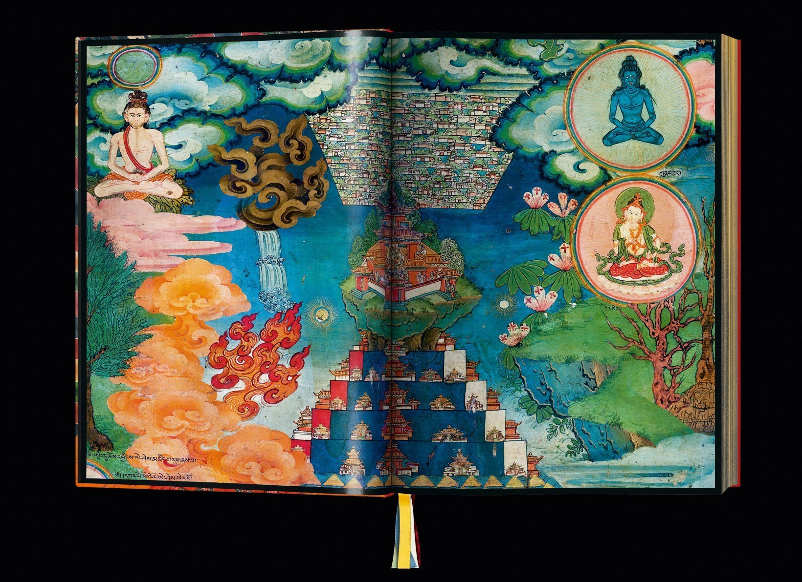
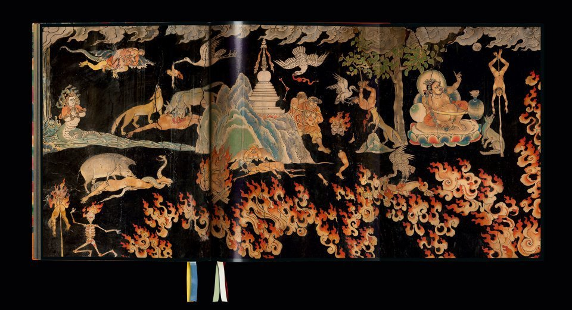

# Introduzione {#sec-intro}

Iniziamo con l'impostare il problema e con il porre delle domande generali. Il tema di cui ci occuperemo in questa discussione è quello della compassione.

La coltivazione secolare della compassione è un fenomeno culturale che è emerso recentemente ed è stato accompagnato dallo studio scientifico in campi quali le neuroscience, la psicologia, e la psicoterapia. L'interesse per il tema della compassione è in costante crescita parallelamente alla scoperta, in psicologia, delle applicazioni cliniche della compassione e, parallelamente, al crescente interesse, nel pubblico generale, delle pratiche volte alla promozione del benessere fisico e mentale.

<!-- -   Da una parte, nelle applicazioni cliniche, gli interventi basati sulla compassione sono stati utilizzati, tra gli altri, nel trattamento di ansia, schizofrenia, dipendenze e PTSD. -->

<!-- -   D'altra parte, al pubblico in generale vengono offerti programmi di formazione incentrati sulla promozione della compassione e dell'auto-compassione in Nord America, Europa e Australia. -->

Pertanto, la coltivazione secolare della compassione è un fenomeno culturale in espansione a cui è associata la dimensione della *mindfulness*, come ad esempio nel programma di riduzione dello stress basata sulla mindfulness (*mindfulness-based stress reduction*, MBSR) sviluppato da Jon Kabat-Zinn (1990). La mindfulness è entrata a pieno titolo nella cultura occidentale, spingendo i media popolari a parlare di una "mindfulness revolution".

Compassione e mindfulness sono entrambi *concetti ibridi* che derivano da varie fonti: buddismo, psicologia contemporanea e pedagogia. Pertanto, al fine di meglio comprendere il dibattito che riguarda la mindfulness e la coltivazione della compassione, è interessante studiare, da una prospettiva storica e filosofica, la coltivazione della compassione nella letteratura buddista Mahāyāna indiana e tibetana. Questo è importante in quanto l'uso contemporaneo e secolarizzato della mindfulness è stato criticato in vari modi: proprio in riferimento a tali fonti è stato giudicato come selettivo, riduzionista, una distorsione del pensiero buddista, privo di fondamenti etici, ecc.

Ma è davvero così? Oppure è possibile che la compassione secolarizzata che ci viene presentata oggi non sia solo un fenomeno appartenente alla cultura del benessere e del consumismo, ma, invece, debba essere intesa come una forma legittima che si è sviluppata all'interno dei continui processi trasformativi che definiscono la storia stessa del pensiero buddista? È ragionevole pensare che le forme secolarizzate di coltivazione della compassione che ci vengono presentate oggi, anziché essere viste come scollegate dalla tradizione buddista, possano invece essere rappresentare una forma di adattamento pensiero buddhista ad una nuova situazione storica?

Queste sono domande importanti, anche alla luce del fatto che la coltivazione secolarizzata della compassione è, come ho detto prima, in continua crescita e che il Dalai Lama XIV attribuisce ad essa una grande importanza.

## Karuṇā

Ma cosa significa "compassione"? Garfield (2022), nel suo testo *Etica buddista*, scrive:

> Translating karuṇā as compassion is unfortunate. For while the root of compassion is passio, indicating being passive, or being affected by something else, the root of karuṇā is kṛ, which means to act. Karuṇā is not a mere feeling, but a determination to act to relieve the suffering of sentient beings. This term is therefore much better translated as care. Crying at movies or becoming despondent when aware of the suffering of others is not a manifestation of karuṇā, but actually doing something to alleviate suffering is.

Pertanto, la conoscenza delle radici filosofiche e storiche della compassione, la varietà dei metodi e degli obiettivi didattici nella storia del buddhismo, e le somiglianze e differenze tra la tradizione buddhista e gli adattamenti secolarizzati a cui siamo esposti oggi, possono aiutarci a meglio comprendere il valore e l'utilità delle pratiche attuali.

In termini psicologici si potrebbe dire che la conoscenza delle radici filosofiche e storiche della compassione, la varietà dei metodi e degli obiettivi didattici nella storia del buddhismo, e le somiglianze e le differenze tra la tradizione buddhista e gli adattamenti secolarizzati sembrano gli strumenti più adatti per esplorare "il dominio del costrutto della compassione", ovvero per capire di quali dimensioni esso sia costituito.

Questa comprensione ci consentirà di affrontare il problema discusso nell'ultima parte di questo intervento, ovvero il tema dell'efficacia degli interventi psicologici basati sulla compassione. Se gli interventi psicologici basati sulla compassione sono efficaci, è poco importante sapere se la versione "secolarizzata" della compassione ci restituisce o meno una comprensione "autentica" della tradizione buddhista. D'altra parte, se gli interventi psicologici basati sulla compassione sono solo in parte efficaci, allora è importate capire per quali motivi la comprensione "secolarizzata" di karuṇā sia, almeno in parte, riduttiva rispetto alla tradizione buddista. Una migliore comprensione di tale concetto, infatti, potrebbe motivarci ad emendare i correnti interventi psicologici e, possibilmente, a migliorarne l'efficacia.

<!-- In un contesto più ampio, l'appropriazione delle pratiche di "mindfulness" buddista per scopi secolari è stata criticata come la trasformazione di una filosofia spirituale altamente evoluta in una merce. È possibile applicare questa critica anche alle pratiche secolarizzate di addestramento alla compassione? La coltivazione secolarizzata della compassione è una distorsione del pensiero buddista? La formazione alla compassione secolare è una forma di mercificazione del pensiero buddista che si rivolge al consumismo invece di proporre il raggiungimento di uno stadio più evoluto di evoluzione spirituale? -->

Per iniziare a chiarire questi temi è necessario prima di tutto ben comprendere il significato di karuṇā nella tradizione buddista, poiché solo una chiara comprensione degli antecedenti o delle origini consente delle conclusioni comparative.

## Karuṇā e tradizione Mahāyāna

Iniziamo dunque ad affrontare il tema di come sia stata compresa karuṇā nella tradizione buddista. Ci focalizzeremo qui sulla tradizione Mahāyāna. La tradizione Mahāyāna è emersa tra l'ultimo secolo prima dell'inizio dell'era comune, o nel primo secolo della nostra epoca, ovvero circa 500 anni dopo la morte del Buddha storico. Il fondamento Sūtra del Mahāyāna risiede principalmente nel corpo di testi noti come Prajñā-Paramitā (Perfezione della Saggezza) Sūtra, così come in alcuni testi ausiliari, tra cui il Vimalakīrti-Nirdeśa-Sūtra (si veda il @sec-vimalakirti). Poiché sono intitolati Sūtra, questi sono presentati come le vere parole del Buddha, anche se questo è ovviamente falso considerata la loro collocazione temporale e il fatto che questi testi sono principalmente scritti in sanscrito. Per questo motivo, la prima letteratura Mahāyāna offre una nuova definizione di Buddhavacana (o parole del Buddha), ma questo è un tema che qui non affronteremo.

La struttura filosofica Mahāyāna è caratterizzata da tre importanti temi:

-   la dottrina che tutti i fenomeni sono vuoti e che la vacuità (śūnyatā) è la natura ultima della realtà;
-   la centralità di karuṇā quale virtù;
-   l'enfasi su un nuovo ideale morale per il buddismo: quello del bodhisattva.

Nelle tradizioni non Mahāyāna, l'ideale morale a cui aspira un praticante non è quello del bodhisattva, o anche quello della buddhità, ma piuttosto quello dell'arhat. Un arhat è colui che ottiene la liberazione dal saṃsāra, e quindi la cessazione della sofferenza. Questo ideale ha senso nel contesto delle quattro nobili verità.

::: callout-note
Le Quattro Nobili Verità (catvāri āryasatyāni) sono:

-   Duḥkha (sofferenza, incapacità di soddisfazione, dolore) è una caratteristica imprescindibile dell'esistenza nel regno del samsara;
-   Samudaya (origine, fonte, combinazione; 'causa'): insieme a Duḥkha viene generata tṛ́ṣṇā ("brama, desiderio o attaccamento, lett."sete"). Mentre tṛ́ṣṇā è tradizionalmente interpretata in occidentale le lingue come la 'causa' di dukkha, tṛ́ṣṇā può anche essere vista come il fattore che ci lega a Duḥkha, o come una risposta a dukkha, che cerca di sfuggirgli;
-   Nirodha (cessazione, fine, riduzione): Duḥkha può essere terminata o contenuta dalla rinuncia o dal lasciar andare questa sete (tṛ́ṣṇā); la riduzione di tṛ́ṣṇā ci libera dal legame di dukkha;
-   Mārga (sentiero, Nobile Ottuplice Sentiero) è il sentiero spirituale che conduce all'eliminazione di tṛ́ṣṇā e Duḥkha.
:::

::: callout-note
Il Nobile Ottuplice Sentiero (ārya aṣṭāṅgika mārga) è descritto nel Dhammacakkappavattana Sutta (Saṃyutta-nikāya):

> Nel mezzo di questo sentiero, realizzato dal Tathāgata che produce la visione e la gnosi, e che guida alla calma, alla perfetta conoscenza, al perfetto risveglio, al nibbāna? Esso è il Nobile ottuplice sentiero, ovvero la retta visione (Samyag-dṛṣṭi), la retta intenzione (Samyak-saṃkalpa), la retta parola (Samyag-vāc), la retta azione (Samyak-karma-anta), il retto modo di vivere (Samyag-ājiva), il retto sforzo (Samyag-vyāyāma), la retta presenza mentale (Samyak-smṛti), la retta concentrazione (Samyak-samādhi).
:::

<!-- ::: callout-note -->

<!-- ० 0 śūnya\ -->

<!-- १ 1 eka\ -->

<!-- २ 2 dvi\ -->

<!-- ३ 3 tri\ -->

<!-- ४ 4 catur\ -->

<!-- ५ 5 pañca\ -->

<!-- ६ 6 ṣaṭ\ -->

<!-- ७ 7 sapta\ -->

<!-- ८ 8 aṣṭa\ -->

<!-- ९ 9 nava\ -->

<!-- ::: -->

Il Mahāyāna, tuttavia, propone il bodhisattva quale ideale morale, caratterizzando questi esseri come coloro che decidono di non raggiungere la liberazione personale, ma piuttosto il pieno risveglio, al fine di facilitare la liberazione di tutti gli esseri senzienti. La loro motivazione è karuṇā, e da qui la connessione tra queste due innovazioni Mahāyāna.

Si noti che la letteratura Mahāyāna tende a trattare karuṇā non come un concetto a sé stante, ma bensì come parte di un insieme di concetti, ovvero considera karuṇā come una componente della determinazione a raggiungere il risveglio per il bene di tutti gli esseri senzienti. Nello specifico, la compassione appare nella triade

-   gentilezza amorevole (maitrī),
-   compassione (karuṇā),
-   bodhicitta.

Oppure come una delle quattro qualità incommensurabili (apramāṇa):

-   gentilezza amorevole (maitrī),
-   compassione (karuṇā),
-   gioia (muditā),
-   equanimità (upekṣā).

L'idea canonica è la seguente: data l'ubiquità della sofferenza che è il contenuto della prima nobile verità, la caratteristica più importante e pervasiva degli esseri senzienti è che stanno soffrendo, anche se non sempre lo sanno. Data l'entità della sofferenza che permea il mondo, l'unico modo concepibile per alleviare una tale infinita sofferenza è quello acquisire le abilità di un Buddha, di un essere completamente risvegliato. Ma ciò è estremamente difficile e richiede un enorme sforzo per un lunghissimo periodo di tempo, ovvero eoni di rinascite successive. Pertanto, intraprendere questo sforzo inumano richiede una motivazione quasi inimmaginabile. L'unica motivazione possibile è l'impegno totale volto ad alleviare la sofferenza degli altri, e questa motivazione è, appunto, karuṇā.

<!-- La presente discussione prenderà in esame un insieme limitato di processi trasformativi che si sono verificati nel buddismo Mahāyāna indiano e tibetano; la selezione di materiali è stata determinata dalla rilevanza dei testi per l'addestramento secolarizzato alla compassione. -->

<!-- Che cosa si intende per compassione? Quando si parla di "coltivare la compassione", che cosa si vuole sviluppare? Quale differenze si possono trovare nel concetto di compassione così come è stato inteso nella tradizione Buddhista e il concetto di compassione così come è inteso nelle pratiche correnti e secolarizzate della coltivazione della compassione? -->

<!-- Per cercare di rispondere a queste domande iniziamo qui a considerare l'area semantica all'interno della quale si situa il concetto di compassione nelle fonti testuali Buddhiste. -->

La compassione (karuṇā) si trova al centro del buddismo Mahāyāna, i cui due "fondamenti" sono stati descritti come compassione (karuṇā) e saggezza (prajñā). Senza compassione, il sentiero Mahāyāna è impensabile. Ma altrettanto impensabile è trascurare la dimensione della prajñā -- questo è un aspetto cruciale su cui ritorneremo in seguito (@sec-wisdom). Per ora ci limitiamo a sottolineare il fatto che la compassione e i concetti ad essa associati pervadono quasi ogni aspetto della dottrina Mahāyāna: la compassione costituisce infatti solo un aspetto di una coltivazione mentale più complessa.

Karuṇā è spesso presentata come una delle cause di bodhicitta (ovvero, l'aspirazione a raggiungere il più alto obiettivo spirituale dell'illuminazione per la liberazione di tutte le creature dalla sofferenza) e i riferimenti testuali a queste due qualità spesso si sovrappongono. Secondo Śāntideva, la mente deve tornare al bodhicitta più e più volte, perché il "mindwandering" (dolāyamāna) è inevitabile.

> IV:11. Sballottato in tal guisa per le esistenze, tirato da un lato dal peso delle sue cattive azioni e, dall'altro, dalla forza del pensiero del risveglio, egli tarda a toccare terra.

> IV:12. Ciò che ho promesso io debbo dunque compierlo scrupolosamente. Se oggi stesso io non faccio uno sforzo, cadrò sempre più in basso.

Ad esempio, il Mahāyānasūtrālaṃkāra, una delle risorse testuali seminali per comprendere la compassione, spiega bodhicitta affermando che

> la sua radice è la compassione, la sua aspirazione il costante beneficio degli esseri.

Un commento a questo testo fornisce la seguente spiegazione:

> Bodhicitta è di due tipi: uno caratterizzato da karuṇā e uno caratterizzato da prajñā. Di questi due, quello caratterizzato da karuṇā è uno stato mentale basato sul pensiero: "Possano tutti gli esseri senzienti raggiungere il nirvāṇa". ... Quello caratterizzato da prajñā è uno stato mentale basato sul pensiero: "Poiché tutti i fenomeni sono vuoti (śūnya), non c'è essere senziente che raggiunga il nirvāṇa". ... Si noti qui l'aspetto duale di bodhicitta, vale a dire il fatto che esso è costituito da compassione (karuṇā) e saggezza (prajñā).

Questo passaggio mostra che, mentre karuṇā costituisce un aspetto di bodhicitta -- ciò che viene chiamato "bodhicitta convenzionale" --, tale aspetto deve essere completato dalla gnosi di śūnyatā (cioè, "bodhicitta assoluto"). La relazione tra questi tre concetti è talvolta espressa con il termine sūnyatākaruṇāgarbha, che potrebbe essere tradotto come "la matrice della vacuità e della compassione". Il punto di tutto ciò è che, nella letteratura buddista tradizionale, *la compassione non è considerata un'entità separata e nemmeno un obiettivo a sé stante*, ma bensì un aspetto di un più generale "ri-orientamento cognitivo" che porta al superamento del pensiero dualistico e il cui fine è il "risveglio". È questo fine soteriologico che giustifica e richiede karuṇā; essa dunque non può essere concepita come un obiettivo che ha un significato in sé. Troviamo dunque qui un'importante differenza dai programmi di compassione secolarizzata, i quali invece aspirano allo sviluppo della compassione come ad un fine a sé stante.

In un'opera della prima letteratura Mahāyāna, colui che si impegna nel sentiero del bodhisattva esprime i seguenti voti:

> Io, con il nome tal dei tali, ... a beneficio della liberazione del mondo infinito degli esseri, per liberarli dalla sofferenza del saṃsāra, genero la mente del risveglio supremo e perfetto. ... D'ora in poi, i doni che faccio, la disciplina che osservo, la pazienza che pratico, gli sforzi che svolgo, la concentrazione che sviluppo, la saggezza che pratico, i mezzi abili che adopero, tutti questi saranno dedicati al benessere, al beneficio e alla felicità di tutti gli esseri.

Questo passaggio mostra che i due stati mentali di bodhicitta e compassione sono usati in modo intercambiabile; entrambi si preoccupano di eliminare la sofferenza di tutti gli esseri. Il sutra afferma che tutti gli esseri nel saṃsāra sperimentano sofferenza. Il tratto saliente dei bodhisattva (esseri eroici che lottano per il risveglio) è l'impegno ad alleviare quella sofferenza, e questo impulso compassionevole li costringe a generare bodhicitta.

I bodhisattva sono quindi considerati l'incarnazione e l'epitomo della compassione: i bodhisattva sono persone molto (mahā) compassionevoli. Inoltre, è la grande compassione (mahākaruṇā) dei bodhisattva che li motiva a rinunciare alla pace nirvāṇica per continuare a lavorare nel saṃsāra per il benessere degli esseri. In conclusione, la letteratura Mahāyāna non distingue rigorosamente la compassione, come entità separata, dall'ideale e dalla pratica del bodhicitta che sorge dalla vista della sofferenza di tutti gli esseri.

## Organizzazione dei contenuti

Nei capitoli seguenti cercheremo di meglio comprendere il collegamento tra karuṇā e bodhicitta, la relazione tra mahā-karuṇā e Śūnyatā, ovvero la relazione tra karuṇā e prajñā e la relazione tra questi concetti e la coltivazione secolarizzata della compassione.

In particolare, nel @sec-definitions esamineremo le definizioni buddiste e secolari della compassione. Per quanto in nessuna delle due tradizioni sia possibile assegnare una definizione univoca alla nozione di compassione, ci sono chiare tensioni e notevoli differenze nel modo in cui questo concetto è stato compreso in questi due ambiti culturali.

Nel @sec-nature-nurture ci chiederemo se, secondo la tradizione buddista, la compassione è al centro della natura umana; se ci si può coltivare; cosa, precisamente, può essere coltivato. Tali domande sono attualmente esplorate da neuroscienziati, neurobiologi e psicologi che sono interessati al pensiero buddista dell'India e del Tibet premoderni. L'esplorazione della compassione e della coltivazione della compassione nella tradizione buddista Mahāyāna è però difficile in quanto entrambe queste idee si sono trasformate nel corso della storia del pensiero buddista: a karuṇā non è stata assegnata una definizione univoca (si veda il @sec-definitions); inoltre, la coltivazione della compassione è stata interpretata in modo diverso nel corso del tempo.

Nel @sec-what-is-trained, ci chiederemo che cosa esattamente viene coltivato nelle pratiche buddiste e secolarizzate: un'emozione, un'intenzione, un'azione o uno stato mentale? Il modo in cui viene concettualizzata la compassione determina infatti l'approccio pedagogico che viene seguito.

Nel @sec-which-training, verranno discussi tre diversi approcci didattici per la coltivazione della compassione nella tradizione Mahāyāna: il metodo costruttivo, il metodo decostruttivo e il metodo cognitivo-analitico. Verrà anche presa in considerazione la discussione sullo stile di vita più favorevole alla coltivazione della compassione e il tema di chi è il beneficiario della compassione: il sé o gli altri?

Il @sec-meditation-tonglen esamina la pratica della meditazione tonglen, proposta dal monaco indiano Śāntideva nel Bodhicaryāvatāra. Tale pratica è importante in quanto ha fornito il principale modello per le meditazioni guidate della coltivazione secolarizzata della compassione.

Nel @sec-wisdom, verrà discusso uno dei punti più difficili e controversi della tradizione buddhista, ovvero la nozione di śūnyatā (vacuità). Tale nozione fa riferimento ad una trasformazione cognitiva del praticante buddhista il quale, come conseguenza della pratica contemplativa, diventa in grado di sviluppare uno stile di pensiero non concettuale e non duale. Nella tradizione buddhista, questa trasformazione cognitiva rappresenta il culmine di quel percorso di trasformazione spirituale che porta alla cessazione della sofferenza. L'esame dei testi Mahāyāna renderà chiaro, inoltre, come non si può sviluppare un'imparziale e universale karuṇā senza, parallelamente, sviluppare la "realizzazione della vacuità". In questo senso, dunque, la manifestazione più autentica dell'etica buddhista, così come espressa nella mahākaruṇā, si dimostra inestricabilmente intrecciata allo sviluppo della saggezza (prajñā). Questa sembra una delle tensioni maggiori che differenziano la tradizione buddhista dalle pratiche secolarizzate di coltivazione della compassione.

Se śūnyatā è assente nelle pratiche secolarizzate, allora si tratta di capire in che modo la "realizzazione della vacuità" è stata utilizzata, nella tradizione buddhista, come guida dell'esperienza nella vita quotidiana. Per affrontare questo tema, nel @sec-vimalakirti verrà discusso un famoso sutra, il Vimalakīrti Sūtra, che discute l'incarnazione della vacuità nel comportamento, non di un monaco, ma di un laico che non ha abbandonato i "traffici del mondo".

Se la dimensione di śūnyatā, realizzabile attraverso la contemplazione, è la risposta alla domanda di come si possa ottenere la cessazione della sofferenza, una domanda parallela, e forse preliminare, è quella che ci porta a chiederci quale sia la causa della sofferenza. A questa domanda il buddhismo ha fornito la risposta della coproduzione condizionata (pratītyasamutpāda). Alle cause della sofferenza, elencate nella Ruota dell'esistenza, il buddhismo ha proposto degli "antidoti". Nel @sec-patience, verrà discusso l'"antidoto" della tolleranza (kṣānti), che è intimamente legato a śūnyatā. Anche questa discussione ha lo scopo di mettere in evidenza una tensione tra l'approccio Mahāyāna e le corrispondenti pratiche secolarizzate di coltivazione della compassione.

La tradizione Mahāyāna non è monolitica, come qualunque altra manifestazione culturale, ma ha avuto uno sviluppo storico all'interno del quale sono emerse molte differenze nel modo di intendere karuṇā. Il @sec-tibetan-tradition esaminerà lo sviluppo storico della coltivazione della compassione nella tradizione tibetana, allo scopo di meglio chiarire le somiglianze e le differenze con le pratiche secolarizzate di coltivazione della compassione.

Data la centralità delle pratiche contemplative nella concezione buddhista, nel @sec-meditation verrà affrontato il tema delle tecniche di meditazione. Lo scopo è quello di capire quali sono le differenze tra la pratica e gli obiettivi della meditazione nel Mahāyāna e nelle pratiche secolarizzate di coltivazione della compassione.

Nei capitoli successivi verranno poi esaminate in dettaglio le pratiche secolarizzate di coltivazione della compassione.
