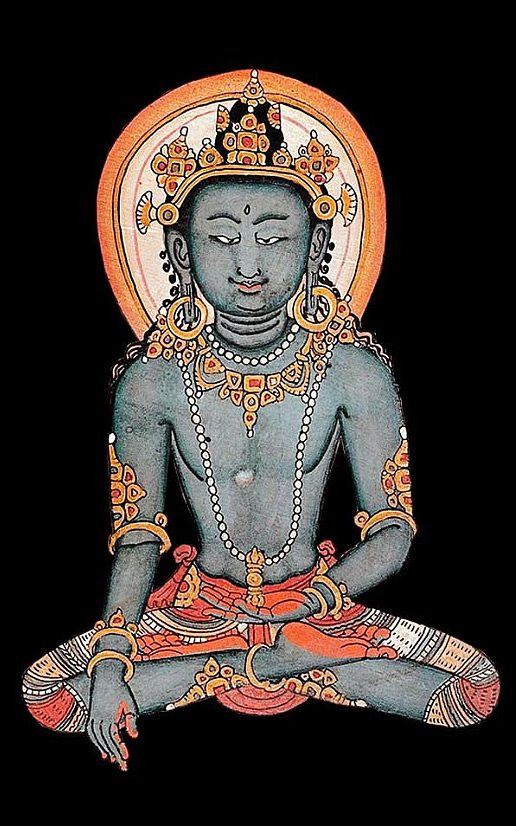

# Sistematizzazioni Mahāyāna

## Domande principali

La letteratura Mahāyāna contiene innumerevoli riferimenti alla compassione (karuṇā): la compassione gioca un ruolo importante in ogni fase del sentiero del bodhisattva ed è descritta in modi diversi quando si fa riferimento ai diversi stadi della progressione spirituale di un individuo. Ci sono tre domande principali che possono essere poste sulla natura della compassione.

-   La prima domanda esplora le *origini* della compassione: è "natura" o "educazione"?
-   La seconda domanda esamina la sua *coltivazione* e la domanda su cosa dev'essere coltivato: un'emozione, una conoscenza, un comportamento o un'intenzione?
-   La terza domanda esplora la *perfettibilità* della compassione: cosa significa essere perfettamente compassionevoli nella visione Mahāyāna?

## La compassione è "natura" o "educazione"?

Questa domanda mira ad esplorare l'origine della compassione. Da dove viene l'impulso per pensieri, parole e azioni compassionevoli? La compassione è parte integrante della natura umana o è un atteggiamento morale generato dalla coltivazione? In breve, la compassione è "natura" o "educazione"?

### Dottrina Tathāgatagarbha

La dottrina del tathāgatagarbha è incentrata sull'idea che tutti gli esseri possiedano l'"embrione", il "germe" o "l'essenza" di un tathāgata. Esposta per la prima volta nel Tathāgatagarbha Sūtra, l'idea si è evoluta dal presupposto che tutti gli esseri possiedono il *potenziale* del risveglio, ovvero dalla credenza in una determinazione quasi genetica che può portare ciascuno di noi a diventare un buddha.

Le interpretazioni di ciò che significa tathāgatagarbha si basano su una serie di similitudini fornite nel Tathāgatagarbha Sūtra.

-   Il tathāgatagarbha viene descritto come un embrione, il che ci trasmette l'idea che tutti gli esseri, a loro insaputa, contengono dentro di sé buddha già completo, anche se le contaminazioni mentali ci impediscono di renderci conto di questo; le contaminazioni mentali, però possono essere superate.
-   Il tathāgatagarbha è paragonato a un seme o germoglio, il che simboleggia il potenziale che deve essere coltivato nella buddhità.

Il Mahayana Uttaratantra Shastra interpreta la nozione di buddha-natura come *luminosità della mente* che è naturalmente dotata di compassione e innumerevoli altre qualità del buddha, e spiega lo stato del risvegliocome dotato delle qualità di conoscenza, compassione e potenza:

> Non prodotta, senza sforzo, non nata dalla comprensione degli altri, la buddhità è dotata del potere della consapevolezza e della compassione.

La dottrina Tathāgatagarbha formula una visione molto ottimistica della natura umana basata sulle convinzioni che tutti gli esseri siano fondamentalmente compassionevoli e che diano dotati del potenziale per manifestare la compassione universale di un buddha, che è caratterizzata dalla sua portata universale (ovvero, non si rivolge a destinatari specifici).

Il compito del bodhisattva non è dunque quello di coltivare karuṇā né di rivelarla, ma bensì quello di riconoscere la sua perfetta presenza. Le capacità e le qualità necessarie per questa disciplina spirituale emergono dalla natura di buddha che già possediamo: saranno le qualità intrinseche in noi a catalizzare la dissoluzione dell'ignoranza e il riconoscimento della compassione. L'Uttaratantra Shastra paragona karuṇā a un potente vento che disperde le contaminazioni mentali, le afflizioni mentali e le oscurazioni cognitive:

> La compassione simile al vento dei vincitori spazza via la rete delle nuvole delle \[oscurazioni\] afflittive e cognitive. \[IV:2\]

### Yogācāra

La scuola di pensiero Yogācāra fa eco a questa visione di un potenziale innato. Anche Asaṅga sostiene l'idea che tutti gli esseri possiedono il tathāgatagarbha. Ciò implica che, per natura, tutti hanno il potenziale delle qualità del Buddha risvegliato, inclusa la mahākaruṇā (compassione universale) del Buddha.

La dottrina Yogācāra introduce a questo proposito il concetto di gotra (famiglia), che sviluppa ulteriormente l'idea di una natura umana naturalmente compassionevole. Secondo la teoria della gotra, ciascun essere nasce in una data gotra che determina il suo potenziale spirituale. Gli esseri sono divisi in cinque "propensioni spirituali" (gotra),

-   *icchantika*: un essere illuso che non può mai raggiungere l'illuminazione;
-   *tīrthya*: non buddisti in generale -- mentre un buddista si rifugia nei Tre Gioielli e percorre la Via di Mezzo tra gli estremi, un titthiya no lo fa;
-   *śrāvaka*: significa "ascoltatore" o, più in generale, "discepolo"; nel buddismo Mahayana, gli śrāvaka o gli arhat sono talvolta contrastati negativamente con i bodhisattva. Queste persone sono descritte come dotate di facoltà deboli, orientate alla propria liberazione personale (non a quella di tutti gli essere) e che coltivano il distacco per ottenere la liberazione;
-   *pratyekabuddha*: che letteralmente significa "buddha solitario" o "un buddha per conto proprio"; si dice che abbiano facoltà medie; Asaṅga descrive i seguaci del Pratyekabuddhayāna come coloro che dimorano da soli e che vivono in piccoli gruppi; sono caratterizzati dall'utilizzo dello stesso canone di testi degli śrāvaka, ma con un diverso insieme di insegnamenti, il "Pratyekabuddha Dharma", e si dice che siano alla ricerca della propria illuminazione personale; nel buddismo tibetano, la "Pratyekabuddha gotra" è descritta come un insieme di individui riservati, che vivono in solitudine, temono il Samsara, desiderano il Nirvana e hanno poca compassione; sono anche caratterizzati come arroganti;
-   *bodhisattva*: secondo molte tradizioni all'interno del buddismo Mahāyāna, sulla via per diventare un Buddha, un bodhisattva procede attraverso dieci, o talvolta quattordici, stadi o bhūmis. Nella tradizione tibetana, i seguenti bodhisattva sono conosciuti come gli "Otto Grandi Bodhisattva": Mañjuśrī ("Gloria delicata"), Kumarabhuta (Giovane principe), Avalokiteśvara ("Signore che guarda il mondo"), Vajrapāṇi ("Vajra in mano"), Maitreya ("Amico"), Kṣitigarbha ("Fonte della Terra"), Ākāśagarbha ("Fonte spaziale") noto anche come Gaganagañja, Sarvanivāraṇaviṣkambhin ("Colui che blocca gli ostacoli"), e Samantabhadra ("Degno universale").

Anche se tutti gli esseri possiedono il potenziale del risveglio, i primi quattro gotra sono caratterizzati dalla presenza di vari ostacoli (āvarāṇa), come l'avversione (vimukhatā) o l'indifferenza (nirapekṣatā) verso il benessere degli altri, e sono quindi limitati nella loro attitudine alla compassione universale.

Il concetto di gotra è un modo per spiegare l'inclinazione di una persona verso uno dei percorsi spirituali piuttosto che un altro, inclusa la compassione universale che è un tratto unico del bodhisattva, o Mahāyāna gotra. La compassione universale, secondo Asaṅga, è naturalmente presente in tutti coloro che appartengono al bodhisattva gotra.

La nozione di gotra è quindi un modo per spiegare che, nonostante la natura di Buddha sia onnipresente, ci sono evidenti differenze nella capacità degli individui di esprimere la compassione. La nozione di gotra risponde alla domanda sul perché le persone reagiscono e rispondono in modi molto diversi alla vista della sofferenza, laddove alcuni mostrano indifferenza anche alla sofferenza dei propri cari, altri mostrano compassione anche verso gli estranei.

Sebbene la dottrina Yogācāra sottolinei le origini naturali della compassione, presenta anche molte altre cause cognitive come significative per far emergere la compassione universale di un bodhisattva.

-   La causa imminente che porta un bodhisattva a generare la compassione è la percezione della sofferenza.
-   Tuttavia, bisogna essere preparati ad una risposta compassionevole attraverso l'educazione.

Secondo Asaṅga, tale educazione richiede, perliminarmente, l'analisi razionale dei vantaggi della compassione; è quindi necessario coltivare la compassione attraverso metodi specifici, eliminando nel contempo gli stati mentali antagonisti:

> I bodhisattva mostrano quattro tipi di compassione (kṛpā):\
> 1) la compassione che deriva dalla propria natura (prakṛti),\
> 2) la compassione che deriva da una attenta analisi (pratisaṃkhyā),\
> 3) la compassione che deriva da metodi di coltivazione della compassione (abhyāsavidhāna) acquisiti in una vita precedente, e\
> 4) la compassione che deriva dallo sviluppo della propria purezza (viśuddhi) attraverso la distruzione delle formazioni mentali antagoniste (vipakṣa).

::: callout-note
È importante capire come il pensiero buddhista è stato formulato usando i concetti che erano disponibili nella società indiana dell'epoca, ma in modo molto più "sovversivo" per l'ordine sociale, culturale e per quel che riguarda l'interpretazione dell'esperienza personale, di quanto possiamo immaginare oggi. Il pensiero buddhista utilizza gli stessi termini usati dalla tradizione braminica, ma sovvertendone completamente il significato. La nozione di *purezza* (ovvero, una delle giustificazioni di base del sistema delle caste, che qui viene reinterpretata in termini spirituali con un significato completamente diverso) è interessante a questo proposito. Ma ancor più chiara quest'operazione di radicale trasformazione del significato emerge quando prestiamo attenzione al termine Atman, il fondamento stesso della visione religiosa braminica. Possiamo immaginare che, all'epoca, Atman corrispondeva a quello che oggi possiamo pensare come "denaro" o "successo", ovvero qualcosa senza il quale, oggi, non possiamo immaginare noi stessi. Se io vi dicessi: provate ad immaginarvi senza denaro, mai più senza un euro nella vostra vita, cosa mi rispondereste? Questo è impensabile per un laico oggi. Eppure il buddismo ha fatto quest'operazione: ha preso questi concetti così fondazionali e identitari, come Atman o purezza, per l'epoca di allora, che potrebbero corrispondere al concetto di denaro oggi, e li ha negati. Nelle foti testuali Pali, infatti, un concetto cruciale è quello di Anatman. E questa negazione di ciò che è cruciale per il nodo di intendere noi stessi, nella tradizione Mahayana, si è estesa a qualsiasi altro aspetto della nostra rappresentazione simbolica dell'esperienza, fino a giungere alla nozione di Sunyata che, vedremo, essere la caratteristica senza la quale la Mahakaruṇā non si può esprimere.

Per fare una metafora contemporanea, quello che dicevano i Buddhisti alcuni millenni fa era qualcosa di simile a quello che qualche filosofo dice al giorno d'oggi in altri termini: la nostra vita è un'illusione in quanto è il risultato di un codice di Intelligenza Artificiale in cui la nostra *apparente* consapevolezza è in realtà l'output di un codice e tutto il mondo empirico è solo una simulazione.

Noi possiamo certamente considerare per un istante un'idea di questo tipo, ma certamente nessuno di noi trasformerà tutta la sua vita sulla base di una tale idea. All'epoca del Buddha, invece, moltissime persone hanno abbandonato il proprio ruolo nella società e sono entrate nella Shanga perché hanno iniziato a credere ad un'idea molto più radicale di quella che ho descritto prima. All'epoca, il buddhismo non era una qualche forma di "religione personale" (che si può sostituire con qualche altra, se la prima non ci soddisfa), come per qualcuno è oggi. È stata una scelta radicale che ha trasformato le vite di molte persone in modi che, per un laico oggi, sono impossibili da capire.
:::

Un altro importante pensatore della tradizione Mahayana è Vasubandhu. Vasubandhu descrive karuṇā nel modo seguente:

> La compassione dovrebbe essere intesa come qualcosa che deriva da:\
> 1) l'eccellenza dell'eredità (gotra) del bodhisattva,\
> 2) un'analisi (parīkṣana) di virtù e difetti,\
> 3) la sua coltivazione (paribhāvana) in una (precedente) vita, e\
> 4) il guadagno che deriva dall'essere liberi dall'avidità (vairāgya).\
> Quando il suo avversario, cioè la violenza (vihiṃsā), viene distrutto, si guadagna la purezza, quindi \[la compassione\] (procede) dal distacco.

Nel suo commento, Vasubandhu specifica che i praticanti della compassione si preparano valutando razionalmente i vantaggi dell'essere compassionevoli e le carenze che derivano dalla mancanza di compassione. Si noti, inoltre, un punto importante: *gli stati mentali aggressivi rendono impossibile il manifestarsi della compassione*. L'assenza di violenza è una pre-condizione necessaria per il manifestarsi della compassione.

Insieme al suo fratellastro Asaṅga, Vasubandhu è stato uno dei fondatori della scuola Yogacara. Al pari di Vasubandhu, Asaṅga elenca la "bontà naturale" e la gotra ("il gene o lignaggio spirituale") come le prime cause della compassione, ma aggiunge che la compassione è stimolata dalla percezione della propria sofferenza e da quella degli altri, ed è sostenuta dalla comprensione della severità e della natura continua della sofferenza.

Mentre il Mahāyānasūtrālaṃkāra pone maggiore enfasi sull'educazione alla compassione, la tradizione Yogacara, pur condividendo l'idea che tutti gli esseri possiedono la compassione come loro natura, qualifica questa affermazione con la teoria del gotra, la quale presuppone una disposizione alla mahakaruṇā solo in un gruppo selezionato di esseri, vale a dire i bodhisattva del Mahāyāna gotra. Questo potenziale per la mahakaruṇā dipende ulteriormente dall'educazione, dalla coltivazione e dalla stimolazione attuale. In una prospettiva buddhista, ciò però significa anche che una persona altruista, la quale può non avere coltivato la compassione in questa vita, a causa del karma, è in grado di manifestare karuṇā come conseguenza della coltivazione della compassione in vite precedenti.

### Madhyamaka

La scuola di pensiero Madhyamaka adotta un approccio leggermente diverso alla questione dell'origine della compassione, poiché non avalla esplicitamente la dottrina del gotra. Madhyamika propone l'idea che un tipo ordinario e limitato di compassione è presente in tutti gli esseri. Ma la mahakaruṇā, la grande compassione, universale e imparziale, è una qualità appresa dei bodhisattva. Pertanto, la mahakaruṇā non è più riservata a un gruppo selezionato, ovvero, la Mahāyāna gotra dell'approccio Yogacara. L'enfasi è invece posta sull'importanza dell'impegno, della formazione e di un guru (guida spirituale).

Gli studiosi del Madhyamaka evitano di rendere esplicita una teoria sull'origine della mahakaruṇā. Per esempio, Nāgārjuna, noto come uno dei primi autorevoli rappresentanti del pensiero Madhyamaka, tace sulla questione dell'origine e no è interessato a elaborare una teoria sistematica sulla compassione. La Ratnāvalī (la preziosa ghirlanda), un famoso testo di consigli scritto da Nāgārjuna, ad esempio, contiene istruzioni pratiche per la condotta morale dei bodhisattva, che include istruzioni sulla coltivazione della compassione, ma senza mai affrontare la questione dell'impulso iniziale e senza fornire una teoria generale della compassione.

In contrasto con la visione Yogācāra di uno specifico gotra (famiglia) che predetermina la qualità della compassione di una persona, la letteratura Madhyamaka propone un diverso tipo di appartenenza ad una famiglia: è attraverso l'atto di generare la determinazione a raggiungere il risveglio per alleviare la sofferenza di tutti gli esseri (bodhicitta) che una persona diventa un membro della famiglia (kula) del buddha. L'appartenenza ad una famiglia è dunque la conseguenza di un un atto intenzionale:

> Oggi è la mia nascita nella famiglia dei Buddha. Sono diventato figlio ed erede del Buddha.

È attraverso la compassione e il bodhicitta che procede il risveglio e si crea il legame con la famiglia del buddha.

L'ordine è qui l'opposto di quello descritto in precedenza nella letteratura Yogacara. Per l'approccio Yogacara, la famiglia (gotra) porta alla generazione della compassione; per l'approccio Madhyamaka, al contrario, è la decisione di sviluppare la compassione la causa che porta l'individuo a diventare un membro della famiglia (kula) del buddha.

Per quanto riguarda la domanda su cosa susciti compassione, Śāntideva afferma che è "mediante il potere di un Buddha" (buddhānubhāvena) che una persona sviluppa la virtù. La virtù (scr. guna) a cui si fa riferimento in questo verso è bodhicitta, che si basa sulla mahakaruṇā del bodhisattva.

Si può dedurre da questo verso che l'approccio Madhyamika assume un potenziale dormiente di compassione che può essere trasformato nella mahakaruṇā e nel bodhicitta per mezzo di stimoli esterni, ovvero l'esposizione al Dharma.

### Considerazioni conclusive

In conclusione, torniamo alla questione di "natura o educazione". Queste brevi considerazioni mostrano come tutte le tradizioni Mahāyāna presuppongono la presenza negli individui di una compassione naturale e ordinaria. Inoltre, i testi Tathāgatagarbha e Yogācāra sono espliciti sul fatto che la Mahakaruṇā, una componente della natura del buddha, è una componente innata in tutti gli esseri senzienti. Lo Yogācāra qualifica questa visione generale positiva della natura umana con l'idea di gotra che definisce diversi gradi di predisposizione alla compassione, acquisita attraverso la coltivazione della compassione nelle vite precedenti. Un gruppo su cinque, il Mahāyāna gotra, possiede un accesso diretto alla mahakaruṇā dei buddha, senza i limiti che derivano dalle afflizioni mentali. L'approccio Madhyamaka, invece, pone un'enfasi molto maggiore sulla decisione etica dell'individuo che sceglie di seguire la via indicata dal Dharma e che, per questo, può sviluppare la mahakaruṇā.
