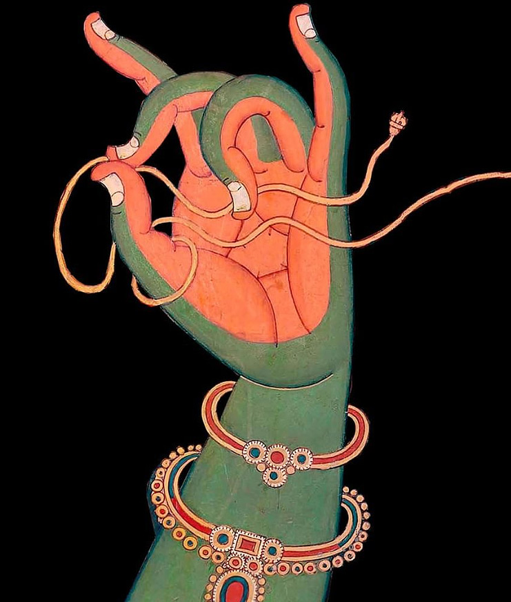
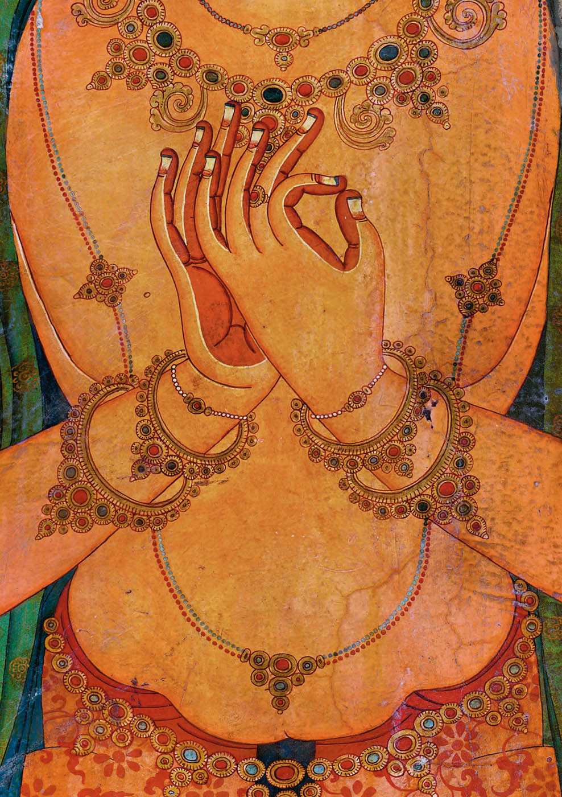

# Che cosa viene coltivato? {#sec-what-is-trained}

## La necessità dell'educazione

Sebbene la compassione sia intesa come un potenziale naturalmente presente, la letteratura buddista sottolinea la necessità di una coltivazione della compassione, disciplinata e prolungata, che possiamo leggere come un riconoscimento dell'importanza della dimensione dell'"educazione" nella contrapposizione tra natura e educazione.

Prima di esaminare le tecniche e le pratiche della coltivazione buddhista alla compassione è necessario chiarire che cosa esattamente viene coltivato (un'emozione, un'intenzione, un'azione o uno stato mentale?), poiché il modo in cui viene concettualizzata la compassione determina l'approccio pedagogico che verrà adottato.

-   Se si intende karuṇā principalmente come un'*emozione*, la sua formazione mirerà a rafforzare l'affetto empatico.
-   Se karuṇā viene intesa come un'*intenzione*, ci si concentrerà sulla corretta impostazione di una tale intenzione.
-   Se karuṇā è concepita come uno *stato mentale* informato dalla conoscenza, la coltivazione della compassione mirerà a correggere e migliorare la dimensione cognitiva dei praticanti e a sradicare le convinzioni errate.
-   Se l'enfasi è posta sull'*azione* compassionevole, allora la coltivazione della compassione si porrà il fine di rafforzare le modalità altruistiche del comportamento.

::: callout-note
Si noti quanto queste considerazioni siano rilevanti relativamente al problema della valutazione dell'efficacia dell'intervento. Quale dimensione di un possibile cambiamento deve essere misurata?
:::

## La compassione è un'emozione?

Per determinare se karuṇā possa essere intesa come un'emozione nel senso occidentale del termine, è prima necessario discutere il significato del termine emozione e determinare come si riflette nella comprensione del buddismo Mahāyāna.

Teorie recenti vedono l'emozione come un'esperienza cosciente complessa che coinvolge l'attività cognitiva e concettuale combinata con sensazioni di piacere o dispiacere. Secondo il filosofo Paul E. Griffith,

> le emozioni traggono la loro identità dai pensieri ad esse associati.

Questa visione filosofica delle emozioni non traccia una linea rigida tra razionalità ed emotività, e quindi assomiglia alla comprensione buddista della mente.

### Abhidharma

L'Abhidharma, spesso indicato come la psicologia buddista, offre diverse sistematizzazioni o tassonomie della mente. Tuttavia, non esiste una categoria dell'Abhidharma che possa essere utilizzata per tradurre il nostro concetto di emozione, e allo stesso modo il nostro concetto di emozione è difficile da usare per tradurre la terminologia dell'Abhidharma.

Piuttosto che contrapporre elementi razionali e irrazionali della psiche, o sistemi cognitivi ed emotivi della mente, l'Abhidharma sottolinea la distinzione tra fattori mentali virtuosi e afflittivi. Pertanto, la nostra familiare distinzione occidentale tra cognizione ed emozione semplicemente non si adatta alla tipologia dell'Abhidharma.

Le tassonomie dell'Abhidharma distinguono tra coscienza (scr. citta) e fattori mentali (scr. caitta). L'Abhidharma analizza ogni stato mentale in termini di

-   un aspetto chiaro e consapevole (citta),
-   un tono emotivo che si spiega con una molteplicità di fattori mentali (caitta) che sono onnipresenti, positivi, negativi o indeterminati.

La categorizzazione dei fattori mentali come positivi (kuśala), negativi (akuśala) o altro è determinata dalle loro conseguenze piacevoli o spiacevoli a breve e lungo termine. Tuttavia non tutti questi "fattori mentali" corrispondono alle idee sulle emozioni della psicologia occidentale.

I fattori mentali positivi includono due che sono rilevanti per la comprensione della compassione, vale a dire,

-   l'assenza di odio (adveṣa),
-   non nocività (ahiṃsā).

L'assenza di malevolenza (vyāpāda) o di odio (dveṣa) può essere intesa come gentilezza amorevole (maitrī), e l'assenza di crudeltà o danno (vihiṃsa) può essere intesa come compassione:

> Che cos'è la non nocività? È la compassione (karuṇā) che fa parte dell'assenza di odio.

È interessante notare che nel trattamento della compassione dell'Abhidharma, la compassione è definita in termini negativi, come un'assenza. Questa descrizione non cattura il tono emotivo della "com-passione" come sofferenza empatica con un altro, né include l'elemento costruttivo o proattivo volto ad alleviare attivamente il dolore degli altri. Pertanto, le descrizioni dell'Abhidharma risultano essere molto diverse dalla definizione di compassione come emozione nel senso psicologico occidentale del termine.

### La tradizione mahayana

Al contrario, nella tradizione Mahayana, numerose istruzioni su come coltivare la compassione implicano gli aspetti emotivi della compassione. Per esempio, l'istruzione di Vasubandhu riguardo alla meditazione su centodieci forme di sofferenza per coltivare la mahakaruna, suggerisce che il bodhisattva è emotivamente toccato dalla sofferenza contemplata.

I testi tibetani sono più espliciti di quelli indiani relativamente agli aspetti emotivi della karuna, usando metafore quali: dovrebbero rotolare le lacrime e dovrebbero rizzarsi i peli del corpo quando si medita sulla gentilezza amorevole e sulla compassione.

Le spiegazioni dell'Abhidharma, con la loro insistenza sull'assenza di ciò che impedisce la compassione, producono un'interessante affermazione pedagogica: la compassione esiste solo nella completa assenza di aggressività. Se le tendenze aggressive nella mente non vengono eliminate, è solo una questione di cause e condizioni affinché emerga l'impulso a fare del male agli altri. Pertanto, lo sradicamento delle tendenze aggressive (inclusi il pregiudizio e le categorizzazioni ingroup/outgroup) viene concepito quale parte integrante della coltivazione della compassione.

Per Vasubandhu, coltivare la compassione inizia con la fase preparatoria di "allontanamento dalla cattiva volontà", cioè con il contenimento del pensiero dannoso. La completa eliminazione della nocività, tuttavia, può solo essere raggiunta, per Vasubandhu, nell'assorbimento meditativo.

## La perfettibilità della compassione

Se il concetto di emozione non cattura sufficientemente le nozioni buddiste di compassione, come possiamo comprendere karuṇā in modo più appropriato? Il pensiero buddista propone un progressivo potenziamento della compassione che si basa su specifici tipi di conoscenza e intenzioni, culminando in uno stato detto di perfezione. Questo punto di vista mette in primo piano il ruolo della conoscenza e dell'impostazione delle intenzioni nella caratterizzazione della compassione dei bodhisattva e dei buddha.

### Mahākaruṇā (grande compassione)

La spiegazione di mahākaruṇā (grande compassione) nell'Abhidharmakośa chiarisce come gli studiosi Mahāyāna comprendevano uno stadio perfezionato di compassione in giustapposizione a stadi meno sviluppati, come la compassione delle persone comuni e dei seguaci di percorsi non Mahāyāna.

La compassione è l'impegno del buddha nel mondo della sofferenza che, a livelli avanzati, diventa sempre più informato dalla saggezza che, secondo Vasubandhu, è l'assenza di illusione (moha) e la conoscenza delle forme più sottili di sofferenza all'interno dei regni saṃsārici dell'esistenza. Al suo livello più avanzato, la compassione diventa Mahākaruṇā.

Vasubandhu elenca cinque caratteristiche di Mahākaruṇā:

-   emerge in relazione al vasto accumulo di merito (puṇya) e conoscenza (jñāna),
-   richiede la conoscenza dei tre tipi di sofferenza,
-   ha una portata infinita e universale,
-   possiede la qualità dell'equanimità,
-   è dotata di una insuperabile eccellenza.

::: callout-note
Le tre forme di sofferenza.

-   *Dukkha-dukkha*: la sofferenza della sofferenza. Questa si riferisce al disagio fisico ed emotivo e al dolore che tutti gli esseri umani sperimentano nella loro vita.
-   *Viparinama-dukkha*: la sofferenza del cambiamento. Questa si riferisce alla sofferenza che deriva dall'incapacità di accettare il cambiamento. Le persone si aggrappano a esperienze piacevoli e si sentono tristi quando passano, e non sono in grado di accettare l'inevitabilità dell'impermanenza.
-   *Sankhara-dukkha*: la sofferenza dell'esistenza. Questa potrebbe quasi essere descritto come una sofferenza di fondo. È la profonda insoddisfazione dell'esistenza, causata semplicemente dall'esistenza.
:::

Secondo Vasubandhu, Mahākaruṇā differisce dai tipi ordinari di compassione nel modo seguente.

-   La compassione ordinaria significa l'assenza di danno (adveṣa), mentre Mahākaruṇā è in aggiunta l'assenza di illusione (moha).
-   La compassione ordinaria è una risposta a forme grossolane di sofferenza, mentre Mahākaruṇā si basa sulla comprensione di tutte le forme di sofferenza (cioè, i tre tipi di sofferenza), anche quelle nascoste e potenziali.
-   La compassione ordinaria si concentra su un numero limitato di esseri, mentre Mahākaruṇā ha la portata più vastapossibile, abbracciando in modo imparziale e uguale tutti gli esseri dei tre regni (Skt. dhatu).
-   Una Mahākaruṇā è accompagnata da una rinuncia sincera (vairāgya), salva e protegge (paritrāṇa) gli esseri senzienti, piuttosto che semplicemente desiderare la loro liberazione, e sorge nel flusso mentale dei buddha.

In tutti questi aspetti, Mahākaruṇā differisce dalla compassione dei seguaci di percorsi non Mahāyāna e da quella delle persone comuni. Questa spiegazione suggerisce che, nella sua forma perfezionata, la compassione è

-   uno stato mentale basato su specifiche forme di conoscenza e di intenzione;
-   trascende la compassione ordinaria motivata emotivamente.

Esprimendo una prospettiva Yogācāra, Asaṅga presenta Mahākaruṇā come il risultato di un'intensa definizione delle intenzioni e di un processo di purificazione:

> (1) È una forma di compassione che si sviluppa dopo aver mentalmente preso possesso della sofferenza degli esseri senzienti che è profonda, sottile e difficile da realizzare.
> (2) È una forma di compassione con cui ci si è familiarizzati per un lungo periodo di tempo ed è stata coltivata per molte centinaia di migliaia di kalpa.
> (3) È una forma di compassione che ha impegnato il suo oggetto con uno sforzo di tale intensità che il bodhisattva che è colmo rinuncerebbe a cento vite per rimuovere la sofferenza degli esseri, per non parlare una singola vita o dei beni materiali che sostengono il suo corpo fisico.
> (4) È una forma di compassione estremamente rifinita grazie alla purezza che caratterizza lo stadio di evoluzione che è stato raggiunto da quei bodhisattva che hanno ottenuto il culmine del sentiero e grazie alla purezza dello stato di un tathāgata.

La descrizione di Asaṅga di Mahākaruṇā sottolinea il ruolo dell'intenzione coraggiosa e dell'impegno all'azione: il testo illustra l'intensità dell'intenzione del bodhisattva di salvare gli altri e la disponibilità del bodhisattva al sacrificio.

Questo testo non parla di un accumulo di saggezza, ma del raggiungimento della purezza per elevare la compassione allo stato di Mahākaruṇā. Implicita in questo approccio è l'idea Yogācāra della trasformazione fondamentale (Skt. āśraya paravṛtti) della mente dal suo stato contaminato alla sua purezza originaria di lucida consapevolezza libera dalle macchie delle afflizioni mentali. Questo approccio riflette la convinzione che Mahākaruṇā, come aspetto della natura del buddha, si trova al centro della mente del bodhisattva e deve semplicemente essere rivelata attraverso la pratica spirituale.

Ciò che distingue Mahākaruṇā dalle forme minori di compassione è anche trovato nella tradizione testuale tibetana. Tzongkhapa afferma che non basta semplicemente pensare "Possano tutti gli esseri essere felici e liberi dalla sofferenza", ma "è necessario assumere con tutto il cuore la responsabilità di produrre in prima persona il beneficio per gli altri".

La Mahākaruṇā dei bodhisattva cerca attivamente di salvare tutti gli esseri, richiedendo un'intenzione straordinaria che implica un fermo impegno personale per impegnarsi nel percorso del risveglio. Questo stato d'animo è stato descritto come un senso di intolleranza verso la sofferenza degli altri, che porta all'impegno ad assumersi personalmente la responsabilità di salvare gli altri dalle loro sofferenze.

È questa straordinaria intenzione o volontà che distingue la Mahākaruṇā del bodhisattva da altre forme meno radicali di altruismo. Quando la compassione è diventata spontanea, il bodhisattva ha ottenuto il prerequisito per generare bodhicitta. Secondo il lam rim chen mo di Tzongkhapa, questo tipo di compassione è il fondamento del sentiero Mahāyāna: dà origine al bodhicitta e quindi segna il momento in cui un discepolo entra nel sentiero del bodhisattva.

In sintesi, come prerequisito per bodhicitta, il Mahākaruṇā del bodhisattva è inteso come l'unica qualità che permette ad un individuo di intraprendere il sentiero della buddhità. Il Mahākaruṇā di un bodhisattva non richiede una comprensione esperienziale della vacuità come suo punto di ingresso, ma si ritiene che la profondità della compassione cresca con la crescente conoscenza esperienziale della realtà ultima. In questo senso la compassione dipende dalla posizione ontologica del bodhisattva -- cioè, richiede la comprensione di sunyata. Anche se Mahākaruṇā può non essere accessibile alla maggioranza dei praticanti buddisti, è importante ricordare che essa svolge la funzione di ispirare l'ideale della compassione universale e imparziale.

### I tre Ālambana

Il Mahākaruṇā di un bodhisattva si riferisce a un ampio spettro di stati mentali, dall'impegno iniziale fino alla quasi perfezione della grande compassione di un buddha. All'interno di quello spettro, la tassonomia della compassione dei tre ālambana distingue tra tre livelli di compassione in base alla maturazione spirituale del bodhisattva.

Il sistema dei tre ālambana della compassione spiega quale tipo di conoscenza è richiesta ai bodhisattva per progredire con successo nella loro coltivazione della compassione. Distingue la compassione in base ai suoi possibili tre oggetti (ālambana):

-   compassione per gli esseri come oggetto (Skt. sattvālambana karunā),
-   compassione per i fenomeni come oggetto (Skt. dharmālambana karunā),
-   compassione senza oggetto (Skt. anālambana karunā).

Pertanto, la comprensione della compassione è legata alla comprensione ontologica del praticante.

-   Sattvālambana karunā si riferisce alla compassione diretta verso gli esseri senzienti (sattvālambana) intesi come oggetti intrinsecamente esistenti. Questo tipo di compassione è condivisa con i non buddisti perché si basa sulla percezione convenzionale dell'esperienza.
-   Dharmālambana karunā nasce in dipendenza da una raffinata comprensione della realtà. Ciò significa che il bodhisattva coltiva la compassione per gli esseri mentre comprende che gli esseri sono semplici raccolte di entità costituenti, o composti di dharma; da qui il nome, compassione in riferimento ai fenomeni (dharmālambana). Mentre generano uno stato mentale altruistico, i bodhisattva sono quindi acutamente consapevoli della natura impermanente degli esseri, o della vita. A un livello più pratico, questo secondo tipo di compassione implica un focus sulle cause della sofferenza, come le afflizioni mentali.
-   Anālambana karunā è il terzo e più avanzato tipo di compassione ed è priva di qualunque punto di riferimento (anālambana). Ciò significa non solo vedere la natura composita degli esseri, ma anche la vacuità dei loro componenti costitutivi. I bodhisattva al livello dell'ottavo bhumi che "accettano il non sorgere dei dharma", "evitando persino di generare una concezione delle entità" hanno questo tipo di grande compassione non oggettivata. Anālambana karuṇā ha la qualità di essere irreversibile (avaivartika) ed è chiamata mahākaruṇā.

Il significato di questa sistematizzazione risiede nella sua concettualizzazione della compassione e dal fatto che tale concettualizzazione determinerà le pedagogie impiegate per coltivarla. Al livello più basso della tassonomia l'accento è posto sulla conoscenza, nel senso della comprensione della realtà. Le forme superiori di compassione sono presentate non come emozioni, ma come stati mentali determinati da forme superiori di conoscenza o saggezza. I tre tipi di karuṇā sono intesi gerarchicamente, il che significa che qui è presente l'idea che migliorando progressivamente la conoscenza, anche la compassione può essere progressivamente accresciuta.

## La triplice tipologia della sofferenza

Questa tassonomia a tre livelli della compassione può essere messa in relazione con i tre tipi di sofferenza che abbiamo descritto in precedenza: la sofferenza esplicita (duḥkhaduḥkhatā, lett. sofferenza della sofferenza), la sofferenza del cambiamento (vipariṇāmaduḥkhatā) e la sofferenza degli esseri condizionati (saṃskāraduḥkhatā).

Questi tre tipi di sofferenza sono caratterizzati da una loro specifica qualità esperienziale.

-   La prima, duḥkhaduḥkhatā, è vissuta come dolorosa dagli individui e comprende tutte le piccole e grandi forme di sofferenza fisica e mentale tra la nascita e la morte.
-   La seconda, vipariṇāmaduḥkhatā, si riferisce alla potenziale sofferenza contenuta nelle esperienze piacevoli; alcune esperienze sono momentaneamente piacevoli, ma portano sempre con sé i semi di una sofferenza futura -- anche per il semplice fatto che necessariamente finiscono. La compassione per questo tipo di sofferenza richiede una raffinata comprensione della natura impermanente della realtà.
-   Il terzo tipo di sofferenza, saṃskāraduḥkhatā, è descritto come un'esperienza neutra (né piacevole né spiacevole) perché troppo sottile per essere notata dagli individui comuni. Tuttavia, è percepitA direttamente dagli ārya bodhisattva. Questo stato fondamentale di sofferenza è il risultato del fatto che i fenomeni sono condizionati (saṃskṛta) e contaminati (sāsravā), il che significa che sorgono sotto forma di contaminazioni di un individuo, come il desiderio e l'ignoranza. Secondo Chögyam Trungpa afferma che anche la gente comune ne è colpita e la descrive in termini psicologici come una "generale insoddisfazione che è sempre presente", "una sensazione di vuoto, pesantezza e miseria". Lo scopo finale del sentiero del bodhisattva è l'eliminazione di questa forma più sottile di sofferenza, poiché la sua assenza è equiparata all'estinzione di tutte le contaminazioni mentali e al nirvāṇa.

### Madhyamakāvatāra

I tre tipi di compassione che abbiamo presentato sono discussi anche dal Madhyamakāvatāra di Ciandrakirti, un'opera importante che fornisce un approccio sistematico all'integrazione tra vacuità (sunyata) e compassione. Il Madhyamakāvatāra è noto per l'attenzione particolare che Ciandrakirti presta alla compassione. Nella lode introduttiva, normalmente riservata a un omaggio al Buddha, Candrakīrti elogia la compassione come la prima causa della buddhità

> Gli Śrāvaka e i pratyekabuddha sono nati dal re Muni;\
> I Buddha nascono dai bodhisattva;\
> E dalla mente della compassione, della non dualità e del Bodhicitta nasce il bodhisattva.

> Poiché la compassione è vista come il seme dell'eccellente raccolto dai Conquistatori,\
> E l'acqua che la fa crescere e la fruizione che ne risulta\
> Continuerà a essere goduta a lungo,\
> all'inizio lodo la compassione.

Il verso I,1 afferma che la compassione deve essere coltivata in combinazione con una mente non duale - intesa come comprensione della vera natura della realtà - e con il bodhicitta. Candrakīrti loda il ruolo onnipresente della compassione in ogni stadio del sentiero del bodhisattva. Con una metafora presenta l'immagine della compassione come il seme, l'acqua e il raccolto della buddhità. Quindi allude ai tre tipi di compassione per mezzo di una allegoria della natura e dell'acqua:

> Esseri indifesi, guidati come una ruota d'irrigazione,\
> Alla compassione per questi esseri, mi inchino.\
> Gli esseri senzienti sono come il riflesso della luna nell'acqua in movimento.\
> Vedendoli vuoti nel loro cambiamento e nella loro natura\
> Il figlio del vittorioso, dotato di tale intelligenza,\
> E sopraffatto dalla compassione, desidera liberare completamente tutti gli esseri.

In questi versi, la ruota d'irrigazione simboleggia il sattvālambana, mentre il riflesso nell'acqua in movimento simboleggia sia il dharmālambana che l'anālambana. Il primo si riferisce alla comprensione della natura impermanente degli esseri, mentre il secondo si riferisce alla realizzazione della vacuità della loro natura.

### Compassione e vacuità

La relazione tra compassione e l'idea di Anatman o di sunyata è stata oggetto di molte controversie nel dibattito accademico. Alcuni studiosi hanno sostenuto che realizzare la vacuità contraddice la compassione, perché se gli oggetti della compassione e la loro sofferenza sono in definitiva privi di esistenza intrinseca, allora non ci sono le basi per una condotta compassionevole e nessuna possibilità di un'etica normativa. Questo tema, tuttavia, non è specifico al dibattito contemporaneo, ma ha una lunga storia nella tradizione testuale buddista.

Ad esempio, Śāntideva che cita l'argomento degli scettici:

> Se gli esseri senzienti non esistono, allora a chi si rivolge la compassione?

Tale apparente paradosso si dissolve se consideriamo la spiegazione Madhyamaka di śūnyatā proposta da Nāgārjuna e Candrakīrti: secondo questi autori la vacuità non è il non essere, ma l'origine dipendente. Nāgārjuna, lodando il Buddha, afferma:

> Ciò che sorge in modo dipendente è esattamente ciò che consideriamo śūnyatā.\
> Oh, il tuo incomparabile ruggito di leone è che non esistono fenomeni indipendenti!

::: callout-note
La dottrina della pratītyasamutpāda, o origine dipendente \[COPRODUZIONE CONDIZIONATA, detta anche originazione interdipendente o genesi dipendente\], è la tesi che ogni fenomeno dipende per la sua esistenza o il suo verificarsi da innumerevoli altri fenomeni in una vasta rete di interdipendenza. Quella rete è multidimensionale, comprende diversi tipi di relazioni causali così come relazioni di dipendenza mereologica e dipendenza dalle convenzioni umane e dall'imputazione concettuale.

La dottrina dell'origine dipendente è uno sviluppo del concetto di anātman (o non-sé) proposto dal Buddha. La nozione Therevada di anatman è stata successivamente sviluppata dall'approccio Mahayana nel concetto di śūnyatā, l'idea che né le persone né qualsiasi altro fenomeno hanno un'identità separata, che noi e qualsiasi altro fenomeno non siamo altro che un insieme di processi psicofisici collegati causalmente con un'identità meramente convenzionale.

Il confine tra sé e gli altri è considerato convenzionale e inadeguato. Pur riconoscendo l'importanza di questa distinzione nel nostro pensiero ordinario e il nostro bisogno di riconoscerla nel ragionamento pratico quotidiano, i teorici buddisti sostengono che attribuiamo troppa importanza a questa distinzione.

L'identità personale è, dal punto di vista buddista, una imputazione convenzionale. Le relazioni tra noi stessi e gli altri, le relazioni tra i fenomeni, sono semplicemente relazioni di causalità e somiglianza, non di identità. L'unica identità che abbiamo è quella che ci viene attribuita da noi stessi e dagli altri: è un'identità narrativa o convenzionale.
:::

Come descritto dalla triplice tipologia della compassione, la coltivazione della compassione precede la realizzazione della vacuità sul sentiero del bodhisattva. Pertanto, gli "esseri inesistenti" non sono un motivo di preoccupazione in quella fase preliminare. Solo a livelli più avanzati è richiesto la comprensione della vacuità, che culmina nel livello più avanzato di deoggettivazione della Mahakaruna.

In sintesi, le nozioni di compassione e sofferenza implicano che i bodhisattva evolvono progressivamente nella loro comprensione della realtà e, di conseguenza, la loro compassione si affina. Sebbene la conoscenza non sia l'unico fattore per coltivare la compassione, essa gioca un ruolo cruciale nel radicare la compassione nella ragione, fornendo un livello di profondità e stabilità che gli aspetti empatici, affettivi e aspirazionali da soli non sono in grado di raggiungere.

## Pedagogie

Secondo Tzongkhapa, l'approccio pedagogico che ci porta ad acquisire la conoscenza richiesta per lo sviluppo della compassione si sviluppa attraverso la contemplazione della propria situazione personale e della propria sofferenza. La conoscenza esperienziale della propria sofferenza è legata al senso di intolleranza nel vedere gli altri soffrire e quindi alla compassione.

Secondo Vasubandhu

> Al fine di evocare una genuina consapevolezza della sofferenza samsarica è necessario prima riflettere sul modo in cui noi stessi vaghiamo nel saṃsāra. Altrimenti, senza aver precedentemente sviluppato tale consapevolezza in relazione a noi stessi, un praticante principiante che cerca di contemplare questo aspetto in relazione agli altri esseri senzienti non sarà in grado di sviluppare la sensazione che tale sofferenza sia insopportabile. Pertanto, come descritto nel commento ai Quattrocento versi di Āryadeva, è necessario prima contemplare la sofferenza samsarica in relazione a te stessi; successivamente, è possibile meditare su di essa in relazione agli altri.

Va notato che la triplice tipologia della sofferenza (abbiamo discusso in precedenza) e le relative istruzioni pratiche mostrano come l'eliminazione della sofferenza riguarda solo in parte ciò che è doloroso, stressante, insoddisfacente ma richiede anche, e soprattutto, una profonda comprensione della struttura sottostante che crea e perpetua la sofferenza in una prospettiva a lungo termine. Per un bodhisattva, compassione significa l'eliminazione delle contaminazioni mentali inerenti ai fenomeni condizionati.
