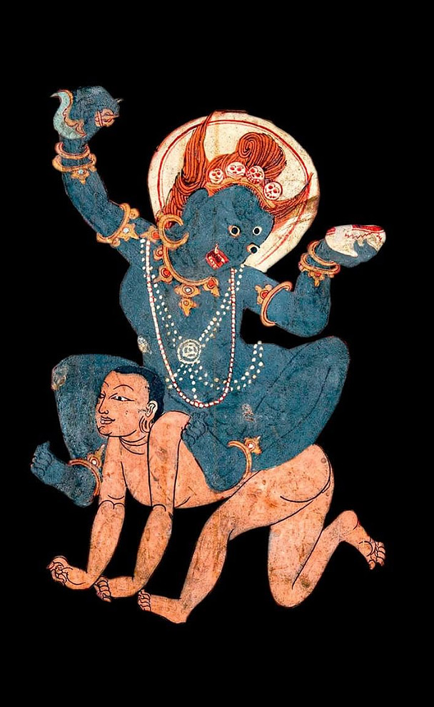
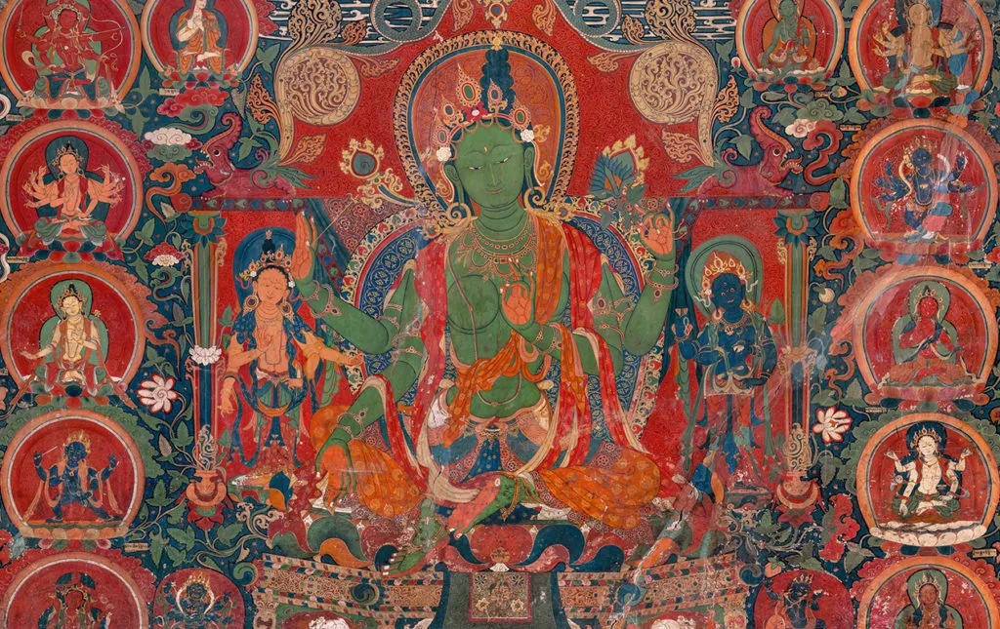

# Metodi di coltivazione della compassione {#sec-which-training}

## Metodi contemplativi per trasformare la mente

Anche se noi abbiamo scoperto solo di recente la capacità di addestramento della compassione, le pratiche del sentiero spirituale buddista sono impensabili senza la convinzione che la mente possa essere radicalmente trasformata. Nelle fonti buddhiste, questa trasformazione della mente include la compassione e viene sviluppata attraverso la ripetizione, la disciplina e l'intuizione. La letteratura Mahāyāna presenta un'ampia gamma di metodi contemplativi per la coltivazione della compassione e dei relativi stati mentali. In questo capitolo analizzeremo tre approcci didattici nella coltivazione della compassione Mahāyāna.

<!-- vari metodi di coltivazione della compassione nel contesto Mahāyāna. -->

<!-- -   In primo luogo, verrà presentata l'idea di una cultura della compassione, che costituisce lo sfondo sul quale vengono applicati i metodi applicati ai singoli individui. -->

<!-- -   In secondo luogo, verranno presentati tre approcci didattici nella coltivazione della compassione Mahāyāna. Insieme, questi approcci forniscono lo sfondo storico per valutare in maniera comparativa i metodi secolarizzati della coltivazione della compassione. -->

<!-- -   In terzo luogo, la nostra discussione tornerà sulla questione della cultura della compassione da una prospettiva più pragmatica, esplorando la questione se la coltivazione della compassione avalli uno stile di vita socialmente impegnato, piuttosto che una vita isolata e "asociale". A questa domanda si tenterà di rispondere analizzando la circolarità dei benefici della compassione per sé e per gli altri. -->



<!-- ## Cultura della compassione -->

<!-- Il buddismo Mahāyāna propone l'ideale etico del bodhisattva, ovvero di una persona che aspira al massimo bene per se stesso e per gli altri. Mediante la gentilezza amorevole (maitrī) e la compassione (karuṇā), i bodhisattva desiderano aiutare tutti gli esseri a ottenere la liberazione e il nirvāṇa, ma anche ad ottenere la prosperità materiale e il benessere (sukha) in questo mondo. La compassione è alla base delle aspirazioni del bodhisattva sia a lungo che a breve termine. Per realizzare le loro aspirazioni motivate alla compassione, i bodhisattva seguono tre tipi di precetti morali: -->

<!-- -   moderazione -->

<!-- -   acquisizione di qualità virtuose, -->

<!-- -   azioni a favore degli esseri viventi. -->

<!-- La moderazione è spiegata come l'impedimento di atti non virtuosi. Diversi individui mettono in pratica diversi livelli di rinuncia: da colui che segue solo alcuni precetti buddhisti nella vita quotidiana, al monaco che rinuncia a tutta la vita sociale così come la conosciamo. -->

<!-- Qui è solo importante notare che, radicata nella compassione, si è sviluppata nella tradizione buddista una complessa struttura etica, accompagnata da un insieme di voti (ovvero, l'esplicitazione dei comportamenti devono essere adottati e dei comportamenti che devono essere evitati) che ne consentono la sua applicazione pratica. Trasmessi per secoli e ancora oggi elementi costitutivi fondamentali della pratica buddista, tali voti accompagnano ogni passo di un seguace della dottrina buddista. -->

<!-- Questa sovrastruttura, costituita da considerazioni etiche, filosofiche e soteriologiche, è ciò che può essere chiamata "cultura della compassione" nel contesto buddista tradizionale. La presenza di una fiorente cultura della compassione fornisce agli individui molteplici punti di riferimento che supportano le proprie pratiche di coltivazione della compassione. -->

<!-- Quando al praticante viene chiesto di esprimere la propria compassione evitando le azioni non virtuose, il seguace ha a disposizione un elenco delle azioni non virtuose: -->

<!-- > uccidere, rubare, cattiva condotta sessuale, mentire, discorsi divisivi, discorsi aspri, discorsi oziosi, brama, ostilità, opinioni sbagliate. -->

<!-- Quando al praticante viene detto di coltivare le qualità virtuose e di lavorare a beneficio degli altri, il praticante sa che deve considerare le istruzioni delle cosiddette sei perfezioni (pāramitā): -->

<!-- > generosità, disciplina, pazienza, sforzo, concentrazione meditativa e saggezza. -->

<!-- La cultura della compassione della tradizione Mahāyāna non è solo un ideale teorico, ma è anche stata una cultura vissuta. Ad esempio, in Tibet la recitazione del mantra di sei sillabe \[auṃ maṇi padme hūṃ\] era onnipresente, tale mantra è scolpito su rocce, pietre e oggetti vari. La devozione del popolo tibetano al Dalai Lama è stata un'espressione di esplicita adesione culturale alla compassione come valore spirituale chiave. Principi come la compassione, la tolleranza e la non nocività vengono trasmessi dai genitori ai figli, non necessariamente come virtù religiose, ma come abilità sociali. -->

<!-- Tenere a mente la cornice globale della cultura della compassione quando si discute delle pratiche di compassione individuali è importante per tre ragioni. -->

<!-- -   In primo luogo, separare la meditazione della compassione dal suo contesto culturale e sociale ci fa correre il rischio di ridurre le pratiche di coltivazione della compassione a esercizi semplicistici. La compassione è invece integrata in numerose pratiche meditative, spesso sovrapposte ad altri aspetti, come il bodhicitta, la gentilezza amorevole (Skt. maitrī) o la generosità (Skt. dāna). Separando il tema della compassione da queste altre dimensioni, gli esercizi contemplativi possono sembrare unidimensionali o troppo semplici. Il concetto di cultura della compassione serve a ricordare che gli esercizi contemplativi individuali devono essere intesi come solo una parte di un più ampio contesto volto allo sviluppo spirituale. -->

<!-- -   In secondo luogo, a causa della natura onnipresente della compassione sul sentiero del bodhisattva, ci sono numerose pratiche che contribuiscono in modo indiretto alla compassione. È importante ricordare che tutte le pratiche volte a purificare la mente da tendenze dannose come l'ignoranza, la paura o l'aggressività, migliorano la qualità e la profondità della compassione. Da questa prospettiva, anche praticare la disciplina sotto seguendo voti e precetti è un modo per esprimere la compassione, poiché l'impegno derivante dai voti aiuta le persone a perseverare e portare a buon fine la coltivazione della compassione. -->

<!-- -   In terzo luogo, la cultura buddista della compassione contiene la convinzione che il potenziale naturale e innato della compassione trova la sua massima espressione solo in una persona risvegliata, un buddha. Poiché questa compassione, o mahākaruṇā, deve essere realizzata in parallelo con una comprensione della vacuità (śūnyatā), ciò implica che anche lo studio, la riflessione e la meditazione sulla realtà ultima sono sia favorevoli che indispensabili alla coltivazione della compassione. E anche se mahākaruṇā potrebbe essere inaccessibile all'inizio del percorso spiritual, credere nel suo raggiungimento fornisce una prospettiva a lungo termine per la coltivazione della compassione, aggiungendo uno scopo ulteriore al semplice atto di aiutare gli altri. -->

<!-- Per queste tre ragioni (vale a dire il rischio di semplificazione eccessiva, il rischio di una selezione riduzionista e il rischio che ci porta a trascurare una visione a lungo termine), è fondamentale tenere presente il più ampio contesto della cultura della compassione all'interno del quale sono presenti le pratiche della coltivazione della compassione. -->

## Tre approcci didattici

Un'analisi delle pratiche di coltivazione della compassione nella letteratura buddista consente di gettare luce sui *metodi didattici* che sono stati impiegati nella tradizione buddista, al fine di consentire uno studio comparativo con la coltivazione secolarizzata della compassione. Secondo Julia Caroline Stenzel, si possono mettere in luce tre stili didattici nella letteratura Mahāyāna:

-   l'approccio costruttivista,
-   l'approccio decostruttivo,
-   l'approccio cognitivo-analitico.

<!-- La discussione seguente presenterà ciascuno di questi approcci con vari esempi tratti dalla letteratura del buddista.  -->

La maggior parte delle pratiche di coltivazione della compassione sono una combinazione di questi tre metodi didattici, ma spesso si può identificare una chiara preferenza dell'autore per uno di questi approcci.

### L'approccio costruttivo

Tra i tre approcci didattici, il più comune è quello costruttivo. Questo approccio cerca di sviluppare la coltivazione della compassione attraverso la trasformazione e il potenziamento di potenzialità già esistenti, ovvero la gentilezza amorevole, la cura, la gratitudine, il senso di responsabilità, la generosità, la perseveranza, il coraggio morale e così via.

L'approccio costruttivo comprende una varietà di metodi.

-   Un insieme di metodi fa leva sulle esperienze vissute dei meditatori. Tali esperienze personali forniscono il punto di partenza per la trasmutazione di tali esperienze in una forma universale di compassione.
-   Un altro insieme di metodi corrisponde ad una trasformazione cognitiva attuata mediante, ad esempio, la recitazione delle preghiere di aspirazione. Tali preghiere, ritenute essere le parole dei grandi bodhisattva del passato, espongono il meditatore a modi di pensare spiritualmente avanzati.

Questi due metodi utilizzano le tecniche formali di contemplazione, visualizzazione e recitazione, che vengono ripetute moltissime volte, poiché si ritiene che, attraverso la ripetizione si possono formare *nuove abitudini mentali*.

Nell'approccio "costruttivo" si possono mettere in evidenza i seguenti aspetti: il ruolo della gentilezza amorevole (Mettā), l'uso delle preghiere di aspirazione, la ri-definizione delle proprie intenzioni e l'impegno in prima persona.

#### Il ruolo di Metta nella coltivazione della compassione

La coltivazione di Metta spesso precede o accompagna quella della compassione. I bodhisattva vedono gli altri come loro "madre, padre, figli e figlie". L'amore materno i propri figli è un simbolo della cura disinteressata per un altro essere, il che spesso implica un sacrificio del proprio benessere. Ad esempio, nel suo Lam rim chen mo, Tzongkhapa (1357-1419) sistematizza una meditazione (detta "Le sette istruzioni di cause ed effetti") incentrata sul riconoscimento della gentilezza materna. Le sei cause e un effetto sono descritte nelle seguenti contemplazioni:

1.  Riconoscere tutti gli esseri viventi come la propria madre.
2.  Ricordare la loro gentilezza.
3.  Desiderare ripagare la loro gentilezza.
4.  Sviluppare la gentilezza amorevole.
5.  Sviluppare la compassione.
6.  Sviluppare una sincera risoluzione.
7.  Ottenere la mente del risveglio.

In questa lista, si notino due aspetti:

-   la meditazione non si esaurisce con la compassione, ma culmina nella mente del risveglio;
-   la meditazione inizia con un elemento di equanimità, piuttosto che con il rapporto personale con la propria madre.

L'uso dell'*esperienza personale* come strumento pedagogico è degno di nota in quanto, in un contesto buddista, è un *metodo ambiguo*. Mentre l'amore e la compassione verso la propria madre sono un punto di riferimento facilmente accessibile per sviluppare la compassione universale, l'*attaccamento* inerente all'amore convenzionale è contestato. Infatti, nella dottrina buddista, possiede una connotazione negativa, essendo descritto come una combinazione di due cause fondamentali della sofferenza nel saṃsāra, vale a dire l'ignoranza (avidyā), sotto forma di falsa concezione di sé, e l'attaccamento (rāga) alla propria persona e al proprio interesse personale.

<!-- La preoccupazione per la propria felicità personale è diametralmente opposta all'orientamento verso l'altro della compassione. L'ignoranza e l'attaccamento appartengono entrambi al gruppo dei fattori mentali negativi (Skt. kleśa) che dovrebbero essere eliminati; ciò nonostante sono entrambi incorporati in una delle più comuni pedagogie della compassione. Tuttavia, poiché l'amore materno è contaminato dall'attaccamento, esso è screditato come limitato e inferiore rispetto all'amore spiritualmente avanzato di un bodhisattva.  -->

Infatti, Asanga afferma:

> Non esiste amore che sia irreprensibile e che non sia mondano, ma l'amore compassionevole dei bodhisattva è irreprensibile e trascendente. L'amore proprio di padre e madre contiene il desiderio (tṛṣṇā) e quindi dovrebbe essere soggetto al rimprovero. Per coloro che dimorano nella compassione mondana, sebbene essa sia irreprensibile, è pur sempre mondana. Ma l'amore del bodhisattva è fatto di compassione ed è sia irreprensibile che trascendente.

Questo verso riassume la relazione ambigua tra l'amore mondano e la compassione: sebbene degno di lode, l'amore mondano e la compassione che da esso deriva sono macchiati dall'attaccamento e dall'ignoranza, e devono essere trascesi.

<!-- Ma non tutte le pratiche di coltivazione della compassione si basano sull'amore materno, o sull'amore per la propria madre, come punto di partenza della meditazione. -->

Altre meditazioni dell'approccio costruttivo usano un punto di partenza diverso, ovvero l'amore e la cura che un individuo ha per sé stesso.

> Poiché desideriamo la felicità per noi stessi, dovremmo desiderare la felicità anche per gli altri esseri.

<!-- La letteratura tibetana descrive questo stato mentale, ovvero l'amore per sé stessi, come egoistico. Proprio  -->

Come nel caso del rapporto madre-bambino, anche l'amore per se stessi contiene una forma di attaccamento la quale deve essere trascesa durante il processo di coltivazione della compassione.

Uno dei mezzi per superare la contaminazione dell'attaccamento insito nell'amore materno o nell'amore per se stessi è quello dell'*espansione infinita*: i bodhisattva, dopo aver raccolto i sentimenti per sé o per la madre, trasferiscono progressivamente l'amore e la compassione così generati, prima agli amici intimi, poi tra gli amici meno vicini, poi agli amici lontani, poi a piccoli nemici e a grandi nemici, e infine all'infinita moltitudine di tutte le creature.

Essere attaccati a tutte le creature significa, di fatto, non avere alcun attaccamento, poiché l'attaccamento è diretto in modo imparziale a tutti gli esseri. Pertanto, nel metodo costruttivo, l'amore per se stessi e l'amore materno sono un semplice punto di partenza della meditazione, mentre l'aspetto più importante è la trasformazione del proprio atteggiamento mentale che domina la maggior parte della meditazione.

<!-- che non possono iniziare con nient'altro che con la loro esperienza diretta. Inoltre, la metafora dell'amore materno per il bambino simboleggia una forma ideale di amore disinteressato e di cura responsabile, fino al punto dell'abnegazione di sé. Le descrizioni dell'amore materno illustrano un atteggiamento di preoccupazione per un altro essere che è più importante della preoccupazione per la propria persona, assomigliando così all'ideale altruistico della compassione del bodhisattva. -->

L'attaccamento al sé e l'amore materno sono dunque "mezzi abili" (upāya) a disposizione dei novizi per coltivare la compassione. I buddisti Mahayana usano spesso il termine Upāya ("mezzi abili" o "mezzi espedienti"). Molto semplicemente, upaya è qualsiasi attività che aiuti gli altri a realizzare l'illuminazione. Il punto cruciale è che l'azione viene applicata con saggezza e compassione ed è appropriato nel suo tempo e nel suo luogo. Lo stesso atto che "funziona" in una situazione può essere completamente sbagliato in un'altra. <!-- Il concetto di upaya si basa sulla comprensione che gli insegnamenti del Buddha sono mezzi provvisori per realizzare l'illuminazione.  --> <!-- Questa è un'interpretazione della parabola della zattera. Il Buddha paragonò i suoi insegnamenti a una zattera che non sarà più necessaria quando si raggiunge l'altra sponda.  --> È interessante notare che, secondo alcune fonti, la nozione di upāya si spinge fino all'idea che qualsiasi cosa sia permessa come upāya, compresa la rottura dei precetti. Quello che è fondamentale qui è che l'amore materno e l'amore per se stessi non sono fini in sé, ma solo strumenti provvisori che devono poi essere abbandonati per raggiungere il vero fine: la grande compassione del bodhisattva che ha le caratteristiche dell'universalità e dell'imparzialità e che trascende completamente l'amore per sé stessi.

> Possa io essere caro agli esseri senzienti come la loro stessa vita,\
> E possano gli esseri senzienti essermi ancora più cari.

In questo verso del Ratnāvalī di Nāgārjuna, l'idea di prendersi cura degli altri anche più di quanto ci si prenda abitualmente cura della propria vita, esprime la sublimazione dell'attaccamento.

<!-- L'attaccamento ai parenti e al sé è quindi usato come Upāya per i novizi per coltivare il primo stadio della compassione, ovvero la "compassione che ha gli esseri senzienti come suoi oggetti (sattvālambana)"; questo primo stadio della compassione è trasceso nelle due forme avanzate della compassione, vale a dire la compassione per i fenomeni come oggetto (dharmālambana) e la compassione senza oggetto (anālambana). -->

#### Preghiere di aspirazione e impostazione dell'intenzione

Il secondo insieme di metodi dell'approccio "costruttivo" è la recitazione delle preghiere di aspirazione (praṇidhāna), individualmente o in comunità. La recitazione delle preghiere di aspirazione costituisce un esercizio mentale nel quale praticante sviluppa l'intenzione di mettere in atto comportamenti altruistici.

Una delle preghiere di aspirazione più conosciute è la Bhadracaryāpraṇidhāna (L'aspirazione per un'eccellente condotta), che deriva dall'ultimo capitolo dell'Avataṃsaka Sūtra (Il Grande sutra dell'ornamento fiorito dei Buddha). La preghiera è costituita da una cinquantina di versi che descrivono l'atteggiamento altruistico di un bodhisattva, come esemplificato ad esempio dal verso seguente:

<!-- ::: callout-note -->

<!-- L'Avataṃsaka Sūtra è uno dei sutra Mahāyāna più influenti del buddismo dell'Asia orientale. Descrive un cosmo di infiniti regni che si contengono a vicenda. È stato interpretato come una descrizione dell'universo visto da un Buddha (ovvero, il Dharmadhatu), che vede tutti i fenomeni come vacui e quindi infinitamente compenetrati. -->

<!-- ::: -->

> In tutti i regni e in ogni direzione, placherò tutte le sofferenze dei regni sfortunati. Stabilirò tutti gli esseri nella felicità e lavorerò per il bene di tutte le creature.

Coloro che recitano questi versi cercano dunque di assumere il punto di vista di un bodhisattva, ovvero un atteggiamento è caratterizzato dalla vastità del campo di applicazione, dalla sincerità dell'impegno e dalla mancanza di riferimenti ai normali sentimenti di affetto per parenti e amici.

<!-- In sintesi, le recitazioni delle preghiere di aspirazione ha la funzione di rafforzare attivamente, attraverso la recitazione ripetuta, i modi di pensare altruistici, preparando così l'individuo a mettere in atto una condotta etica nella vita quotidiana e rafforzando l'entusiasmo per la pratica contemplativa. -->

<!-- #### I quattro incommensurabili -->

<!-- Nelle tradizioni tibetane una preghiera di aspirazione molto utilizzata è la preghiera dei quattro incommensurabili: -->

<!-- > Possano tutti gli esseri possedere la felicità e la causa della felicità.\ -->

<!-- > Possano tutti gli esseri essere liberi dalla sofferenza e dalle cause della sofferenza.\ -->

<!-- > Possano tutti gli esseri non essere separati dalla sublime felicità che è libera dalla sofferenza.\ -->

<!-- > Possano tutti gli esseri dimorare nell'equanimità che è libera da pregiudizi e parzialità. -->

<!-- I quattro incommensurabili forniscono una definizione specifica della compassione come universale (apramāṇakaruṇā) e focalizzata sull'eliminazione delle cause della sofferenza. -->

<!-- Riguardo alla pratica dei quattro incommensurabili, Asaṅga spiega che sono esercizi del sentiero della coltivazione mentale (Skt. bhāvanāmārga) che mira a raggiungere una misura incommensurabile delle seguenti quattro qualità: -->

<!-- -   gentilezza amorevole (Skt. apramāṇamaitrī), -->

<!-- -   compassione (scr. apramāṇakaruṇā), -->

<!-- -   gioia (scr. apramāṇamūdita), -->

<!-- -   equanimità (scr. apramāṇopekṣā). -->

<!-- Questa preghiera tibetana viene recitata da molti seguaci buddisti più volte al giorno. Essa fornisce una definizione di gentilezza amorevole e compassione anche per coloro che non sono impegnati nello studio della dottrina buddista. Rafforza l'abitudine al pensiero altruistico. Inoltre, la portata infinita delle aspirazioni ha lo scopo di generare una quantità incommensurabile di virtù, da cui il nome incommensurabili -- apramāṇa. -->

#### Impegno personale

La caratteristica fondamentale dell'approccio costruttivo è l'enfasi sulla responsabilità personale. La gentilezza amorevole, la compassione, la gioia e l'equanimità devono motivare l'impegno attivo del praticante rivolto alla liberazione degli esseri dalla sofferenza, piuttosto che rappresentare semplicemente un desiderio astratto. Le aspirazioni compassionevoli assumono dunque la forma di un impegno in prima persona, il quale viene riassunto nel voto del bodhicitta:

> Allo stesso modo dei sugata (buddha) del passato che hanno raggiunto la bodhicitta e hanno avviato il percorso dei bodhisattva, anche io risveglierò la bodhicitta e avvierò gradualmente questa trasformazione per il bene di tutti gli esseri senzienti. Oggi la mia nascita è fruttuosa, la mia condizione umana è giustificata. Oggi nasco nella famiglia dei buddha, sono figlio dei buddha. Da questo momento terrò una condotta degna di questa famiglia e non la macchierò. Come un cieco può trovare una pietra preziosa tra i rifiuti, questa bodhicitta è emersa in me. Di fronte a tutti i protettori invito tutti gli esseri senzienti a realizzare lo stato di sugata e in attesa di ciò la felicità temporanea. Possa la preziosa bodhicitta sorgere in coloro in cui non è ancora nata e in chi è già presente possa non diminuire ma sempre crescere. Che nessuno essere si allontani mai dalla bodhicitta e che gli esseri possano sempre e esclusivamente mettere in atto l'azione illuminata.

<!-- Nono soltanto la compassione viene espressa come l'aspirazione di liberare tutti gli esseri senzienti dalla sofferenza, ma tale aspirazione si esprime come un impegno *personale* volto a generare la bodhicitta e ad applicarla nella vita quotidiana. A causa dell'impegno a raggiungere il risveglio, i bodhisattva manifestano compassione in *ogni* azione che compiono. -->

<!-- **Conclusione.** I metodi dell'approccio costruttivo per coltivare la compassione sono quelle pratiche volte a sviluppare nuovi modi di pensare: -->

<!-- -   la trasformazione psicologica dell'affetto macchiato dall'attaccamento all'interno delle relazioni famigliari ad un'imparziale preoccupazione e compassione amorosa universali, -->

<!-- -   la generazione deliberata e ripetuta di aspirazioni, che dovrebbe tradursi nell'assunzione di responsabilità e nell'azione diretta. -->

### L'approccio decostruttivo

```{=html}
<!-- , piuttosto che cercando di indebolire le propensioni antitetiche, il che corrisponde all'approccio decostruttivo. 
In questo approccio, la coltivazione della compassione include il tentativo di sviluppare stati mentali correlati, come  -->
```
L'approccio decostruttivo prende la strada opposta, ovvero decostruire le barriere mentali che impediscono la compassione. Queste includono le afflizioni mentali come la malevolenza, il disgusto, la gelosia, la rabbia e così via. Lo strumento fondamentale usato dall'approccio decostruttivo per indebolire le propensioni antitetiche è quello di *distruggere la credenza in un sé separato e sostanzialmente esistente*, minando in questo modo l'attaccamento egoistico e il pensiero dualistico.

<!-- Le definizioni dell'Abhidharma di compassione come assenza di malevolenza (vihiṃsa) esprimono la il punto di vista secondo il quale la compassione può manifestarsi in maniera autentica solo una volta che le forze oppositive alla compassione (come rabbia, odio e aggressività) sono state eliminate. A ciò, Vasubandhu aggiunge che Mahākaruṇā è anche l'assenza di ignoranza (cioè richiede una comprensione della vacuità). -->

<!-- Questo punto di vista trova eco nelle spiegazioni di Asaṅga della compassione in termini negativi, vale a dire come decostruzione dell'avidità (vairagya) e malevolenza (vihiṃsa), o decostruzione della distinzione tra felice e infelice, o tra sé e l'altro. -->

<!-- Tutte le esperienze sono transitorie e, quindi, sono una forma di sofferenza. Pertanto, secondo Asaṅga, si dovrebbe provare compassione anche verso le persone che sembrano felici, non solo verso quelle che soffrono. Così come per Vasubandhu, anche secondo Asaṅga una genuina compassione richiede la decostruzione della falsa distinzione tra sé e l'altro. -->

L'approccio didattico decostruttivo non si rivolte tanto alle manifestazioni evidenti della sofferenza, quanto piuttosto alle loro cause sottostanti. È quindi un approccio indiretto e a lungo termine per coltivare la compassione. È solo abbandonando il pensiero dualistico convenzionale che, secondo il Mahāyāna, possono essere eliminate le cause che ostacolano la compassione e può essere raggiunto uno stato di purezza (viśuddhi).

Il metodo didattico dell'approccio decostruttivo che consente di superare l'"imputazione di essenza intrinseca" assegnata al sé e ad altri, in base alla quale essi vengono considerati come separati, autonomi, intrinsecamente esistenti, è quello del "capovolgimento" ontologico, ovvero dello scambio di sé e altri. Questa pratica meditativa è stata proposta nel Bodhicaryāvatāra di Śāntideva e sarà discussa nel @sec-meditation-tonglen. Queste meditazioni sono conosciute collettivamente come "equalizzazione e scambio di sé e altri" (svaparasamatā parātmaparivartana) e mirano a decostruire il senso di un sé sostanziale separato e a indebolire la valutazione secondo la quale il sé è più importante degli altri. L'approccio decostruttivo sarà descritto in dettaglio nel @sec-meditation-tonglen.

<!-- per decostruire le barriere tra sé e l'altro (o tra soggetto e oggetto) è spiegato in modo più diretto nel Bodhicaryavatāra (Bodhicaryāvatāra). Il Bodhicaryavatāra è un breve testo in versi che presenta le pratiche di addestramento per sviluppare il carattere virtuoso del bodhisattva. Il testo è stato scritto dal monaco studioso Śāntideva, buddista Mahayana della scuola Madhyamaka residente in India, presso l'università monastica di Nālandā c. VIII secolo d.C. Una caratteristica significativa del testo è la sua incorporazione di argomentazioni filosofiche in contemplazioni volte a sviluppare un carattere virtuoso. I passaggi spesso funzionano simultaneamente come argomenti intesi a convincere un interlocutore (o se stessi) delle loro affermazioni, così come meditazioni per sviluppare la virtù in questione. I temi del testo sono lo sviluppo di bodhicitta, il desiderio di diventare un buddha pienamente illuminato ,e lo sviluppo delle virtù che costituiscono il carattere del bodhisattva. Il testo sottolinea anche lo sviluppo della compassione, dell'introspezione e della mindfulness (Skt. smṛti). -->

<!-- ::: callout-note -->

<!-- Smṛti originariamente significava "ricordare", "rievocare", "tenere a mente", come nella tradizione vedica di ricordare i testi sacri. Il termine Smṛti significa anche "ricordare" gli insegnamenti delle scritture. Nel Satipațțhāna-sutta il termine Smṛti significa mantenere la consapevolezza della realtà, dove le percezioni sensoriali sono intese come illusioni e quindi si può vedere la vera natura dei fenomeni. -->

<!-- ::: -->

<!-- #### Decostruire la paura -->

<!-- Un argomento controverso è il rapporto del bodhisattva con la sofferenza. Ci possiamo chiedere: la coltivazione della compassione danneggia il bodhisattva? -->

<!-- Asaṅga riconosce che la compassione implica il dolore. Śāntideva si chiede: "La compassione ci fa provare dolore, perché dunque permettere che essa sorga contro la nostra volontà?" Entrambi questi autori sviluppano queste considerazioni affermando che eventuali esperienze dolorose saranno eventualmente, ovvero dal risultato di consentire la felicità agli altri. Ciò è particolarmente vero per i bodhisattva negli stadi più avanzati dello sviluppo spirituale, le cui esperienze emotive poggiano sulla comprensione della realtà ultima. Invece di dolore o terrore, i bodhisattva provano gioia. La tradizione buddista sottolinea la presenza di un aspetto di coraggio e impavidità nel comportamento compassionevole e descrive tale coraggio con una connotazione di gioia entusiastica. Tuttavia, una tale "gioia entusiastica" è uno stato mentale non convenzionale in cui un individuo non opera al livello ordinario di autoconservazione e si riferisce solo ai bodhisattva avanzati. -->

<!-- Tali considerazioni su una tale "l'eventuale gioia maggiore" propria degli stadi avanzati sulla via dei bodhisattva forniscono però la base per le pratiche contemplazione dei novizi. -->

<!-- Per un novizio, la pratica della compassione rende necessario il confronto con gli aspetti dolorosi dell'empatia e richiede la disponibilità a sopportare una difficoltà personale per il bene degli altri. La paura di sperimentare la sofferenza impedisce a molte individui di impegnarsi nella compassione. Un aspetto importante della coltivazione della compassione è quindi quello della decostruzione di una tale paura. -->

<!-- Nella tradizione buddhista, un metodo usato per decostruire una tale paura è quello di un *allenamento mentale* che si impegna ad immaginarsi le conseguenze più estreme della sofferenza come un metodo per indebolire la propria resistenza mentale, ovvero l'avversione al confronto con la sofferenza. -->

<!-- La letteratura Mahāyāna è piena di esempi e istruzioni che si contrappongono al senso abituale di autoconservazione dell'individuo: -->

<!-- > Anche se tagliano il mio corpo in cento pezzi, io produco amore e compassione e non provo malizia nei loro confronti. -->

<!-- Śāntideva, nel suo Bodhicaryāvatāra, proclama con entusiasmo la sua volontà di cambiare il suo rapporto con il dolore, sia esso autoinflitto o causato da altri: -->

<!-- > Se per il bene degli altri mi faccio del male, allora l'eccellenza sarà la mia eredità. -->

<!-- E ancora: -->

<!-- > Da questo corpo mi sono ora distaccato\ -->

<!-- > Per servire il piacere di tutti gli esseri viventi.\ -->

<!-- > Lascia che lo uccidano, lo disprezzino e lo abusino,\ -->

<!-- > Usandolo secondo i loro desideri. -->

<!-- Il disprezzo senza alcun timore per il proprio corpo è molto lodato fin dall'inizio della storia buddista. Le contemplazioni proposte dai testi buddisti richiedono al bodhisattva in formazione ad analizzare i presupposti relativi alla natura della sofferenza e a sperimentare cosa significa accettare gli svantaggi che derivano dal mettere gli altri al primo posto. -->

<!-- Le loro riflessioni proposte in tali testi includono il riconoscimento che la "sofferenza" non deve essere concepita come un'entità dotata di un'esistenza intrinseca, il che significa che un'esperienza di disagio o sofferenza può essere esperita come una sfida o come una maledizione, a seconda di come viene concettualizzata. -->

<!-- Portare ad un cambio di prospettiva è uno degli aspetti del metodo didattico dell'"equalizzazione e scambio di sé e dell'altro". In particolare, una tale pratica meditativa si fonda sullo scambio della propria felicità con il dolore degli altri. Questa pratica contemplativa della tradizione tibetana del Lojong è uno dei metodi attraverso i quali i meditanti sviluppano la propria capacità di sopportare il dolore. Una tale pratica contemplativa è detta *tonglen* (tib. per dare e ricevere) ed è utilizzata anche nell'addestramento secolare alla compassione. -->

<!-- Nella pratica del tonglen, i meditatori immaginano la sofferenza degli altri e la assorbono in sé. In questo modo rafforzano la loro resistenza al dolore. Uno degli scopi della meditazione tonglen proposta da Śāntideva è quindi quello di decostruire l'abitudine mentale di autoconservazione e autoprotezione. Nel Bodhicaryāvatāra di Śāntideva è descritta una progressione -->

<!-- -   dall'esperienza della sofferenza -->

<!-- -   all'accettazione della sofferenza, -->

<!-- -   all'invito della sofferenza, -->

<!-- -   alla trasformazione della sofferenza in gioia. -->

<!-- Le pratiche tonglen combinano aspetti sia decostruttivi che costruttivi poiché decostruiscono l'attaccamento al sé, ma anche sviluppano le qualità del coraggio e dell'impavidità. -->

### Approccio cognitivo-analitico

Il terzo approccio è quello cognitivo-analitico, ovvero un approccio che combina la *meditazione analitica* con la coltivazione della compassione e del bodhicitta. Ai praticanti viene chiesto di contemplare, per esempio, i vantaggi che derivano dalla coltivazione della compassione, gli svantaggi che derivano dalla mancanza di compassione, le varietà della sofferenza e il significato dell'uguaglianza di sé e altri.

<!-- Queste meditazioni richiedono che i praticanti analizzino da vicino i vari aspetti della realtà; le intuizioni così ottenute trasformeranno la loro visione della vita. -->

<!-- Le meditazioni analitiche (Skt. vicārayet, vicārabhāvanā) non si limitano alla coltivazione della compassione. Svolgono un ruolo importante nel contesto della meditazione di tranquillità e insight (Skt. śamatha e vipaśyanā), dove si riferiscono agli sforzi attraverso i quali i meditatori cercano di acquisire certezza sulla realtà. Le indagini iniziano con gli oggetti di esame (parīkṣaṇa) che sono oggetti materiali, ma poi si spostano su oggetti di forma non materiali e culminano in intuizioni sulla natura della mente. -->

<!-- La meditazione analitica è giustapposta alla meditazione volta a calmare la mente (Skt. śamatha). Questo secondo tipo di meditazione si riferisce alla capacità della mente di dedicare un'attenzione rivolta unicamente all'oggetto della meditazione. Quando questa attenzione vigile è combinata con la capacità d'indagine, essa migliora notevolmente la qualità dell'indagine stessa. -->

<!-- Nella sua fase finale, la mente è in grado di stabilirsi in modo non duale nella realizzazione della propria natura che ha acquisito attraverso l'indagine. -->

#### Vantaggi e svantaggi

Secondo Śāntideva, desiderare la felicità per gli altri invece che per se stessi porta, a lungo termine, i vantaggi della prosperità (sarvasaṃpada), della felicità (sukha) e del potere (svāmitva), mentre non praticare la meditazione tonglen comporta svantaggi che includono l'impossibilità di raggiungere i risultati meditativi (sādhya), la buddhità (buddhatva), o anche solo la felicità mondana (sukha).

L'analisi dei vantaggi e degli svantaggi è una parte comune della descrizione delle pratiche di meditazione nella tradizione buddista e consente ai praticanti di stabilire un fondamento logico per le pratiche intraprese, il che aiuta il praticante a perseverare con diligenza sulla via dello sviluppo spirituale.

#### Sofferenza

Un altro oggetto di analisi comune nella meditazione analitica è la sofferenza. Ad esempio, Śāntideva fornisce ampie descrizioni della sofferenza samsarica che risulta dal desiderio e dall'ignoranza come mezzo per rafforzare la motivazione alla meditazione tonglen di equalizzazione e scambio di sé e altri.

#### Equanimità

<!-- Equanimità significa serenità e imparzialità nell'assumere una posizione o nel pronunciare un giudizio. -->

<!-- Nella tradizione buddista, i meditatori non si pongono il problema di generare l'equanimità, ma piuttosto quello di imparare a riconoscere una tale condizione come già esistente in una realtà segnata dall'impermanenza e dalla sofferenza. In questo contesto,  -->

L'equanimità significa il riconoscimento dell'aspirazione alla felicità di tutti gli esseri, la vulnerabilità alla sofferenza che è uguale per tutti gli esseri e la speranza di evitare il dolore che accomuna tutti gli esseri.

Il tema dell'equanimità appartiene a tutti e tre gli approcci didattici per la coltivazione della compassione, l'approccio costruttivo, l'approccio decostruttivo e l'approccio cognitivo-analitico.

-   Come elemento costruttivo, l'equanimità rafforza il punto di vista secondo il quale tutti gli esseri sono uguali in quanto sono stati le nostre madri (nel ciclo infinito delle rinascite), il che conduce ad atteggiamenti di gratitudine e di cura.
-   Come elemento decostruttivo, l'equanimità conduce all'abolizione delle barriere tra sé e gli altri il che conduce al riconoscimento che entrambi sono ugualmente importanti.
-   Come elemento dell'approccio cognitivo-analitico, l'equanimità è un oggetto diretto di metitazione il quale viene utilizzato per attuare una trasformazione cognitiva nel modo in cui percepiamo il mondo e interagiamo con esso.

<!-- Il riconoscimento dell'equanimità serve come argomento per la pratica della compassione: è un'esperienza condivisa innegabile di tutti gli esseri umani, e ancor più in generale, di tutti gli esseri senzienti. I bodhisattva percepiscono tutti gli esseri come un'unica famiglia, riconoscendo così l'interdipendenza di tutti gli esseri e la loro identità come membri della famiglia. -->

<!-- Riconoscere l'identità di sé e dell'altro è una delle abilità cognitive fondamentali del bodhisattva. -->

<!-- > Quando hai sviluppato l'atteggiamento dell'uguaglianza tra te stesso e gli altri, o l'atteggiamento per il quale ritieni gli altri più cari di te stesso, allora hai consideri il benessere degli altri come più importante del tuo stesso benessere. In tali circostanze, cosa significa contrapporre "il mio benessere" al "tuo benessere"? (Asanga) -->

La piena comprensione dell'equanimità è riservata ai bodhisattva avanzati, in quanto richiede la piena realizzazione della vacuità. Vasubandhu afferma che

> \[...\] la compassione del bodhisattva si basa sull'equanimità a causa della sua intenzione, della retta pratica, dal fatto di essere libera dall'avidità, ed è basata sulla non percezione e sulla purificazione.

L'equanimità si manifesta, in primo luogo, nell'intenzione del bodhisattva, poiché la compassione dei bodhisattva è diretta in egual modo a tutti gli esseri, sia quelli infelici sia quelli felici, sapendo che tutte le esperienze potenzialmente portano con sé la qualità della sofferenza. Inoltre, nella descrizione di Vasubandhu, l'equanimità deve essere espressa mediante la "giusta pratica", che è quella che porta il bodhisattva a "proteggere tutti gli esseri". Il bodhisattva deve essere "libero dall'avidità", cioè deve manifestare un'intenzione imparziale e mai malevola. Interessante è il quarto punto delle caratteristiche elencate da Vasubandhu, ovvero la "non-percezione" (anupalambha) delle cosiddette tre sfere: sé, l'altro e la compassione stessa. Questi tre aspetti devono essere messi sullo stesso piano fino al punto in cui non ha più senso distinguerli, il che viene espresso con il riferimento alla "non-percezione". Tale "non-percezione" (ovvero, non distinzione) deriva dal fatto che la natura ultima del sé, dell'altro e della stessa compassione è la vacuità. Ogni fenomeno è coprodotto da molteplici fattori e solo così si manifesta. Ma, in realtà, l'altro, la compassione e qualsiasi concetto a cui attribuiamo un'esistenza separata sono vuoti di un'identità indipendente: è la mente che "imputa" l'apparente esistenza intrinseca ai fenomeni, portando all'illusione della loro separata e permanente stabilità. Dalla realizzazione della vactuità, e della coproduzione condizionata, discende che, ontologicamente, i fenomeni (il sé, l'altro, la compassione) sono componenti di una medesima totalità che solo il nostro pensiero dualistico suddifive arbitrariamente in componenti separate. Tale concezione ontologica dell'equanimità ulteriormente rafforza l'ultima caratteristica elencata da Vasubandhu, ovvero la "purificazione". Ciò si riferisce al fatto che, nella percezione di un bodhisattva, tutti i fenomeni sono uguali, ovvero hanno lo stesso "valore", nella loro non origine, in una visione non dualistica del reale.

Come ultimo punto, possiamo notare una conseguenza contro-intuitiva a cui può portare l'applicazione pratica della nozione di equanimità, poiché la compassione universale include anche gli oggetti apparentemente improbabili, come i criminali o le persone che non soffrono manifestamente (gli individui ricchi, sani e di successo). Tuttavia, nella prospettiva a lungo termine delle cause e delle conseguenze karmiche, tutti, ma soprattutto gli autori di azioni non virtuose, affronteranno necessariamente le inevitabili sofferenze future che derivano dalle loro azioni e, pertanto, tutti gli individui devono comunque essere ritenuti come validi oggetti di compassione.

##### Conclusione intermedia

Come uno dei tanti esempi di pratica contemplativa della compassione, il seguente passaggio da uno dei primi Sūtra Mahāyāna, l'Aṣṭasāhasrikā Prajñāpāramitā Sūtra, illustra come i tre approcci didattici descritti sopra possano essere combinati e intrecciati in un'unica e multiforme pratica contemplativa.

> Un bodhisattva, grande essere, dovrebbe percepire tutti gli esseri senzienti come se fossero sua madre, suo padre, i suoi figli e le sue figlie. Poiché ciascuno di noi desidera la felicità per se stesso, allo steso modo dovrebbe desiderare la felicità per gli altri. Dovrebbe impegnarsi per liberare dalla sofferenza di tutti gli esseri, senza eccezioni, senza rinunciare a nessuna creatura. Anche se altri tagliano il nostro corpo in cento pezzi, si dovrebbe reagire con amore e compassione, senza malizia nei loro confronti.

In questo passaggio dell'Aṣṭasāhasrikā Prajñāpāramitā Sūtra possiamo identificare nove temi che si intrecciano in un complesso allenamento mentale. Tali temi possono essere distinti secondo il triplice sistema didattico che è stato presentato in precedenza.

-   Elementi costruttivi:
    -   coltivare un senso di parentela con tutti gli esseri
    -   apprezzare la cura di sé, applicandola agli altri
    -   coltivare aspirazioni (liberare gli esseri)
    -   coltivare la tolleranza (di fronte al dolore)
    -   produrre amore e compassione
-   Elementi decostruttivi:
    -   superare la parzialità (devono essere inclusi tutti gli esseri senza eccezioni)
    -   eliminare le intenzioni malevole
-   Elementi cognitivo-analitici:
    -   percepire l'interdipendenza di tutti gli esseri (ovvero, percepire tutte le creature come appartenenti alla stessa famiglia)
    -   riconoscere l'identità di sé e altri (nel desiderare la felicità)

Tutti i temi qui elencati sono importanti nella letteratura Mahāyāna e vengono discussi in molti testi. In generale, si noterà che questi tre approcci pedagogici non sono mai intesi come pratiche isolate, ma vengono sempre combinati per dare vita a pratiche contemplative complesse. Sebbene ciascuno dei tre approcci pedagogici, da solo, sia in grado di contribuire alla coltivazione della compassione, gli studiosi buddisti li hanno sempre presentati insieme, in varie combinazioni.

Dal punto di vista del meditatore, si può dire quanto segue.

-   Il metodo costruttivo è il più versato nel produrre effetti a breve termine nella coltivazione della compassione;
-   il metodo decostruttivo ha l'obiettivo di produrre risultati a lungo termine e di portare all'eliminazione delle cause della sofferenza;
-   l'approccio cognitivo-analitico rafforza la motivazione per coltivare la compassione e fornisce un quadro teorico che ne stabilizza la pratica e aiuta il praticante a rendere la compassione un tratto stabile del suo carattere.


## Stile di vita

Quale stile di vita è più favorevole alla coltivazione della compassione? Questo argomento sarà discusso a lungo nel @sec-vimalakirti. Introduciamo qui alcuni aspetti di questa discussione.

### Le varianti prosociali e asociali

La compassione può essere coltivata mediante uno stile di vita prosociale o asociale.

#### Stile di vita prosociale

IL dono è l'espressione prosociale più comune della compassione. Una tale generosità si manifesta in tre forme, vale a dire dare agli altri oggetti materiali, fornire agli altri supporto psicologico o dare agli altri consigli spirituali.

> La compassione, la generosità e la fortuna aumentano sempre per il compassionevole. Da ciò deriva la felicità, nata dall'amore e dall'assistenza e prodotta dalla capacità di agire. (Asanga).

Asanga spiega che una delle funzioni della generosità è quella di motivare gli esseri ad adottare uno stile di vita virtuoso, ovvero ad impegnarsi in un percorso di sviluppo spirituale. Asanga ci fornisce un'indicazione importante su cosa significhi alleviare la sofferenza degli altri. Secondo Asanga, la generosità espressa nei termini del dono di beni materiali per contribuire ad alleviare povertà e sofferenza è certamente importante, ma ha un effetto a breve termine. È invece l'eliminazione delle cause della sofferenza deve essere intesa come l'obiettivo principale. Impegnarsi in azioni che educano gli altri a condurre una vita virtuosa e che porti all'eliminazione delle cause di sofferenza è, quindi, l'aspetto più importante di una visione a lungo termine dell'attività compassionevole.

È questo aspetto a lungo termine, volto all'eliminazione delle cause della sofferenza, che collega la compassione con la più ampia *struttura etica* della disciplina Mahāyāna, cioè con le cosiddette sei perfezioni (pāramitā) del sentiero del bodhisattva:

-   Dāna pāramitā: generosità, donazione di sé;
-   Śīla pāramitā: virtù, moralità, disciplina, condotta corretta;
-   Kṣānti pāramitā: pazienza, tolleranza, sopportazione, accettazione, perseveranza;
-   Vīrya pāramitā: energia, diligenza, vigore, sforzo,
-   Dhyāna pāramitā: attenzione, concentrazione meditativa;
-   Prajñā pāramitā: saggezza, intuizione.

##### La generosità

La prima pāramitā è quella della generosità. Asaṅga definisce la generosità come segue:

> 1.9.1 Qual è l'essenza della generosità? È la volizione di un bodhisattva che è indifferente verso tutti gli oggetti materiali così come il proprio corpo, e una volizione che sorge insieme a un atteggiamento libero dall'avidità. Anche gli atti del corpo e della parola sono fatti sorgere da quella volontà allo scopo di rinunciare a quegli oggetti che non sono adatti ad essere donati, così come la rinuncia irreprensibile a tutti quegli oggetti che sono adatti ad essere donati. Dovrebbe essere compreso che la natura essenziale della generosità di un bodhisattva è l'atto di donare qualcosa a un individuo che la desidera, e questo atto è compiuto da un individuo che dimora nel sistema della disciplina morale del bodhisattva, che vede cosa si può guadagnare praticando la generosità e che riconosce i risultati della pratica della generosità. (Il sentiero del Bodhisattva verso l'illuminazione insuperabile, 206)

Si noti qui l'enfasi non solo sull'atto del donare, ma anche sul carattere trasformativo che ha questa pāramitā nei confronti di colui che la mette in pratica.

##### La disciplina

La seconda pāramitā è quella di śīla (disciplina). Asaṅga definisce śīla come segue:

> 1.10.1 In breve, dovrebbe essere compreso che l'essenza della śīla di un bodhisattva è composta da quattro qualità: (1) accettare correttamente śīla da un'altra persona; (2) farlo con un atteggiamento estremamente puro; (3) porre rimedio a eventuali trasgressioni; e (4) avendo l'atteggiamento che porta a rimanere liberi dalle trasgressioni, dimorare in uno stato di raccoglimento. (Il sentiero del Bodhisattva verso un'illuminazione insuperabile, 237--238)

Si noti che śīla è qualcosa che si riceve, ricevendo i voti o i precetti. E questo significa che ciò che costituisce śīla per ogni persona dipende dal tipo di voti o precetti che ha ricevuto. Ciò che costituisce śīla per un monaco, ad esempio, può essere diverso da ciò che costituisce śīla per un laico, riflettendo ancora una volta la relatività dell'etica buddista.

Nel quinto capitolo del Bodhicaryāvatāra, la trattazione di śīla viene sviluppata, anziché mediante una discussione che include i temi della condotta, del linguaggio e dell'azione, come tradizionalmente viene fatto, ma facendo invece riferimento alla necessità di domare la mente.

> V:1. Chi vuole custodire la regola, deve custodire con ogni sforzo il pensiero. Chi non custodisce il pensiero, perennemente mobile, non può custodire la regola.

> V:6. Tutte le paure, tutti i dolori infiniti, provengono, infatti, come ha detto il Veridico, dal solo pensiero.

Nel verso V-8 si afferma:

> V:8. Tutte queste cose - ha deto il Buddha - son prodotte unicamente dal pensiero colpevole. Nessuna cosa, nei tre mondi, è quindi più spaventevole del pensiero.

<!-- Segue poi un riferimento alla paramita della generosità, con la descrizione del desiderio di porre fine alla povertà degli esseri. A ciò, uno scettico potrebbe controbattere fornendo questa argomentazione: "L'aspirazione è nobile, ma ho notato che nulla è cambiato; la povertà materiale dilaga ancora come prima". E ciò è vero: lo scettico ha ragione. Ma allora la generosità è inutile? Questa è l'implicazione della critica dello scettico. Su ciò Shantideva non concorda. Ma il punto importante è come Shantideva argomenta la sua risposta a questa critica ipotetica: "Finché non affronteremo la povertà nella mente, la ridistribuzione di tutta la ricchezza del mondo non cambierà la situazione esterna". In altri termini: la presenza della povertà nel mondo materiale è una conseguenza di un modo di pensare (chiamatelo capitalismo se volete) che ha creato le condizioni dell'ingiustizia sociale. Fintanto che un tale modo di pensare non verrà superato, la povertà continuerà ad esistere, indipendentemente da tutte le donazioni che si possono fare. L'esempio che viene in mente è quello dei miliardari che, pur restando ricchissimi, dichiarano di svolgere azioni di beneficenza estremamente generose. Ma è proprio il sistema economico che ha creato i miliardari a generare la povertà. I miliardari che svolgono azioni di beneficienza sicuramente non mettono in discussione il sistema economico che è responsabile della loro ricchezza e, nel contempo, della povertà degli altri. -->

Facendo riferimento ad un Sutra, ricordiamo che una volta una mendicante chiese del cibo al Buddha. Vedendo il suo immenso bisogno, il Buddha cercò rivelare alla mendicante la causa della sua sofferenza. Così, quando la mendicante tese la sua ciotola, il Buddha promise di dare da mangiare a lei e alla sua famiglia ogni giorno per il resto della loro vita, ma a una condizione. Chiese alla mendicante di dire "No, non ne ho bisogno" e poi aspettare qualche minuto prima di prendere il cibo. Ma la mendicante non riuscì a dire queste parole. Il Buddha le diede comunque il cibo per quel giorno, ma la mendicante non ritornò mai più. Se continuiamo ad essere animati da un desiderio che, per natura, è insaziabile, continueremo a provare dukkha (insoddisfazione, sofferenza) perché il desiderio (l'attaccamento) non può essere mai soddisfatto, in linea di principio.

Questo è proprio il punto di Shantideva. Le pāramitā (come, in questo caso, la disciplina, o la generosità) non hanno alcun effetto se vengono applicate meccanicamente da una mente che continua a restare animata dall'attaccamento e dal desiderio: le pāramitā sono inutili se non portano ad una trasformazione della mente.

> V:13. Dove trovare tanto cuoio da ricoprire tutta la terra? Ma basta, per ricoprirla, una semplice suola di cuoio!

Il verso V-13 è probabilmente il verso più famoso del Bodhicharyavatara. L'analogia suggerisce di immaginare di camminare a piedi nudi sulla sabbia bollente, sulle spine o sulle pietre taglienti. Per mettere fine alla nostra sofferenza potremmo pensare di ricopriremo tutta la superficie del mondo di cuoio. Questo è, ovviamente, impossibile. Ma cosa succederebbe se avvolgiamo nel cuoio soltanto i nostri piedi? In questo modo possiamo camminare ovunque senza problemi.

Fuor di metafora, i nostri problemi non possono essere risolti eliminando tutte le possibili cause esterne. Tuttavia, sempre e ovunque gli individui adottano questo approccio: "È colpa degli altri; è colpa della situazione in cui mi trovo; è troppo difficile; è troppo faticoso. Ma se potessi sbarazzarmi di tutte queste difficoltà sarei felice". A questo punto di vista che Shantideva ribatte: se vuoi proteggere i tuoi piedi, indossa le scarpe; se se vuoi proteggerti dai dolori che il mondo ti infligge, doma la tua mente. L'antidoto alla miseria è domare la propria mente.

<!-- Immaginiamo come cambierebbe il mondo se tutti domassero la propria mente. Una mente chiara e stabile, infatti, porta un beneficio ancora maggiore di quello che consiste nell'eliminare la sofferenza nostra e degli altri là dove essa ha origine. Per raggiungere quel tipo di mente stabile, e per mantenerci motivati, abbiamo bisogno della paramita dell'entusiasmo. -->

<!-- Anche anni e anni di meditazione, se praticati con la mente distratta, non ci libereranno dagli schemi abituali. La paramita della meditazione consiste nel domare la mente, non solo nel sedersi in una posizione eretta, pensando alle gioie e ai dolori della vita. -->

<!-- Il verso V-17 afferma: -->

<!-- > coloro che non conoscono questo segreto della mente,\ -->

<!-- > il sublime e supremo dharma,\ -->

<!-- > vogliono ottenere la gioia e porre fine alla sofferenza\ -->

<!-- > ma vagano inutimente senza alcun risultato o fine. -->

<!-- In definitiva, la chiave della felicità e della libertà dalla sofferenza è l'esperienza diretta della vacuità. Questo è il picco del Dharma, l'argomento del nono capitolo del Bodhicaryāvatāra. Nessuno di noi vuole essere infelice; tutti vogliamo essere felici. Ma non possiamo raggiungere questo obiettivo se rimaniamo bloccati in un modo di pensare parziale e ristretto. Non importa quanto desideriamo la gioia, essa ci sfuggirà se continuiamo ad agire in base ai concetti di giusto e sbagliato, buono e cattivo, accettazione e rifiuto. Ciò che alla fine ci può liberare da questi schemi costrittivi è smettere di reificare la nostra esperienza e connetterci con la natura ineffabile e priva di fondamento di tutti i fenomeni -- ovvero, sunyata. -->

<!-- Questi frammenti del capitolo V del Bodhicaryāvatāra fanno capire che, per Shantideva, l'eliminazione della sofferenza richide un equilibrio tra samadhi e prajna, ovvero tra il controllo della mente e la comprensione della vacuità. Non c'è uso migliore della vita umana che riuscire ad esperire la luminosità e la chiarezza non concettuale e non fabbricata della mente. Questa è la fonte di tutta la saggezza e di tutta la compassione. -->

##### La tolleranza

La terza pāramitā è la pazienza (o tolleranza). La pazienza in questo contesto denota una capacità di sopportare difficoltà e provocazioni senza soccombere alla rabbia o allo sconforto, non semplicemente la capacità di aspettare che si realizzi qualcosa che si desidera. La sua importanza risiede in gran parte nel suo status di antidoto alla rabbia, un atteggiamento sempre considerato patologico dalla psicologia buddista. La rabbia è patologica sotto diversi aspetti. Per prima cosa, si basa su un'indebita assegnazione di agenzia all'oggetto della rabbia, un'assegnazione che oscura il fatto che qualsiasi atto o atteggiamento è il risultato di una rete infinita di cause e condizioni, e non di qualche speciale agente che agisce autonomamente. La rabbia codifica così un'illusione relativa alla natura della realtà e all'azione umana all'interno di quella realtà. Inoltre, non riesce a risolvere le situazioni che la provocano, offuscando il nostro giudizio, rendendoci meno abili, e findendo solo per perpetuare un ciclo di rabbia e delusioni. La pazienza è l'antidoto alla rabbia.

<!-- > 1.11.1 In breve, la pazienza va intesa come la sopportazione del danno causato da altri, sia la tolleranza di tutti sia la tolleranza del tutto, facendo affidamento sulla forza che viene da un'attenta considerazione o da una forma di tolleranza che si verifica naturalmente, così come una tolleranza che è accompagnata da una mente libera dal desiderio corporeo e da una forma di compassione che è assoluta. (Il sentiero del Bodhisattva verso un'illuminazione insuperabile, 313--314) -->

Secondo Asaṅga, la pazienza è un modo di reagire alle avversità, ma non è semplicemente una ricusazione della vendetta o della rabbia. È invece la manifestazione di un atteggiamento "libero dal desiderio" e di una "compassione assoluta". Cioè, la pāramitā della tolleranza è completamente disinteressata, mettendo sullo stesso piano sé e altri, compresi gli agenti del danno, può manifestarsi soltanto nel superamento del pensiero dualistico, ovvero mediante la realizzazione della vacuità.

##### Lo sforzo

La quarta pāramitā è lo sforzo. Lo sviluppo spirituale è difficile e richiede un'attenzione costante. Śāntideva afferma

> VII:1. In possesso della pazienza bisogna coltivare al forza, poiché il risveglio ha, come base, la forza. Senza energia, infatti, nessun merito spirituale è possibile, così come, senza vento, alcun movimento.

> VII:2 Ma che cos'è al forza? Energia nel bene. E quali sono i suoi avversari? L'indolenza, l'attaccamento al male, lo scoraggiamento e il disprezzo di sé.

> VII:14. Tu possiedi la nave della tua condizione di uomo. Traversa perciò li gran fiume del dolore. Insensato, non è li momento di dormire! Questa nave non è facile da ritrovare un'altra volta.

> V:62. Qualunque cosa egli intraprenda, egli deve dedicarvisi appassionatamente, con ebbrezza, con animo insaziabile, come un giocatore desideroso di vincere.

> V:74. Egli deve rendere il suo spirito leggero, ripensando al Sutra sull'Attenzione, per esere sempre pronto in ogni circostanza, prima ancora di cominciare ad agire.

> V:75. A quel modo che un fiocco di cotone obbedisce all'andare e venire del vento, così egli deve lasciarsi guidare dall'energia. E in tal maniera egli realizza magico potere.

##### La concentrazione meditativa

La quinta pāramitā è la meditazione. La meditazione in questo contesto è il meccanismo che ci porta dal sapere come fare al sapere fare, da una comprensione teorica dell'orientamento etico all'adozione spontanea di quell'orientamento. Quando ci impegniamo in meditazioni etiche, come quelle progettate per coltivare karuṇā, o per coltivare la pazienza, ecc., non ci limitiamo a pensare a queste cose: ci impegniamo in esercizi volti a ri-orientare il nostro modo di vivere così da rendere spontanei gli atteggiamenti che fanno parte dell'orientamento etico Mahāyāna. La condotta etica diventa quindi naturale e senza sforzo, non è il risultato di una deliberazione, e certamente non è qualcosa che si fa per dovere nonostante l'inclinazione a volere fare altrimenti. La meditazione, nel senso di coltivare questa spontaneità, è quindi un elemento essenziale nel passaggio dal bodhicitta aspirazionale al bodhicitta impegnato.

##### La saggezza

La sesta pāramitā (si veda il @sec-wisdom), e la seconda componente di quella transizione cruciale dal bodhicitta aspirazionale a quello impegnato, è la perfezione della saggezza. Ancora una volta, mentre generalmente non pensiamo all'intuizione metafisica come ad un'importante qualità morale, da una prospettiva buddista prajñā è essenziale per l'etica. La comprensione metafisica della vacuità degli individui e di tutti i fenomeni è al centro del Mahāyāna ed è articolata nei Sūtra della Perfezione della Saggezza, così come da Nāgārjuna e dai suoi commentatori e seguaci.

L'idea è che, acquisendo la profonda comprensione della vacuità e dell'interdipendenza di tutti i fenomeni attraverso lo studio e la contemplazione, si smette di sperimentare il sé come un ego sostanziale al centro dell'universo morale. Al contrario, si matura un'esperienza del sé come interdipendente e in profonda comunità con gli altri. In tal modo, non si vedono più gli altri come esseri separati che, potenzialmente, hanno un significato morale minore in relazione al sé, ma come esseri importanti, degni di cura e gioia, al pari del sé.

Questa comprensione della vacuità è alla base dell'upekṣā, o equinimità o imparzialità, poiché implica il non essere parziale verso gli amici e ostile verso i nemici. In questo contesto, secondo Tsongkhapa, la perfezione della saggezza comprende anche l'upāya, o abilità etica, ovvero una sorta di saggezza pratica morale che rende possibile manifestare ciascuna delle sei pāramitā nell'azione concreta.

Le sei pāramitā sono generalmente intese come i mezzi che consentono al praticante di raggiungere "l'altra sponda" del risveglio. Nel contesto della coltivazione della compassione, Asaṅga ritiene che la loro pratica abbia la funzione aggiuntiva di educare coloro che agiscono in modi non virtuosi: praticare le sei pāramitā non produce solo benefici per il sé, ma anche per gli altri. Asaṅga immagina dunque che il praticante impegnato nella coltivazione della compassione sia una persona con un atteggiamento prosociale, il cui obiettivo a lungo termine è quello di liberare gli esseri dalla sofferenza, e per questo motivo si impegna a praticare e ad insegnare agli altri gli standard etici Mahāyāna.

#### Stile di vita asociale

In contrasto con questo stile di vita prosociale, gli studiosi buddisti hanno anche proposto un punto di vista diametralmente opposto, ovvero quello di uno stile di vita asociale, ovvero una vita isolata dalla società.

Il motivo per considerare una vita in solitudine come espressione di compassione è che perfezionare delle proprie capacità spirituali diventa un mezzo per ispirare gli altri nello sviluppo del loro cammino spirituale. La relazione tra uno stile di vita isolato e contemplativo, e la compassione espressa in una vita prosociale, può essere trovata nelle seguenti parole di Śāntideva:

> Una mente assorta nella meditazione vede le cose così come sono. In un bodhisattva che vede le cose come sono, mahākaruṇā si dispiega per gli altri esseri senzienti. Una tale persona pensa: "Dovrei fare in modo che tutti gli esseri senzienti vedano tutto così com'è come risultato dell'assorbimento meditativo". Mossa dalla mahākaruṇā, questa persona completa rapidamente l'addestramento di una disciplina morale superiore, di un pensiero superiore e di una saggezza superiore, e ottiene il più genuino risveglio. (Śāntideva)

Secondo questo verso, praticare l'assorbimento meditativo diventa un atto compassionevole volto ad aiutare gli altri a sviluppare la propria maturità spirituale. Sono le intenzioni dell'agente che caratterizzano le sue azioni come compassionevoli. Il beneficio per gli altri non è immediatamente percepibile, poiché il "rapido completamento dell'addestramento" menzionato nel sutra può richiedere molte vite. Nel Bodhicaryāvatāra, la descrizione della meditazione tonglen (di equalizzazione e scambio) è preceduta da meditazioni su vari aspetti che motivano il meditatore a rinunciare alla vita sociale e a perseguire una vita contemplativa in isolamento, le quali sono viste da Śāntideva come l'ambiente perfetto per coltivare la compassione e il bodhicitta (si veda il @sec-meditation).

### Chi trae vebeficio dalla coltivazione della compassione?

Il materiale testuale buddista e la ricerca scientifica contemporanea accertano entrambi che i praticanti della compassione traggono vantaggio dalla loro formazione mentale. Il successo della coltivazione della compassione secolare potrebbe, in parte, essere derivato da questo fatto: che coloro che praticano la coltivazione della compassione sono i primi beneficiari di tale pratica, poiché esperimenti neuroscientifici, neurobiologici e autovalutazioni psicologiche hanno mostrato che da tale pratica derivano benefici per la salute scientificamente misurabili per i praticanti. Questo sembra però un paradosso: trarre un beneficio personale contraddice direttamente la natura stessa della compassione come desiderio orientato ad alleviare la sofferenza degli altri.

Si potrebbe pensare che anche un minimo beneficio personale possa contaminare la purezza della compassione. Questo, tuttavia, non è il punto di vista sostenuto dai pensatori buddisti. La filosofia Mahāyāna presenta l'idea dei due vantaggi:

-   il perseguimento del vantaggio personale (Skt. svārtha/ātmahita), e
-   il beneficio degli altri (Skt. parārtha/ parahita).

Asaṅga spiega che la pratica corretta deve includere l'equilibrio di entrambi gli aspetti, insistendo sul fatto che ignorare il proprio vantaggio personale costituisce un errore. Il duplice vantaggio è ulteriormente suddiviso in risultati a breve termine e risultati finali.

-   I bodhisattva si impegnano in attività prosociali che mirano a portare la massima felicità agli altri e che forniscono agli altri una felicità anche a breve termine.
-   Per quanto riguarda i benefici a breve termine di coloro che praticano la coltivazione della compassione, tali benefici corrispondono alla maturazione del merito. A causa dell'accumulo del merito karmico, ogni atto a favore degli altri porta, potenzialmente, ad un vantaggio personale: come conseguenza degli atti virtuosi, ai bodhisattva verranno garantite migliori rinascite future. Il massimo beneficio per coloro che perfezionano la propria compassione è il raggiungimento della buddhità.

Nonostante la circolarità del beneficio per sé e per gli altri, alcuni pensatori buddisti insistono sul fatto che per generare genuina compassione, l'intenzione deve essere orientata verso l'altro, cioè la preoccupazione per il benessere dell'altro deve essere l'obiettivo primario dell'agire compassionevole. In altre parole, la motivazione della compassione non deve essere motivata da intenzioni egoistiche.



## Conclusione {.unnumbered}

Abbiamo identificato tre approcci didattici per la coltivazione della compassione: i metodi costruttivi, decostruttivi e cognitivo-analitici. Tra essi, l'approccio più impegnativo è quello decostruttivo, poiché richiede una trasformazione radicale della relazione con se stessi, una trasformazione dei confini tra sé e gli altri, e una conseguente trasformazione dell'abitudine che ci porta a metterci in primo piano a spese degli altri.
