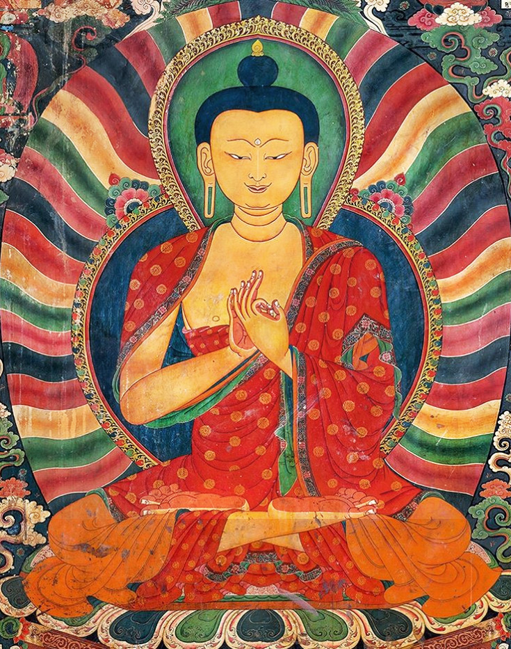
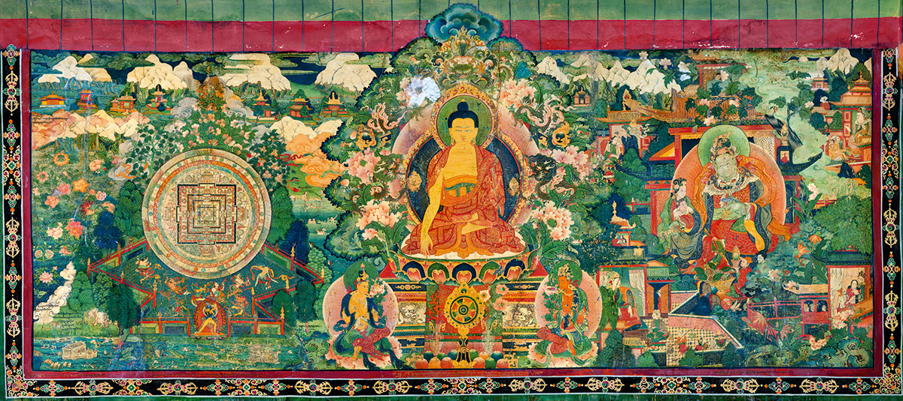
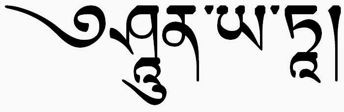

# La perfezione della saggezza {#sec-wisdom}

## Introduzione {.unnumbered}

Questo capitolo esamina il ruolo che la saggezza (prajñā) ha all'interno del percorso di sviluppo spirituale del bodhisattva. Per il buddismo, la saggezza (prajñā) -- ovvero la gnosi o intuizione della vera realtà delle cose -- è l'unico strumento valido che consente di evitare le insidie sulla via dello sviluppo spirituale. Ma che cosa sia prajñā non è immediatamente evidente e i dibattiti filosofici su questo punto si sono moltiplicati. Nei capitoli otto e none del Bodhicaryāvatāra, le preoccupazioni principalmente pratiche di Śāntideva lasciano il posto a discussioni relative a sottili punti filosofici. Tuttavia, per Śāntideva, la filosofia è posta al servizio della coltivazione dell'intuizione contemplativa: alla fine, le preoccupazioni pratiche e teoriche di Śāntideva risultano essere una cosa sola -- il dibattito filosofico non è mai separato dalle applicazioni pratiche.

Diverse caratteristiche del movimento Mahayana devono essere notate all'inizio per dare un senso al progetto di Śāntideva. Il Mahayana non era una scuola del buddismo, ma piuttosto una serie di interventi e innovazioni che spostavano l'enfasi, l'orientamento e l'aspirazione della tradizione precedente; questi interventi possono essere fatti risalire storicamente a scritture apocrife (Sūtra), come i Prajñāpāramitā Sūtra (Sutra della Perfezione della Saggezza) emersi intorno al primo secolo dell'era volgare che si sono sviluppati in una ricca letteratura di testi Mahayana.

Le nuove scritture non soppiantano del tutto i canoni precedenti, ma, tra gli aderenti alle idee Mahayana, ricevono uno status più elevato, mentre i materiali testuali precedenti sono spesso visti con sospetto, ovvero sono considerati come altamente problematici. Inoltre, il lavoro del filosofo del II secolo d.C. Nāgārjuna sulla vacuità è stato cruciale per lo sviluppo filosofico del Mahayana, comprese le trasmissioni del Buddismo in Cina e nel resto dell'Asia orientale, e, più tardi, in Tibet.

Le due innovazioni più importanti del Mahayana riguardano lo sviluppo dell'ideale del bodhisattva, in particolare la sua enfasi sulla compassione universale (mahākaruṇā), e il fatto che le idee filosofiche sulla vacuità vengono messe in primo piano. Entrambi questi temi sono centrali nel pensiero di Śāntideva.

Consideriamo per primo l'ideale del bodhisattva. Nel buddismo che gli studiosi moderni chiamano non-Mahayana o Theravada, il Buddha viene considerato come un esempio morale e come una guida lungo il percorso verso la liberazione. Il lungo viaggio del Buddha verso il risveglio, che ha richiesto innumerevoli vite, è istruttivo, ma generalmente non è considerato come un percorso che le persone comuni possono emulare. Invece, i praticanti non-Mahayana cercano di diventare degli arhat, ovvero persone liberate che però non raggiungono il livello del Buddha. Durante le sue vite precedenti, mentre praticava le perfezioni necessarie per scoprire il sentiero buddista, il Buddha era chiamato "bodhisattva", cioè buddha-in-formazione. Allontanandosi dal punto di vista Theravada, le scritture Mahayana suggeriscono che la vita del Buddha, incluso il suo lungo percorso come bodhisattva, può essere preso come esempio per tutti i praticanti.

Ciò che rende notevole il sentiero del bodhisattva è che non riguarda esclusivamente la liberazione, o il superamento dalla sofferenza della rinascita, il karma e la rimozione delle contaminazioni tossiche, caratteristiche queste del sentiero di purificazione e della libertà soteriologica dell'arhat. Tutti concordano sul fatto che ciò che il Buddha è stato in grado di fare non è stato solo la sua liberazione personale, ma è stato anche quello di scoprire la verità ultima delle cose, di insegnarla agli altri e, quindi, di salvare gli altri esseri senzienti. L'obiettivo di un bodhisattva, quindi, è la realizzazione delle perfezioni che favoriscono la scoperta delle verità ultima delle cose e la messa in atto delle pratiche concrete che contribuiscono alla liberazione degli esseri dalla sofferenza nel saṃsāra.

::: callout-note
Al termine pāramitā possono essere assegnati due significati. Come sostantivo indica quelle "virtù trascendenti" ovvero "non mondane" che chi vuole intraprendere il cammino del bodhisattva, e quindi realizzare lo stato di Buddha, deve sviluppare. Come aggettivo privo del diacritico nella ultima vocale, quindi pāramita, può essere compreso come composto da pāram, "oltre" e ita, "andato", quindi con il senso di colui che è "giunto alla riva opposta", ovvero al termine possiamo assegnare il significato di "sviluppo del percorso spirituale".
:::

Se l'obiettivo è diventare un Buddha (piuttosto che "solo" un arhat libero dal saṃsāra), allora le perfezioni diventano il sentiero -- soprattutto la compassione, che più di ogni altra perfezione caratterizza questo obiettivo superiore. Inoltre, il percorso diventa molto più lungo: sebbene sia concepibile diventare un arhat in una singola vita, il percorso del bodhisattva, modellato sulle innumerevoli vite passate del Buddha, si allunga considerevolmente. In quanto pensatore Mahayana, Śāntideva mira non al percorso di purificazione volto ad ottenere la liberazione individuale di un arhat, ma a questo ideale molto più grande che intende salvare tutti gli esseri.

La seconda grande innovazione del Mahayana è lo sviluppo degli insegnamenti della vacuità. La vacuità non era sconosciuta ai Theravada. Ma nei Prajñāpāramitā Sūtra e nell'opera di Nāgārjuna -- e per Śāntideva, sei secoli dopo -- la vacuità diventa la posizione filosofica fondamentale. Il discorso sulla vacuità utilizza argomentazioni epistemologiche per stabilire una comprensione di tutti i fenomeni come condizionati e condizionanti e, quindi, "vuoti" (śūnya) di essenze intrinseche, autonome e indipendenti. Nel promuovere la vacuità, i filosofi Madhyamaka si oppongono alle tradizioni dell'Abhidharma dell'India settentrionale che postulavano invece un'ontologia della realtà ultima e, nel Bodhicaryāvatāra, Śāntideva fa riferimento ad una lunga storia di ragionamenti metafisici ed epistemologici per smantellare tali visioni metafisiche. Questa discussione sulla vacuità, che viene riproposta nel Bodhicaryāvatāra, ha aperto un ampio dibattito, tra gli studiosi tradizionali e quelli moderni, sul significato della vacuità. Ci si è chiesti se il risultato di questo lavoro filosofico si traduce in una posizione sulla realtà ultima -- ovvero l'idea che tutte le cose sono vuote -- o se, alla fine, questo lavoro filosofico si limita "semplicemente" a smantellare tutte le posizioni teoriche, quali esse siano, inclusa la stessa vacuità.

## Le due verità

<!-- L'argomento del nono capitolo del Bodhicaryāvatāra è, specificamente, la prajñā, termine spesso tradotto "saggezza", "conoscenza superiore" o "discriminazione". In quanto tale, è la "Perfezione della Saggezza" (prajñāpāramitā), l'apice delle sei perfezioni del sentiero del bodhisattva ed è identificata come l'obiettivo dell'insight meditativo (vipaśyanā), lo strumento contemplativo del "vedere attraverso" che, unito alla tranquillità (śamatha), costituisce il cuore della meditazione buddista. Prajñā, come la descrive Śāntideva, corrisponde all'insegnamento della vacuità della tradizione Madhyamaka della filosofia buddista, e deriva da Nāgārjuna. Nāgārjuna è noto per la sua enfasi sulla "vacuità" (śūnyatā) dei fenomeni, ma il significato di questo concetto è stato oggetto di molteplici dibattiti. In questo capitolo cercheremo di chiarire il modo in cui Śāntideva comprende la nozione di śūnyatā. -->

Una distinzione chiave nel contesto Mahayana, che qui è rilevante, è la distinzione tra le "due verità" (satyadvaya), la verità "ultima" (che descrive come stanno veramente le cose; paramārtha-satya) e "convenzionale" ("relativa" o "superficiale"; saṃvṛti-satya). Da un lato la realtà assoluta, "il silenzio dei santi", «non comunicabile ad altri, pacificata, non dispiegata dallo spiegamento del pensiero discorsivo, priva di rappresentazioni soggettive» (Madhyamakakārikā, XVIII, 9), e dall'altro lato il vario immaginare discorsivo, concepito come una specie di ignoranza innata, impotente a cogliere la realtà cosi com'è, ma, se bene usato, valido strumento, l'unico, anzi, che abbiamo, per raggiungere la vera realtà.

Nel suo *Trattato Fondamentale sulla Via di Mezzo* (Mūlamadhyamakakārikā), Nāgārjuna afferma:

> Il Dharma che viene insegnato dai Buddha,\
> Si basa completamente su due livelli della verità:\
> Il livello convenzionale della verità mondana,\
> E il livello della verità ultima.\

E Śāntideva ripete:

> IX:2. Vi sono due verità, la verità relativa e la verità assoluta. La verità assoluta trascende il dominio della mente. La mente è la realtà relativa.

<!-- Secondo l'interpretazione di Prajñākaramati, "Saṃvṛti è così chiamato perché con esso la comprensione di ciò che è così com'è è nascosta, o occlusa... Ignoranza, stupore ed errore sono sinonimi \[di saṃvṛti\]. Poiché l'ignoranza, essendo l'imputazione delle"forme delle cose inesistenti \[a ciò che esiste\] ... è saṃvṛti". Così, per Prajñākaramati "occultamento" ha la precedenza su "convenzionale" come senso primario di saṃvṛti. -->

La discussione sul significato di ciò che è "ultimo" (paramārtha) rivela una mescolanza di due temi che sono stati associati a questo termine sin dall'antichità. Da un lato, seguendo una tradizione stabilita nell'Abhidharma (cioè, la prima scolastica buddista), "ultimo" è ciò che è in definitiva reale, è ciò che "resiste" a qualsiasi procedura analitica di riduzione. Per Vasubandhu, filosofo del V secolo, questo significa che "ultimo" corrisponde agli atomi fisici e/o fenomenici, o dharma, di cui è costituita la realtà (fisica e fenomenica). Per i pensatori Madhyamika, tuttavia, l'analisi non deve "arrestarsi" davanti a tali "atomi", non ulteriormente riducibili. Invece, l'analisi deve continuare fino a rivelare la contingenza radicale di tutti i fenomeni condizionati, ovvero la loro vacuità. In questo secondo senso, il significato di paramārtha corrisponde a "assenza dell'essere intrinseco" di tutti i dharma, ovvero la vacuità.

<!-- La discussione di Prajñākaramati sul significato di ciò che è "ultimo" (paramārtha) rivela una mescolanza di due temi che sono stati associati a questo termine sin dall'antichità. Da un lato, seguendo una tradizione stabilita nell'Abhidharma (cioè, la prima scolastica buddista), "ultimo" è ciò che è in definitiva reale, è ciò che "resiste" a qualsiasi procedura analitica di riduzione. Per Vasubandhu, filosofo del V secolo, questo significa due cose: ciò che è "ultimo" corrisponde agli atomi fisici e/o fenomenici, o dharma, di cui è costituita la realtà (fisica e fenomenica). Per Prajñākaramati pensatore Madhyamika, tuttavia, l'analisi "arrestarsi" davanti a tali "atomi" non ulteriormente riducibili. L'analisi deve continuare fino a rivelare la contingenza radicale di tutti i fenomeni condizionati, ovvero la loro vacuità. In questo secondo senso, il significato di paramārtha corrisponde a "assenza dell'essere intrinseco" di tutti i dharma, ovvero la vacuità. -->

Ma, se i fenomeni che abbiamo davanti agli occhi, e che il nostro pensiero discorsivo descrive, non hanno il carattere di "separatezza" e "indipendenza" che volevamo attribuire loro, allora che valore può essere assegnato al pensiero discorsivo? Il valore del nostro pensiero non sta nella sua realtà (esso è, per definizione, irreale) ma nella sua efficacia pratica. Sia l'acqua reale, sia l'acqua di un miraggio, nella misura che sono immagini discorsive, sono ambedue egualmente insussistenti, prive di natura propria, vuote. Questa loro vacuità non toglie tuttavia che la prima immagine sia praticamente efficiente - nel senso che, raggiunta, è in grado di dissetare, ecc. - e l'altra, viceversa, è delusiva. L'errore ha due facce, di cui l'una positiva, utile, e l'altra mera fonte di delusione e, da questo punto di vista, doppiamente erronea.

Il primo compito di chi cerca la verità è quello di distinguere fra errore utile ed errore disutile o dannoso. Dal punto di vista religioso, il più utile "errore epistemico" è la compassione. La compassione -- la bontà effettiva e instancabile, il senso di simpatia e di uguaglianza verso tutte le creature che soffrono -- è "l'errore epistemico" che deve necessariamente fare il Bodhisattva, la "creatura in risveglio", ovvero colui che ha fatto voto di aiutare gli altri a raggiungere l'intuizione della vacuità (prajñā).

Il seguace Mahayana si muove di continuo fra due diversi piani di realtà, fra due verità, fra il fine e il mezzo, fra la "gnosi" e la "compassione". La dimenticanza della gnosi, della vacuità, lo espone al pericolo dell'eternalismo (śāsvatavāda) -- cioè, l'idea che le cose abbiamo un'intrinseca essenza -- e, viceversa, se perde di vista la compassione, si rizza immediatamente contro di lui il demone del nichilismo (ucchedavàda) -- ovvero, l'idea che nulla esiste; se ciò è vero, qualunque motivazione etica svanisce. Dal punto di vista iconografico, questi due aspetti del Mahayana prendono forma personale e concreta nelle due figure mitiche di Mañjuśrῑ e di Avalokiteśvara. Mañjuśrῑ, che tiene nella destra la spada che recide avidyā (la nescienza) e nella sinistra il libro che racchiude ogni conoscenza, è la gnosi, la vacuità, il fine. Avalokiteśvara, il "Signore che guarda pietosamente", è, com'indica il nome, l'incarnazione della compassione infinita dei bodhisattva, di quest'"errore epistemico" consapevole e volontario, che è l'unica via che porta alla gnosi.

La distinzione fra gnosi e compassione è anch'essa di ordine puramente empirico, e, in realtà, esse sono una cosa unica. Dice Advayavajra, un autore del X secolo

> La diversità fra la vacuità e la compassione è simile a quella della lampada e della luce. L'unità fra la vacuità e la compassione è simile a quella della lampada e della luce. La vacuità non è diversa dalle cose né v'è cosa senza la vacuità, in quanto che cose e vacuità sono due idee inseparabilmente connesse, né più né meno che l'idea di realtà condizionata e l'idea di impermanenza.

L'affermazione della realtà vera non implica l'eliminazione della realtà relativa. La realtà vera non può essere, anzi, concepita indipendentemente dalla realtà relativa. La realtà, il nirvāna, secondo Nāgārjuna, non è diversa dalla realtà relativa, dalle cose del mondo, ma consiste semplicemente nella conoscenza: è la visione del mondo così come veramente è, cioè a dire, consiste nella rimozione dell'illusione che ce lo fa sembrare doloroso e insufficiente. Il nirvāna non è altro che la piena conoscenza (parijñāna) dell'esistenza fenomenica.

> Tra la trasmigrazione e il nirvāna non c'è la più piccola differenza. Tra il nirvāna e la trasmigrazione non c'è la più piccola differenza. Quello che è il confine del nirvāna, questo è anche il confine della trasmigrazione. Tra essi due non c'è neppure la minima diversità. (Madhyamakakārikā, XXV, 19-20.)

Il tema di un'analisi che, quando viene spinta agli estremi, non trova un fondamento ultimo, è associato ad un secondo tema, quello del carattere finale, ovvero del fine, del percorso soteriologico: la meta finale è l'"abbandono delle afflizioni". Poiché paramārtha, infatti, può significare, non solo "significato ultimo" in senso analitico, ma anche paramapuruṣārtha, cioè il "termine più alto dell'uomo", ovvero la liberazione (mokṣa) \[dalla sofferenza\].

Nell'interpretazione di Prajñākaramati, dunque, il risultato ultimo dell'analisi dei fenomeni non è solo quello di metterne in luce la necessaria vacuità; è anche quello di illustrare il fatto che il risultato ultimo, o di maggior valore, dell'attività umana è la liberazione delle afflizioni. La liberazione delle afflizioni, dunque, risulta intrinsecamente legata alla comprensione della vacuità dei fenomeni.

## La liberazione attraverso la realizzazione della vacuità

Per i buddisti Mahayana, come Śāntideva, la conoscenza non è un fine in se stesso: non è tanto la conoscenza che è in gioco, quanto la rimozione della sofferenza che dipende da tale conoscenza. Il tipo di conoscenza che consente l'eliminazione della sofferenza si chiama prajñā. Questo termine è spesso tradotto come "saggezza", "conoscenza superiore" o "discriminazione", ma sembra essere più vicino al significato di "intuizione", "conoscenza non discriminante" o "apprensione intuitiva". La prajñā è la "conoscenza/saggezza suprema" che consente di raggiungere in modo diretto il risveglio spirituale (bodhi). La saggezza, prajñā, è anche detta "madre di tutti i Buddha", perché la saggezza consente il conseguimento della Buddità. La "conoscenza/saggezza suprema" si ottiene, non solo tramite lo studio e la riflessione intellettuale, ma piuttosto per mezzo della pratica meditativa. La prajñā pone fine al "fallimento epistemico", ovvero ad avidyā (la nescienza), che causa la sofferenza (dukkha).

> IX:1. Chi desidera la cessazione del dolore, deve dunque suscitare in sé la gnosi.

Il percorso del bodhisattva conduce all'autentica cognizione della realtà così come veramente è (yathābhūta), ovvero alla visione della vacuità.

::: callout-note
yathābhūta: il modo in cui le cose sono in realtà; un termine usato per designare la vera natura dei fenomeni, la realtà delle cose così come sono in sé stesse prima della loro organizzazione deformata dal nostro pensiero o l'esperienza diretta non mediata dalla sovrapposizione di concetti falsi come l'idea di un'identità o di un sé intrinseco e permanente (ātman). In quanto tale, il termine è usato in Mahāyāna come sinonimo di vacuità (śūnyatā), attualità (tattva), talità o quiddità (tathatā) e così via.
:::

### La corda e il serpente

L'esempio classico per illustrare l'eliminazione della nostra sofferenza attraverso lo sviluppo della saggezza è l'esempio della corda e del serpente. Se c'è una corda che è avvolta in una stanza buia e guardiamo la corda senza sapere che è una corda, possiamo scambiarla per un serpente. Se pensiamo che sia un serpente, allora andiamo nel panico, ci spaventiamo e siano angosciati. L'idea sbagliata è la causa della nostra sofferenza ed è essa stessa causata semplicemente dalla nostra ignoranza. Ignoriamo la vera natura della corda e crediamo che sia un serpente. La soluzione per eliminare la nostra angoscia è sapere che ciò che abbiamo visto è davvero una corda e che la nostra convinzione che fosse un serpente era solo un'illusione. È attraverso questa saggezza di vedere la vera natura della corda che, in questa situazione, possiamo eliminare la nostra sofferenza. Allo stesso modo, tutte le grandi sofferenze e i problemi della nostra vita derivano dal non conoscere la natura dell'illusione che è la nostra percezione del mondo.

### La prajñā nel Bodhicaryāvatāra

Śāntideva afferma esplicitamente, fin dall'inizio del Bodhicaryāvatāra, che la gnosi della vacuità, la quale porta a vedere le cose così come sono, eccede le abilità del nostro intelletto razionale:

> IX:2. La verità assoluta trascende il dominio della mente. La mente è la realtà relativa.

> Il nostro scopo è qui eliminare la causa del dolore: il pensiero che i fenomeni abbiano una vera esistenza.

È la reificazione della realtà, ovvero la convinzione che i fenomeni siano dotati di svabhāva, la causa della sofferenza. Se consideriamo gli enti (bhava) come reali, cioè dotati di un'esistenza indipendente, allora finiamo per rimanere attaccati ad essi, anche se non sono altro che nostre proiezioni, reificazioni del flusso in continuo cambiamento della nostra esperienza fenomenica.

::: callout-note
Svabhāva significa letteralmente "natura intrinseca", "essere proprio" o "divenire proprio". È la natura intrinseca, la natura essenziale o l'essenza degli esseri e dei fenomeni. Tutte le scuole Mahāyāna rifiutano l'esistenza di una tale natura intrinseca e sostengono che tutti i fenomeni sono privi di qualsiasi tipo di svabhāva. Secondo l'Abhidharma, lo svabhāva era l'unico e inalienabile 'segno' o caratteristica per mezzo del quale le entità potevano essere differenziate e classificate. Identificando lo svabhāva di un'entità si potrebbe produrre una tassonomia degli esistenti reali. Ad esempio, lo svabhāva del fuoco è stato identificato come calore e lo svabhāva dell'acqua è stato definito come fluidità. Così le scuole dell'Hīnayāna, pur negando un sé delle persone, accettarono nondimeno la realtà sostanziale di quegli elementi (dharma) che componevano il mondo in generale, inclusi cinque skandha del soggetto individuale. A partire da Nāgārjuna, il Mādhyamaka mina questo insegnamento negando la realtà sostanziale non solo del sé (ātman) ma di tutti i fenomeni. Tutte le entità sono quindi viste come simili per la mancanza di un modo d'essere discreto o dell'essenza del sé (svabhāva), e per la condivisione invece dell'attributo comune della vacuità (śūnyatā).
:::

Secondo Śāntideva, il superamento della reificazione del reale può essere ottenuto solo attraverso la realizzazione della vacuità (śūnyatā), ovvero, con la cessazione del pensiero discorsivo.

> IX:41. La liberazione si ottiene per la vita delle Sante Verità; a che pro' dunque questa tua teoria dela vacuità? Ma perché, secondo la scrittura, (io ti rispondo) il risveglio, senza questa via, non si ottiene.

Si noti che, in questi versi, Śāntideva non introduce śūnyatā mediante una giustificazione di tipo ontologico, ma mediante l'autorità delle Scritture, ovvero, potremmo dire, in termini pragmatici, sottolineandone l'efficacia. In seguito Śāntideva afferma che la mente è, sì, in grado raggiungere momenti di purezza anche senza la realizzazione della vacuità; ma così facendo inevitabilmente finisce per il ricadere nei normali stati di nescienza; ovvero, senza la realizzazione della vacuità, la mente continua ad oscillare, al di fuori del controllo dell'individuo, tra nescienza e purezza.

> IX:49. Senza al vacuità, il pensiero è legato e si riproduce continuamente, così come accade nell'estasi detta incosciente. Perciò bisogna coltivare la vacuità.

In altre parole, Śāntideva afferma che non è sufficiente accontentarsi della capacità di entrare negli stati superiori della coscienza; bisogna anche raggiungere un grado più alto di saggezza (prajñā). Abbiamo visto che prajñā corrisponde alla realizzazione della vacuità, ovvero alla capacità non cadere più vittime dell'abitudine che ci porta ad attribuire un'esistenza intrinseca a quelle che sono solo le nostre proiezioni, ovvero alle categorie. Nelle parole di Nāgārjuna:

> Quando cessa la nescienza (avidyā), non sorgono più le formazioni mentali (saṃskāra) --- (MMk. 26.11a)

::: callout-note
Saṃskāra è un termine difficilmente traducibile. Letteralmente significa "coefficienti" e si riferisce alle impressioni del karma passato, alle potenze o formazioni karmiche che costituiscono gli elementi responsabili della vita presente, in un cattivo o buono destino, secondo le azioni passate.

Questo termine significa anche 'ciò che è stato messo insieme' e 'ciò che mette insieme'.

-   Nel primo senso (passivo), saṃskāra si riferisce ai fenomeni condizionati in generale ma specificamente a tutte le "disposizioni" mentali. Queste sono chiamate "formazioni volitive" sia perché si formano come risultato della volizione sia perché sono cause del sorgere di future azioni volitive. Le traduzioni di saṃskāra in questo primo senso della parola includono "cose condizionate", "determinazioni" e "formazioni" (o, in particolare quando ci si riferisce a processi mentali, "formazioni volitive", "costruzioni mentali", "fabbricazioni", "costrutti mentali").
-   Nel secondo senso (attivo) della parola, saṃskāra si riferisce al karma che porta al sorgere condizionato, all'origine dipendente. Le traduzioni di saṃskāra in questo secondo senso della parola includono "coefficienti", "fattori condizionati", "cose condizionate", "determinazioni", "formazioni karmiche".

Il termine saṃskāra compare nel Mahāparinibbāna Sutta. Le ultime parole del Buddha, secondo il Mahāparinibbāna Sutta, furono "Discepoli, questo dichiaro: tutte le *cose condizionate* (saṃskāra) sono transienti -- lottate instancabilmente per la vostra liberazione". (Pali: *handa'dāni bhikkhave āmantayāmi vo, vayadhammā saṅkhārā appamādena sampādethā ti.*). Il Buddha insegna dunque che tutti i saṃskāra sono impermanenti (anitya) e privi di essenza. Poiché sono impermanenti non possiamo fare affidamento su di essi. Non comprendere ciò è la nescienza (avidyā); invece, comprendere l'impermanenza è la saggezza (prajñā).
:::

Śāntideva illustra un duplice beneficio che deriva da prajñā, ovvero dalla realizzazione della vacuità: in primo luogo, prajñā consente di agire con compassione; in secondo luogo, prajñā consente la rimozione delle contaminazioni emotive. Solo la saggezza della vacuità (prajñā) e i "mezzi abili" (upāya) dei bodhisattva consentono di rimuovere completamente le oscurazioni mentali:

> IX:52. Indugiare e dimorare nel saṃsāra, liberato da ogni brama e da ogni paura, per ottenere il bene di chi soffre a causa dell'ignoranza: tale è il frutto che la vacuità produce.\

> IX:54. Le varie obiezioni contro la tesi della vacuità sono logicamente insostenibili. Quindi bisogna, senza esitazioni, coltivare la vacuità.

> IX:53. Grazie alla vacuità, noi evitiamo le due estremità dell'attaccamento e del terrore. L'unica cosa che trattiene ancora il bodhisattva nell'esistenza, è la sua intenzione - dovuta a un utile offuscamento - di guarire le creature afflitte dai dolori. Questo è il frutto della vacuità.

::: callout-note
Un punto di vista simile, laddove la liberazione dal saṃsāra (mokṣa) è messa in relazione con il superamento della dimensione concettuale, è espresso nel Mahāyāna-Uttaratantra Shastra di Arya Maitreya:

> La libertà dall'attaccamento consiste nelle\
> due realtà della cessazione e del sentiero.

Tra le sei qualità che caratterizzano il dharma, le prime tre qualità (essere inconcepibile, libero dal duale e non concettuale) spiegano la *realtà della cessazione*. Pertanto, dovrebbe essere compreso, ci dice Maitreya, che la libertà dall'attaccamento consiste nell'essere inconcepibile, libero dal duale e non concettuale. Le restanti tre qualità (essere puro, rendere manifesto ed essere un fattore riparatore) spiegano la *realtà del sentiero*. Pertanto, la libertà dall'attaccamento corrisponde alla realtà della cessazione; la causa della libertà dall'attaccamento è invece la realtà del sentiero. Insieme, la realtà della cessazione e la realtà del sentiero spiegano che

> il dharma libero dall'attaccamento\
> È caratterizzato dalle due realtà della purificazione.

Per ciò che concerne le *oscurazioni* mentali, Maitreya dice nel Mahāyāna-Uttaratantra:

> L'ostilità verso il dharma, la visione che esiste un'entità del sé,\
> La paura delle sofferenze del saṁsāra\
> E disprezzo per il beneficio delle creature\
> Sono le quattro oscurazioni. \[ 1:32\]\
:::

## Anātman

La nozione della presenza di un sé in ogni cosa nel mondo è stata alimentata dalla religione e dalla cultura fin dagli albori della storia umana. Secondo le credenze tradizionali, è l'essenza o il sé che funziona come il fondamento di qualsiasi entità corporea o immaginabile. Il sé plasma ogni cosa (sia una persona, un animale, un oggetto o anche un'idea) come ciò che è, determinando come si presenta quando viene incontrata. In breve, si crede che il sé conferisca ad ogni cosa "identità e autonomia individuali" (Glynn 2011:197).

Sebbene il nostro modo consueto di pensare rafforzi in noi la convinzione della presenza di un sé "individuale" e autonomo in ogni creatura e in ogni cosa, e sebbene la nostra esperienza diretta del mondo fenomenico spesso ci inviti a credere in questa idea, il buddismo, in particolare la scuola Mādhyamika, ha proposto un punto di vista diametralmente opposto. Sfidando il punto di vista popolare che individua un'essenza intrinseca in ogni creatura e in ogni cosa, il buddismo "ritiene la nozione di un soggetto identico a sé stesso e che sussiste in modo indipendente sia un'illusione" (Glynn 2011:197). Il buddismo propugna invece una "consapevolezza dell'inessenza delle cose" (Misra, qtd. in Magliola 1984: 95). Ogni persona, cosa o idea, spiega il buddismo, è priva di un sé o di un'identità intrinseca. L'apparente sé di qualcuno/qualcosa invece di essere "immutabile" o "eterno" è effimero, esiste solo "mendiante l'essere in connessione" con altri fattori (Zhang 2011: 110). Dato che, secondo il buddismo, nessuna creatura/cosa è dotata di un sé persistente, è necessario riconoscere śūnyatā, cioè la vacuità o "l'assenza di essenza", come l'unica realtà del mondo.

È importante distinguere, in questo contesto, la nozione di "sé", ovvero un essenza ontologicamente stabile e persistente, dalla nozione di "persona". Nessuno di noi pensa ad una persona, o alla personalità, come a un qualcosa di permanente, unico e indipendente da tutto il resto. Ma non è questo che viene negato dal buddhismo. L'idea che esistono le persone, la personalità o l'ego, non viene messo in discussione. In termini buddhisti, la nozione di "persona" viene descritta, ad esempio, nei termini dei cinque skandhas. La domanda cruciale non è se oppure non la persona, la personalità o l'ego possa cambiare. Qualsiasi analisi razionale ci mostra che questo succede -- e nessuno ha alcun dubbio di questo. La domanda importante è: perché allora ci comportiamo emotivamente come se le persone siano dotate di un "sé" permanente, unico e indipendente? Quindi, quando in questo contesto, si fa riferimento al sé, è molto importante ricordare che è una risposta emotiva quella che il buddhismo sta esaminando. Quando noi rispondiamo agli eventi che ci accadono, come se possedessimo un "sé", per esempio quando ci sentiamo feriti o offeso, dovremmo chiederci: *chi o cosa esattamente si sta sentendo ferito o offeso?*

Quando i meditatori cercano di capire che cosa o chi sia questo "sé", non riescono a trovarlo. Poi gradualmente, molto gradualmente, si rendono conto loro che la ragione per cui non riesco a trovarlo è che non c'è, e non c'è mai stato. C'è una tremenda resistenza emotiva che ostacola questa realizzazione, pertanto, ci vuole molto tempo nella meditazione per riuscire ad accettare questo. Ma quando finalmente succede, c'è un rilascio immediato di tensione e sofferenza. La causa di dukkha è scomparsa. La causa era un attaccamento mentale a qualcosa che non c'è mai stato -- il sé è solo un'illusione cognitiva.

Realizzare il non sé è il primo passo per realizzare la vacuità di tutti i fenomeni. Ecco perché i primi insegnamenti del Buddha riguardano i Tre Segni dell'Esistenza, cioè sofferenza, impermanenza e non-sé.

Nāgārjuna, un importante pensatore buddista dell'India del II secolo e fondatore della scuola Mādhyamika, è noto per avere detto: "nessun fenomeno ha una natura essenziale o intrinseca, qualunque cosa esso sia" (Nāgārjuna 2002: 95). Le parole di Nāgārjuna indicano il fatto che a nessuna cosa nel mondo fenomenico, sia essa qualcosa di corporeo o solo un'idea, possiamo attribuire un'essenza (una caratteristica ontologica persistente). Il mondo che funge da fondamento della nostra conoscenza è non sostanziale -- se vogliamo rappresentarlo accuratamente, non possiamo descriverlo nei termini di entità solide e immutabili (atomi). Più vicina alla concezione buddhista è la fisica quantistica, la cui descrizione dei fenomeni fisici non è basata su un qualche insieme di "sostanze", ma si riduce invece ad un insieme di equazioni, di "propensioni" basate sulle leggi della probabilità.

La non-sostanzialità o non-essenzialità del mondo indica la naturale mancanza di sé di ogni dhárma (fenomeno). Non possedendo un sé, ogni dhárma diventa śūnya, cioè vuoto. Kumārajīva, un monaco buddista cinese del IV secolo, ha affermato: "tutti i dhárma sono vuoti" (Zhang 2011: 111). Secondo il buddismo, la mancanza dell'essenza o del sé del mondo è l'unica verità possibile. Ji Zang (549 - 623) dice: "La verità ultima ... è ... rendersi conto che non c'è alcun sé \[nessuna essenza\]" (Zhang 2011: 107, 110). Avendo realizzata la vacuità di ogni fenomeno, cioè una volta che śūnyatā sia stata accettata come l'unica verità possibile, si ottiene il Risveglio.

::: callout-note
Questo non vuol dire che tutti fisici quantistici siano "illuminati". Anche ammettendo che śūnyatā possa essere messa in relazione con la fisica quantistica, una cosa è la comprensione razionale, un'altra cosa è l'esperienza diretta in prima persona. Inoltre, la nozione di śūnyatā è inserita in una struttura di credenze che ha un obiettivo soteriologico; la fisica quantistica no.
:::

### La metafora del sogno

Per illustrare la vacuità il Buddha usava spesso l'esempio del sogno. Questo è un esempio che bene illustra i due piani della realtà, quello relativa e quello assoluto. In sogno facciamo l'esperienza di una persona con un corpo e una mente che vive in un mondo di oggetti nei confronti dei quali proviamo attrazione o repulsione. Finché non ci rendiamo conto che è solo un sogno, consideriamo tutte queste cose come reali e, a causa loro, ci rallegriamo o ci rattristiamo.

Ad esempio, possiamo sognare di essere sbranati da una tigre. Sul piano della verità assoluta, nessuno viene sbranato da una tigre, ma nella dimensione onirica possiamo davvero soffrire come se venissimo effettivamente attaccati da questo animale feroce. La sofferenza nasce dal fatto che ci identifichiamo con la persona che è protagonista del sogno. Ma se ci rendiamo conto che è solo un sogno, anche se continuiamo a sognare, possiamo pensare: 'Non c'è nessun problema; è solo un sogno; non sta realmente accadendo.' Possiamo dunque dire che la persona che soffre nel sogno è una manifestazione temporanea che dipende dalla condizione del nostro non essere consapevoli che si tratta solo di un sogno. Una tale persona "onirica" non è dotata di un "sé" sostanziale, ovvero non ha un carattere permanente, unitario e indipendente.

Comprendere razionalmente questa metafora, tuttavia, non basta per liberarci dall'abitudine, così fortemente radicata in noi, che ci porta a considerare la nostra mente e il nostro corpo come se fossero un "sé" unico, permanente e indipendente. È solo con una lunga e opportuna pratica di meditazione che è possibile superare questa illusione cognitiva. Solo a quel punto emerge la realizzazione del non-sé e quell'esperienza ci libera da dukkha.

La motivazione principale del buddismo non risiede ad un livello teorico, ma esperienziale. In particolare il buddhismo si occupa dell'esperienza della sofferenza. Ciò che il Buddismo ha scoperto è che l'esperienza della sofferenza è sempre associata a forti emozioni"attaccamento a un vago senso di "sé". Quindi il Buddismo rivolge la sua attenzione a questa forte risposta emotiva associato al senso del "sé" e si chiede: che cos'è quel "sé" viene esperito nella sofferenza?

Per svolgere questa indagine in modo sistematico i pensatori buddisti hanno organizzato l'esperienza in una serie di categorie. Uno di questi insiemi di categorie è quello dei cinque skandha, che letteralmente significa "aggregati": forma, sentimento, percezione, costruzioni mentali e coscienza.

L'analisi meditativa ci fa capire che nessuno di questi skandha ha un'esistenza fissa e immutabile, né ci sono delle relazioni fisse tra i vari skandha. Dunque, alla fine della nostra analisi dobbiamo giungere alla conclusione che il sé è semplicemente un concetto vago e "di convenienza", che semplicemente "solidifica" ora qui e ora un flusso di esperienze sempre mutevole. Il buddismo non ci dice che non siamo "una persona" o che non abbiamo un "sé". Ci dice che se guardiamo attentamente al modo in cui soffriamo, ci rendiamo conto che le nostre risposte emotive dipendono dall'implicita assunzione che esiste un "sé" permanente, unico e indipendente, anche se qualunque tipo di analisi, meditativa o razionale, rivela che un "sé" avente tali caratteristiche non può essere trovato.

Quando meditiamo sulla vacuità degli skandha, li vediamo semplicemente come sono, ovvero come entità che non sono permanenti, non sono singole e non sono indipendenti. Una volta che ci rendiamo conto, come nel sogno, che la costruzione mentale di un "sé" permanente, singolo e indipendente non corrisponde a quello che noi veramente siamo, la sofferenza svanisce (così come, sapendo di sognare, non si soffre più dell'attacco della tigre). In tali circostanze, la mente può riposare pacificamente in uno spazio vuoto, con perfetta fiducia e sicurezza. La realizzazione della vacuità dissipa le nostre ansie e pacifica la nostra mente.

### Dall'illusione del "sé" alla sofferenza

Il nostro attaccamento emotivo nei confronti dell'illusione del "sé" conduce alla nozione di "altro". Dall'aggrapparsi al "sé" nascono i desideri, l'odio e la delusione. Questi stati mentali malsani motivano comportamenti disfunzionali e sono responsabili dei risultati di tali comportamenti, ovvero di sofferenze di vario tipo. Quindi, l'unico modo per rimuovere la sofferenza è il superamento dell'ignoranza (avidyā) che promuove l'attaccamento ad un "sé" illusorio. La comprensione (prajñā) che non esiste un "sé" permanente, singolo e indipendente corrisponde alla realizzazione della vacuità.

Questo obiettivo, ovvero la rimozione della sofferenza personale (nirvana), è l'obiettivo degli Shravaka (uditori) del veicolo Theravāda. Il Mahayana nota come l'obiettivo dello Shravaka non è quello di rimuovere la sofferenza di tutti gli esseri, né quello di raggiungere la Buddità. Il suo obiettivo è relativamente più modesto. È semplicemente la rimozione della causa della propria sofferenza personale. Anche questo primo obiettivo, però, richiede una realizzazione piuttosto profonda della vacuità. Una tale realizzazione corrisponda a ciò che viene maturato dai Bodhisattva dal primo al sesto bhūmi (livello). Pertanto si può dire che la realizzazione della vacuità del non-sé rappresenta solo il primo passo del sentiero Mahāyāna. Per il Mahāyāna, infatti, l'obiettivo non è solo la rimozione della sofferenza personale, ma la rimozione della sofferenza di tutti gli esseri. Questi brevi accenni fanno capire come, nella tradizione buddista, la realizzazione della vacuità si può manifestare a vari livelli, e che i livelli più avanzati della prajñā appartengono solo ai Bodhisattva che si trovano ad uno stadio avanzato di maturazione spirituale.

## La coproduzione condizionata

Ma come è stata compresa precisamente, nel buddhismo, la "realizzazione della vacuità"? Come abbiamo già detto, affermare che "tutti i dhárma sono vuoti", non significa dire che non esistono. Nāgārjuna afferma:

> Qualunque cosa sia sorta in modo dipendente, la chiamiamo vacuità, (MMc. 24:18a)

ovvero, nelle *Parole chiare* di Candrakīrti (c. 600 -- c. 650 CE):

> La coproduzione condizionata, questa e non altro noi chiamiamo vacuità. La vacuità è una designazione metaforica. Questo e non altro è il Cammino di mezzo. (24:18)

A differenza del significato convenzionale di vacuità, śūnyatā nel buddismo non indica il nulla. Secondo il buddismo, una cosa è śūnya, cioè è priva di un "sé", a causa della sua origine relativa o "dipendente" (pratītya-samutpāda). In altre parole, secondo il buddhismo non c'è un essenza o un sé trascendentale poiché qualunque cosa, per esistere, dipende sempre da fattori diversi da se stessa. Nelle parole di Derrida, tutto ciò che si vede o si conosce porta sempre "la traccia" o il segno (1976: 75) di "ciò che non è ... ciò che assolutamente non è" (1973: 143). Ogni cosa, dunque, necessariamente *continuamente* cambia in seguito alla mutazione dei fattori da cui dipende. Quindi, realizzare śūnyatā significa conoscere la natura effimera di qualunque fenomeno, a causa della dipendenza di ciascun fenomeno da altri fenomeni. Per dirla diversamente, si è consapevoli della verità del mondo solo quando si comprende che "le cose non sono intrinsecamente reali" ma "esistono solo in relazione ad altre cose" (Mabbett 2011:26). Riprenderemo, da un punto di vista più "concreto", quest'idea del carattere "relazionale" dei fenomeni nel @sec-vimalakirti.

Secondo Khenchen Thrangu, riconoscere la natura inter-dipendente dei fenomeni è simile all'idea della relatività. Se siamo in piedi su una collina, la collina su cui ci troviamo è "qui" e la collina che vediamo in lontananza è la collina "laggiù". Ma se andiamo sull'altra collina, la collina su cui ci troviamo ora è la collina "qui" e la collina su cui stavamo prima è la collina "laggiù". Allo stesso modo, le cose che si basano sull'inter-dipendenza con altre cose non hanno una natura intrinseca, ma dipendono sempre dalle circostanze. In altre parole, sono costrutti mentali come grande/piccolo, buono/cattivo, chiaro/scuro, ecc. -- ovvero, dipendono dal punto di vista.

La consapevolezza dell'origine dipendente dei fenomeni ci libera dall'attaccamento all'essenza, cioè a un sé trascendentale. Secondo il buddhismo, la realizzazione del carattere transiente del mondo fenomenico ci libera dalle afflizioni, in quanto le afflizioni sono sempre, in un modo o nell'altro, il risultato di un attaccamento all'essenza di qualcosa, e derivano dall'erronea concezione di un'essenza immutabile. "La sofferenza nasce dal fatto che le persone si 'aggrappano' o si 'attaccano' a oggetti o idee come se fossero dotati di un essenza immutabile" (Zhang 2011: 110). Di conseguenza, l'alterazione della natura apparentemente immutabile degli oggetti e/o delle idee dell'attaccamento produce un senso di perdita. Un individuo illuminato, consapevole dell'origine dipendente di ogni fenomeno, è invece libero da queste sofferenze. Una tale persona non manca mai di vedere che "l'identità è costantemente in procinto di essere creata senza che sia mai possibile chiamarla un'identità" (Parco 2011: 18). Questa mancanza di esistenza intrinseca è, appunto, la "vacuità". La dottrina Mādhyamika, a cui si richiama Śāntideva, presume che tutto, inclusi i nostri stati mentali, sorga in modo dipendente. L'idea che ogni fenomeno, per sua stessa natura, dipende sempre, comunque e necessariamente da altri fenomeni, nega dunque la possibilità di un "sé" ontologicamente immutabile.

Questa è la dottrina della pratītya samutpāda, ovvero la "coproduzione condizionata", detta anche "originazione interdipendente", o "genesi dipendente". Comprendere pratītya-samutpāda (e, in parallelo, śūnyatā) consente di "cessare l'ipostatizzazione", ovvero consente di liberaci dalla reificazione delle nostre proiezioni mentali. E insegnare questa verità ultima a coloro che continuano a credere alla realtà delle proprie proiezioni mentali è lo scopo ultimo di Śāntideva:

> IX:167. Quando, a queste creature torturate dal fuoco del dolore, quando potrò portare lenimento e pace colle piogge di felicità, prodotte dalle nubi dei miei meriti? Quando, a coloro che credono alla realtà delle cose, quando, appoggiandomi sulla verità relativa, potrò insegnare la vacuità? E d'insegnare con cura l'importanza di una provvista di meriti spirituali, non contaminata, s'intende, da nessuna nozione di realtà?

Ma come si può ottenere l'obiettivo che Śāntideva si pone? Il Bodhicaryāvatāra può essere letto in molti modi.

Secondo Amber Carpenter (2019), il Bodhicaryāvatāra fa parte di quel genere letterario detto *protrèttico* (o protrèptico) \[dal gr. προτρεπτικός, der. di προτρέπω «promuovere, stimolare»\], ovvero un genere letterario le cui opere tendono a esortare, a stimolare. Il Bodhicaryāvatāra ci esorta a trasformare noi stessi in modo tale da giungere ad un nuovo modo di vedere la realtà. Questo ri-orientamento cognitivo non si ottiene, secondo Śāntideva, all'improvviso e tutto in una volta, ma piuttosto mediante una lunga pratica: lo scopo del Bodhicaryāvatāra è proprio quello di guidarci in tale pratica. Per questa ragione, il Bodhicaryāvatāra può essere inteso come un'opera protrèttica. Un modo per leggere il Bodhicaryāvatāra è quello di considerarlo come un manuale di istruzioni per la meditazione. Secondo Śāntideva, infatti, il praticante deve (1) accettare la validità di śūnyatā come un insegnamento del Buddha, e (2) meditare su di essa.

Ricordiamo che il buddismo ha tradizionalmente diviso la pratica della meditazione in due fasi: il calmo dimorare della mente, ovvero la stabilizzazione meditativa (śamatha), e l'insight, intuizione o visione superiore (vipaśyanā). Secondo Śāntideva, neppure gli stadi più avanzati del "calmo dimorare" (śamatha) sono sufficienti -- in essi manca, infatti, la realizzazione della vacuità. Per realizzare la vacuità è invece necessario alternare stabilizzazione meditativa e meditazione analitica.

> VIII:4. Grazie al raccoglimento l'uomo chiaroveggente compie la distruzione delle passioni. Consapevole di ciò, in primo luogo bisogna cercare proprio il raccoglimento. E questo nasce dall'indifterenza, dal distacco per le cose del mondo.

Śāntideva auspica uno stadio iniziale di rinuncia interiore che consenta alla mente di stabilizzarsi. Solo una volta che è stata ottenuta la stabilizzazione meditativa diventa poi possibile iniziare l'analisi della natura della realtà, ovvero la realizzazione della vacuità.

> IX:142-143. Da questa critica emerge chiaramente che nulla esiste senza causa, che nulla risiede nelle cause prese ciascuna per sé o tutte insieme, che niente passa da un posto all'altro, che niente sta o trascorre. In che dunque differiscono da una magia le cose che gli ignoranti prendono per una realtà?

> IX:144. Ciò che è creato da una magia e ciò che è creato da cause, donde viene, donde va? Esaminate, di grazia, questo attentamente!

Come si realizza la "meditazione analitica" auspicata da Śāntideva nel verso precedente? Per cercare di rispondere a questa domanda, possiamo citare il Dalai Lama (1975), che riprende l'affermazione di Śāntideva secondo cui la realizzazione della vacuità non può essere ottenuta solo attraverso il pensiero razionale (l'intelletto). Il Dalai Lama sottolinea invece che la comprensione della vacuità è un processo a due stadi il quale, al suo interno, include anche la razionalità del pensiero concettuale:

> Per ottenere la saggezza non concettuale che realizza la vacuità è necessario prima coltivare una coscienza concettuale della vacuità; in seguito al sorgere di una chiara percezione dell'oggetto della meditazione, diventa poi possibile giungere ad una conoscenza non concettuale (1975:55).

Nelle parole di Dharmakīrti:

> Pertanto, su qualunque cosa reale o irreale si mediti, quando la meditazione è completa, essa giunge ad ottenere come risultato una chiara consapevolezza non concettuale.

Analogamente, Śāntideva afferma

> IX:33. Ma, quand'uno è impregnato dall'idea del vuoto, la falsa impressione dell'esistenza sparisce; e, ripetendosi di continuo che nulla esiste, l'idea del vuoto è, alla fine, eliminata anch'essa. In effetti, quand'uno non percepisce più un'esistenza che possa negare, come gli si presenterebbe davanti alla mente la non-esistenza, privata così di supporto? E quando, davanti alla mente, non si presentano più né esistenza né non esistenza, non essendoci più nessun'altra via, la mente, senza più supporto, allora si acqueta.

<!-- Questo processo di "razionalità autocritica" ci porta ad abbandonare gli schemi abituali del pensiero secondo i quali le persone e i fenomeni sono dotati di un'esistenza intrinseca.  -->

La meditazione analitica esamina l'oggetto della meditazione fino a giungere alla "cognizione dell'introvabilità". Secondo Śāntideva, giungiamo alla conclusione del processo di decostruzione delle nostre abitudini mentali quando non troviamo più nulla da decostruire:

> IX:109. Il pensiero che immagina e la cosa immaginata esistono in ragione l'uno dell'altro. Ogni esame critico si appoggia su questi due elementi, così come essi sono ammessi dal senso comune.

> IX:110-111. Ma (dirà alcuno) se voi criticate per mezzo di una critica, da voi a sua volta criticata, ne seguirà allora un regresso all'infinito. Perché? Ma perché anche questa nuova critica dovrà essere criticata. La vostra obiezione (io vi rispondo) non sta in piedi, poiché, criticato che abbiamo il criticabile, viene a mancare ogni punto di appoggio ad un'ulteriore critica. Questa, per la mancanza di ogni punto d'appoggio, non si produce più; tale stato è ciò che si chiama il nirvāṇa.

Raggiunto il limite dell'analisi meditativa, ad esempio, dopo avere scomposto ad esempio, l'oggetto meditativo nelle sue "componenti", il meditatore non è in grado di trovare alcun ulteriore "residuo". Si produce, in questo modo, la realizzazione della vacuità.

Tuttavia, anche quando la vacuità diventa una realizzazione diretta, Śāntideva nota, permane comunque nel meditatore un'oscillazione tra questo stadio di realizzazione e uno stadio precedente, caratterizzato dal pensiero concettuale. Secondo Śāntideva, queste ricadute nella realtà reificata si manifestano fino all'ottavo stadio (bhumi) del cammino del bodhisattva. Solo a partire dall'ottavo bhumi, il bodhisattva sarà in grado di rimanere costantemente, senza altre ricadute, nello stadio di realizzazione diretta della vacuità.

## Che cos'è śūnyatā?

Ma che cos'è la vacuità che viene completamente realizzata nell'ottavo bhumi del percorso del bodhisattva?

> IX:137-138. Ma (tu dirai), sebbene l'effetto stia nella causa, a causa dell'illusione, gli uomini non lo vedono. Ma anche voi che conoscete la verità (io vi rispondo) vi comportate così, come la gente del mondo! Questa conoscenza, poi, non si capisce perché non ce la dovrebbe avere anche il mondo e perché esso non dovrebbe vedere le cose così come sono. Ma (tu dirai) il modo di vedere del mondo non è un criterio di verità. Ma allora (ti rispondo) anche l'apparizione dele cose nel cosiddetto stato manifesto non esiste.

> IX:139 Ma (dirà alcuno), se i cosiddeti mezzi di conoscenza non sono veri mezzi di conoscenza, ne seguirà che la conoscenza ottenuta per mezzo di essi sarà falsa; quindi la vacuità delle cose è, in realtà, una tesi falsa.

In altre parole, è possibile giungere ad una realizzazione della vacuità mediante il pensiero discorsivo che, per sua stessa natura, è ingannevole? O ancora: che cosa si trova quando ci si lascia alle spalle il pensiero discorsivo, quando andiamo oltre la verità convenzionale? Quando abbandoniamo le nostre proiezioni mentali, le nostre illusioni, è possibile giungere all'Assoluto? A tale domanda, Nāgārjuna, a cui Śāntideva si ispira, fornisce una risposta negativa.

{width="450px"}

## L'abbandono di tutte le opinioni (dṛṣṭi)

Dire che le cose sono vuote non significa dire che non esistono. Piuttosto, significa dire che *non esistono nel modo in cui appaiono*, ovvero come entità separate e indipendenti: dire che le cose sono prive di identità intrinseca significa dire che le cose esistono solo in modo relazionale. La rete di Indra è una famosa metafora per illustrare ciò. Indra è un dio indiano e, come si sarà intuito, possiede una rete enorme. Così enorme, infatti, che si estende all'infinito in tutte le direzioni. Ad ogni nodo della rete c'è un gioiello. Se osserviamo da vicino ciascuno di questi gioielli vediamo, riflessi sulla sua superficie, tutti gli altri gioielli di questa rete infinita. L'aspetto di ogni gioiello, il modo in cui appare, dipende perciò da tutti gli altri gioielli della rete, e questo vale per ciascuno dei gioielli della rete di Indra. In altre parole, dire che qualcosa è vuoto, significa fare un'affermazione su tantissime cose, ovvero su tutto l'universo, nel passato, presente e futuro.

Un punto importante è che anche la vacuità è priva di essenza, ovvero di un'identità indipendente. La verità che tutto esiste solo in un senso relazionale è anch'essa solo una verità relazionale: la vacuità è essa stessa vuota. In base all'approccio Mādhyamika, la vacuità non è l'Assoluto, non va intesa come l'ennesimo discorso sulla natura delle cose, ma è invece concepita solo in termini funzionali. È uno strumento che, man a mano che de-ontologizza, produce il vuoto negli interlocutori privandoli di qualsivoglia appiglio teorico al quale essi possano attaccarsi per continuare a interporre tra sé e il mondo una qualche rappresentazione di senso. La funzione della vacuità è strumentale e decostruente: non serve cioè a produrre una teoria del vuoto, ma a negare ogni contenuto determinato di pensiero, in modo tale che il praticante sia poi in grado di cogliere la realtà così com'è, al di là dell'attività di proliferazione concettuale (prapañca).

Il discorso sulla vacuità serve quindi solo a vanificare se stesso, non a pervenire ad un Assoluto al di là delle apparenze. Il metodo delle "quattro opzioni" (catuṣkoṭi) di Nāgārjuna ha l'obiettivo di produrre un collasso del pensiero discorsivo in virtù dello smarrimento ingenerato dal rifiuto di ogni possibilità predicativa: di qualsivoglia cosa, afferma Nāgārjuna, non è possibile dire che sia, che non sia, che sia e non sia, che né sia né non-sia.

Il quadruplice metodo critico di Nāgārjuna si pone l'obiettivo di rendere in-intelleggibile il reale, così come viene rappresentato dal pensiero discorsivo. Ciò che i koṭi di Nāgārjuna esprimono è il tentativo del pensiero discorsivo di costruire una rappresentazione di senso. Ma i koṭi di Nāgārjuna costituiscono dei filtri che ci restituiscono la realtà in modo opaco, anziché "così com'è". Nāgārjuna mostra però che tutte le possibilità che si possono articolare nell'ambito della pensabilità, ovvero i koṭi, sono contraddittorie. In altri termini, Nāgārjuna mostra come qualsiasi tentativo di appropriazione della realtà per mezzo dei concetti non è tenibile dal punto di vista logico.

In un tale contesto, anche śūnyatā è un concetto che, in quanto tale, dev'essere respinto (come illustrato dalle precedenti citazioni del Dalai Lama e di Dharmakīrti), altrimenti andrebbe a costituire un ulteriore punto di vista e, anziché assolvere al fine soteriologico di eliminare ogni ostruzione che impedisce di vedere la realtà così com'è, diventerebbe esso stesso un impedimento rispetto all'attingimento diretto della realtà. In tal caso, la vacuità, perdendo il suo carattere di mezzo e venendo intesa erroneamente come fine, costituirebbe l'ennesimo baluardo di attaccamento mentale. Chi fa dello strumento usato per togliere di mezzo ogni dṛṣṭi (visione del mondo, punto di vista, teoria) l'ennesimo dṛṣṭi viene detto "inguaribile":

> La vacuità - han detto i Vittoriosi - è eliminazione di tutte le opinioni. Coloro poi per cui anche la vacuità è un'opinione, questi li han detti inguaribili. (Madhyamakakārikā, XIII, 8)

Questo effetto viene paragonato a una medicina che, invece di guarire una malattia, la peggiora. Il compito del vero buddhista è invece quello di eliminare ogni opinione.

Tutte le stanze del Cammino di Mezzo non sono altro che una serie di riduzioni all'assurdo. L'argomentazione dialettica di Nāgārjuna non offre una sintesi in grado di risolvere il conflitto tra i diversi punti di vista (dṛṣṭi).

> Se io avessi una qualche tesi sarei vittima di questi controsensi. Io, senonché, non ho nessuna tesi e quindi non mi si può imputare nessun controsenso. (Vigrahavyāvartanī, 29)

L'argomentazione di Nāgārjuna, tuttavia, si configura come il necessario luogo di transito per potersi elevare alla consapevolezza dell'insufficienza del pensiero discorsivo a cogliere la realtà: è necessario rendersi conto in maniera diretta e in prima persona del limite del pensiero concettuale per superare il miraggio della razionalità fondativa e accogliere la realtà così com'è al di fuori della sfera discorsiva.

Il fatto che tutte le cose, dal punto di vista della realtà "ultima", siano vuote, insussistenti, che tutto quello che pensiamo sia privo di natura propria e, in ultima istanza, una falsificazione della realtà, non implica che queste cose, che sappiamo essere vuote e insussistenti, siano inutili. Il pensiero discorsivo è sì sempre fallace e dev'essere superato, ma è anche l'unico strumento di cui disponiamo per raggiungere, un giorno, la realtà. Gli aggregati, gli elementi, il dolore, le quattro stesse verità sono distinzioni mentali e illusorie, non dissimili da una fata morgana, da un riflesso, ma di essi non possiamo fare a meno proprio per poterli un giorno trascendere. L'importante è non confonderli con cose reali, non ipostatarli in una realtà, ma tener sempre presente davanti a sé il loro valore puramente strumentale.

La dialettica di Nāgārjuna non produce perciò una teoria risolutiva delle antinomie razionali, ma eleva il praticante alla consapevolezza critica del conflitto che la ragione produce in sé stessa. Nāgārjuna ammette di non avere alcuna tesi propria. La funzione della dialettica che egli mette in campo è puramente negativa, in quanto non opera alcuna sintesi tra le opposte dicotomie. Così, il superamento del conflitto tra le diverse opinioni non implica una conciliazione concettuale finale, ma il tacitamento della mente e del discorso, *ed è in questo tacitamento che la vacuità si realizza come esperienza concreta anziché come teoria*, che invero è esattamente ciò che impedisce di fare quell'esperienza.

Mostrando l'impossibilità dell'appropriazione concettuale e discorsiva della realtà, Nāgārjuna consegna la vacuità al "nobile silenzio" in cui solo è possibile la pacificazione della mente. Śūnyatā non deve dunque essere intesa come l'esito di un intenso sforzo cogitativo, ma bensì come l'impossibilità di quella presa che il cogito vorrebbe esercitare nei confronti della realtà. Alla nescienza (avidyā) non subentra quindi una conoscenza teorica, ma l'esperienza diretta della vacuità che il Mahāyāna indica col termine di prajñā-pāramitā (perfezione della saggezza). Non una teoria, dunque, ma la contemplazione.

## Il nobile silenzio

Nelle *Stanze del Cammino di Mezzo* (Mūlamadhyamakakārikā), Nāgārjuna afferma che tutto ciò che ha una genesi condizionata è vuoto e che il punto di vista del Cammino di Mezzo è quello di ritenere tutti i fenomeni come derivanti dalla coproduzione condizionata. In altre parole, Nāgārjuna identifica la coproduzione condizionata (pratītya-samutpāda) con la vacuità: la vacuità non è altro che l'interdipendenza di tutti i fenomeni. Tutto rimanda ad altro proprio perché nulla è in sé fondato, ma ogni cosa è data solo nella sua interconnessione con tutto il resto. In questo continuo rimando ad altro non si trova mai qualcosa che non dipenda da altro che da se stesso: persino saṃsāra e nirvāṇa sono interdipendenti, in quanto ambedue privi di natura propria.

Poiché tutto è vuoto, nulla è afferrabile. Dato che l'esistenza e la costituzione di ogni realtà dipendono da tutto il resto, la separazione ontologica tra "questo" e "quello" corrisponde unicamente al miraggio della sostanza. La sostanza è l'oblio della funzione costitutiva che la relazione ha nei confronti di qualsiasi realtà: non si dà prima un nucleo sostanziale e poi le relazioni che ad esso ineriscono come accidenti, ma ciò che si dà risulta invece proprio dalle relazioni che lo costituiscono. Il fatto che ogni realtà si dia solo in quanto interconnessa con altro vuol dire, appunto, che essa non esiste in sé, in quanto dotata di una propria sostanza, ma può esistere, esiste, muta, e infine svanisce, solo in quanto dipendente da un vasto insieme di cause e condizioni. Nulla esiste di per sé; tutto esiste solo in virtù della sua interrelazione con altro da sé. Questo è il significato di "vacuità".

La comprensione profonda dell'insegnamento Mahāyāna culmina dunque nell'abbandono dell'insegnamento stesso, in quanto l'insegnamento più elevato diventa quello che si realizza pienamente solo nel silenzio. Dice perciò Nāgārjuna:

> Mai dovechessia nessun Dharma è stato insegnato dal Buddha. (MMK XXV:24)

Un Sūtra precedente a Nāgārjuna afferma che il Buddha, dal momento in cui raggiunse il risveglio fino al completo Nirvãna, cioè alla morte, non pronunciò neppure una parola:

> Dalla notte, o Santamati, in cui il Tathagata ha ottenuto la suprema completa illuminazione fino alla notte in cui egli è entrato nel parinirvana senza residuo neppure una sola sillaba è stata da lui espressa né pronunciata né la pronuncerà.

La realtà, che risulta dall'estinzione dell'appropriazione concettualmente e dal tacitamento della proliferazione discorsiva (prapañca), non può essere qualificata. Della realtà nulla può essere predicato: né l'essere, né il non-essere, né l'essere e il non-essere, né la negazione di essere e non-essere. Tale "limpida visione", capace di vedere la processualità insostanziale della realtà senza il miraggio ontologico della sostanzialità, è prajñā, ovvero l'intuizione che riconosce la vacuità dei fenomeni. La verità, che consiste in questo disvelamento della realtà così com'è, è data nella forma di una conoscenza esperienziale della vacuità, ovvero come un "conoscere non conoscendo", nel quale svaniscono il soggetto conoscente, l'oggetto conosciuto e l'atto del conoscere.

Il "nobile silenzio" del Buddha può essere indicato come un silenzio "non proposizionale": esso non dice il nirvāṇa, ma è il nirvāṇa; corrisponde, cioè, all'estinzione del pensiero ipostatizzante, dell'attaccamento, dell'illusione della sostanzialità, delle idee di "io" e "mio" e di ogni "-ismo", compreso lo stesso Buddh-ismo. Così come il linguaggio, anche il Buddhismo ha infatti valore strumentale: il linguaggio veicola l'insegnamento buddhista, ma sia il linguaggio sia l'insegnamento vanno superati; non bisogna attaccarsi ad essi, ma bisogna invece comprenderne il valore terapeutico rispetto alla guarigione dalla malattia costituita dal miscuglio di nescienza, brama e attaccamento che corrisponde al nostro modo di vivere. Il Buddha stesso, non a caso, non diceva forse che la dottrina è simile a una zattera, e che, finiti i suoi compiti, dev'essere abbandonata?

> Vi ho mostrato, o monaci, come l'insegnamento sia simile a una zattera, la quale è costruita allo scopo di traghettare e non di mantenercisi attaccati.

<!-- ::: callout-note -->

<!-- Una descrizione della modalità argomentativa di Nāgārjuna è fornita nel testo *Philosophy of Mysticism: Raids on the Ineffable* di Richard H. Jones (2016). -->

<!-- Nāgārjuna giustifica la vacuità attraverso l'eliminazione l'auto-esistenza. Dal momento che rifiuta di avanzare qualsiasi argomento positivo indipendente a sostegno della vacuità, deve rimuovere tutte le possibilità logiche a sostegno dell'auto-esistenza. L'assunzione che sta alla base del metodo argomentativo di Nāgārjuna è che il contrasto tra $x$ e non-$x$ sia esclusivo ed esaustivo. Se assumiamo questo, allora la sua conclusione sulla necessità della vacuità (shunyata) segue come unica alternativa alla negazione dell'auto-esistenza (svabhāva). -->

<!-- Nagarjuna impiega la forma più semplice di inferenza, riconosciuta in Occidente come modus ponens (es. MK 19.6): -->

<!-- (1) Se A, allora B;\ -->

<!-- (2) A;\ -->

<!-- (3) Pertanto, B.\ -->

<!-- Ha anche usato il più complesso modus tollens (ad es. MK 24.24, 27.7): -->

<!-- (1) Se A, allora B;\ -->

<!-- (2) Non B;\ -->

<!-- (3) Pertanto, non A.\ -->

<!-- Ad esempio, se (A) c'è l'auto-esistenza, allora (B) non ci può essere alcun cambiamento (poiché un cambiamento di qualsiasi tipo è impossibile per ciò che è auto-esistente e quindi permanente); ma (non B) vediamo il cambiamento; e quindi, (non A) non c'è auto-esistenza. -->

<!-- Nagarjuna usò anche un'altra forma di inferenza, ovvero -->

<!-- (1) Se A, allora non B.\ -->

<!-- (2) Se non-A, allora non-B.\ -->

<!-- Il suo punto è che se c'è A o no-A, non c'è B. Ad esempio, se (A) c'è auto-esistenza o (non-A) non c'è, (B) il cambiamento non è possibile: se qualcosa è auto-esistente, è permanente e quindi non può esserci cambiamento; se non c'è auto-esistenza, allora non esiste nulla, e quindi non c'è nulla che possa cambiare. -->

<!-- Nāgārjuna utilizzò anche il metodo delle "quattro opzioni" (catuṣkoṭi). In questo caso, Nāgārjuna nega che $x$ esiste, che $x$ non esiste, che $x$ esiste e non esiste, e che $x$ non esiste né non esiste. Recentemente, è stato mostrato mediante gli strumenti della moderna logica simbolica che le conclusioni di Nāgārjuna sono logicamente valide. Tuttavia, tali letture sono probabilmente ridondanti rispetto al punto che Nāgārjuna ha voluto dimostrare. Nāgārjuna vuole trasmettere il messaggio che non è possibile pensare a nulla in termini di auto-esistenza (svabhāva). Usa l'argomentazione delle quattro opzioni semplicemente per cercare di coprire tutte le possibilità, positive e negative, cioè ci sta dicendo che non ci sono altre opzioni possibili, e quindi non possiamo pensare in alcun modo a nessun fenomeno in termini di "auto-esistenza" (svabhāva) -- la parola 'svabhāva' consiste in 'sva' o sé e 'bhāva' o esistenza. Nāgārjuna vuole esaminare tutte le possibilità in modo tale che tutte le pretese che coinvolgono l'auto-esistenza (svabhāva) vengano eliminate, e quindi la vacuità - cioè l'assenza della natura intrinseca (niḥsvabhāvatā) - sia stabilita come l'unica alternativa possibile. -->

<!-- È facile dimostrare che l'approccio delle quattro opzioni non è logicamente contraddittorio. Si consideri il fatto che i numeri non hanno colore. Se qualcuno chiede di che colore è il numero 4, potremmo dire "Non è blu, non è un colore diverso dal blu, né blu né un altro colore, né non blu né un altro colore". Tutte e quattro le affermazioni sono vere e coerenti tra loro, poiché i numeri non hanno colore. La negazione di una qualunque delle opzioni non ci impegna logicamente nell'affermare un'altra delle quattro affermazioni sul colore del quattro. Allo stesso modo, con le quattro opzioni riguardanti l'esistenza di qualcosa: per Nāgārjuna, finché pensiamo ai fenomeni in termini di auto-esistenza, non capiamo la vera natura della realtà. -->

<!-- Pensiamo all'esempio di Bertrand Russell "L'attuale re di Francia è calvo". È sbagliato rispondere "sì", o "no", o che "è sia calvo che non calvo", o che "non è né calvo né non calvo", poiché non esiste. Così anche, per Nāgārjuna: solo un'entità dotata realmente di auto-esistenza (svabhāva) potrebbe essere il soggetto delle quattro opzioni, mentre la negazione di tutte e quattro le opzioni è coerente con il fatto che non ci sono realtà auto-esistenti. -->

<!-- In sintesi, gli argomenti di Nāgārjuna sono razionali e logici, anche dal punto di vista di un logico del ventunesimo secolo. Né si può dire che Nāgārjuna stia "usando la ragione per distruggere la ragione": invece cerca di mostrare con un'analisi concettuale rigorosa e con l'uso di un ragionamento logico che qualsiasi sistema metafisico che afferma entità permanenti auto-esistenti è incoerente con ciò che vediamo effettivamente accadere nel mondo e quindi non è tenibile. La logica e la necessità di evitare le contraddizioni sono assolutamente centrali nel modo in cui procedono le sue argomentazioni. -->

<!-- Si noti inoltre che, per quanto si confronti con la logica, il suo scopo è stato soteriologico, ovvero quello di liberare la mente dei non illuminati dal processo di proiezione di concetti sulla realtà fenomenica (prapancha), in modo tale che sia possibile sperimentare la realtà (tattva) del mondo fenomenico così com'è (yathabhutam), liberando così i praticanti dalla sofferenza che tutti noi proviamo quando cerchiamo di costringere la realtà a conformarsi ai nostri preconcetti e ai desideri che ci costringono a vagare nel saṃsāra (devanāgarī संसार, "scorrere insieme"). -->

<!-- ::: -->

<!-- ::: callout-note -->

<!-- Nel buddismo vengono contrapposte forme di conoscenza "non concettuali" (avikalpita) in contrasto con forme di conoscenza che sono "concettuali". Cosa c'è di sbagliato in un concetto? Dharmakirti propone la seguente definizione di concettualizzazione: -->

<!-- > Si parla di concettualizzazione perché appare qualcosa che non è una cosa, ed è un disturbo perché è discordante. -->

<!-- L'idea è che un concetto o una concettualizzazione (vikalpa) è qualcosa che non è una cosa particolare, ma piuttosto un'entità generale o universale (per sua natura, è una categoria). Le entità generali hanno caratteristiche molto diverse dai particolari: non sono limitate nel luogo e nel tempo, non "appaiono" a un soggetto (almeno nello stesso senso in cui le cose possono apparire nella percezione), e sono il risultato di processi di astrazione. In questo senso, i concetti non sono reali nel senso che sono una sorta di finzione risultante da un giudizio che sussume in sé molteplici istanze diverse -- quindi i concetti sono "discordanti" in quanto non corrispondono mai esattamente ad alcun ente particolare. Tuttavia, queste finzioni possono permetterci di comprendere le cose e la realtà, ma solo se non ne veniamo ipnotizzati in modo tale da arrivare a credere che abbiano un valore ontologico maggiore di quello che effettivamente hanno. Questo è un aspetto molto importante del pensiero buddista: le finzioni e persino gli errori possono aiutarci a capire e a progredire verso il "sommo bene", ma solo se non diventiamo prigionieri di essi, solo se li consideriamo strumenti e non obiettivi. -->

<!-- ::: -->

<!-- ## Relazione tra metafisica e etica -->

<!-- Nel nono capitolo del Bodhicaryāvatāra, Śāntideva si impegna in una lunga difesa della metafisica Madhyamaka contro varie obiezioni, ma senza aggiungere nulla a quanto già affermato da autori precedenti come Nāgārjuna e Candrakīrti. Ciò che invece è maggiormente innovativo dell'approccio di Śāntideva è il modo in cui integra vari argomenti, quali la realizzazione del vacuità (śūnyatā), l'altruismo (anātman) e l'origine dipendente (pratītyasamutpāda), nello sviluppo del percorso spirituale del bodhisattva. -->

<!-- Quale esempio del metodo argomentativo di Śāntideva possiamo considerare un estratto dell'ottavo capitolo, dove Śāntideva fa appello al principio buddista dell'altruismo (anātman) per sostenere che è irrazionale dare priorità al proprio benessere. Questa argomentazione ha suscitato un notevole interesse nel dibattito filosofico contemporaneo. -->

<!-- > VIII:90. Prima di tutto egli deve riflettere attentamente sull'uguaglianza tra sé e gli altri: «Tutti hanno le mie stesse pene e i mici stessi piaceri e debbo dunque proteggerli come me stesso». -->

<!-- > VIII:95. Io e gli altri aspiriamo ugualmente ala felicità: quali caratteri particolari presenta l'io per meritare, lui solo, tutti gli sforzi? -->

<!-- > VIII:96. Io e gli altri detestiamo ugualmente li pericolo e ka sofferenza: quali caratteri particolari presenta l'io, perché io debba proteggere lui solo e non altro? -->

<!-- Si noti come questi versi possano essere intesi sia come meditazioni progettate per aumentare la nostra compassione, sia come premesse per l'argomentazione di Śāntideva a favore della benevolenza imparziale. Essi agiscono come meditazioni, poiché riflettere sul fatto che il desiderio della felicità e dell'eliminazione della sofferenza degli altri stimola la compassione. Ma nel contempo Śāntideva sfida anche il suo avversario egoistico a fornire una distinzione (viśeṣa) a giustificare l'obiezione che porta ad assegnare una maggiore priorità al proprio benessere rispetto a quello altrui. Poiché il desiderio di libertà dalla sofferenza è lo stesso per tutti, argomenta Śāntideva, il desiderio di eliminare solo la propria sofferenza non può fornire la giustificazione necessaria. Tra le altre possibili obiezioni a sostegno di un comportamento egoistico c'è l'idea che questo particolare dolore appartiene in maniera specifica a me stesso. Śāntideva respinge questa obiezione con tre versi che concludono la sua argomentazione. -->

<!-- > VIII:101. Le nozioni di un continuum e di un insieme sono illusioni, né più né meno che quelle di un'assemblea o di un esercito. Una persona cui appartiene il dolore non esiste. Chi dunque possiede un «suo» dolore? -->

<!-- > VIII:102. Tutti i dolori, senza distinzione, non appartengono a nessuno e bisogna combatterli nella misura che sono dolori. A che pro' fare delle restrizioni? -->

<!-- > VIII:103. - Ma (tu dirai) se non esiste nessun essere sofferente, perché combattere il dolore? - Perché, quanto a ciò, son tutti d'accordo. E se esso dev'essere combattuto, sia allora combattuto in tutti i suoi aspetti! Se poi non dev'essere combattuto, non lo sia affatto, né in me né in altri! -->

<!-- Questi versi rispondono a un'obiezione che giustifica l'idea che si debba dare maggiore enfasi al proprio benessere solo perché ci riguarda in prima persona. Śāntideva risponde a questa obiezione egoistica sottolineando che, poiché il sé non esiste (VIII:101), la sofferenza non appartiene a nessuno (VIII:102). Piuttosto, è solo il carattere malevolo e impersonale della sofferenza che deve motivare la sua rimozione. Il verso 103 risponde fornendo un ulteriore obiezione: poiché non ci sono persone, si chiede l'avversario, perché allora eliminare la sofferenza di qualcuno? Śāntideva risponde sottolineando il principio universale che è la sofferenza in sé a dovere essere eliminata, al di là di qualsiasi altra considerazione. Le discussioni devono finire da qualche parte, e l'evidente carattere malevolo della sofferenza è una ragione sufficiente per impegnarsi a rimuoverla. Śāntideva conclude la sua argomentazione affermando che, non essendo stata offerta alcuna giustificativa che assegna un ruolo speciale al sé, è necessario impegnarci a rimuovere la sofferenza di tutti. -->

<!-- Si notino due caratteristiche dell'argomentazione di Śāntideva. In primo luogo, nel Bodhicaryāvatāra Śāntideva propone una stretta connessione tra meditazione e ragionamento filosofico; anche se l'argomentazione filosofica può non essere sufficiente a convincere l'interlocutore, meditare sulla non esistenza del sé e sulla sofferenza degli altri contribuisce a ridurre l'egoismo e a rafforzare la compassione. In secondo luogo, ritroviamo ancora una volta in questi versi di Śāntideva la tensione creativa che si ripropone in altre parti del testo tra il livello convenzionale e il livello ultimo della realtà. A livello convenzionale, si medita sul dolore degli altri e si genera compassione per fornire la motivazione a progredire lungo il sentiero del bodhisattva. Al livello ultimo, si riconosce che il sé non esiste e si usa questa intuizione per dissolvere l'egoismo. -->

<!-- Ciò che è più distintivo nell'approccio di Śāntideva alla saggezza, dunque, non è tanto la sua difesa della prajñā, che si limita a ripetere argomenti già presentati in altre opere, quanto piuttosto l'uso che Śāntideva fa di prajñā quale strumento a sostegno del percorso di trasformazione spirituale del bodhisattva. -->

## Applicazioni dell'etica buddista

<!-- Sia in India che in Tibet, la presentazione di Śāntideva del sentiero del bodhisattva ha esercitato un'enorme influenza sullo sviluppo del Buddismo Mahāyāna. Sebbene il Bodhicaryāvatāra sia tutt'altro che esaustivo nel trattamento della dottrina Mahāyāna, lo stile vivace con cui Śāntideva presenta le intuizioni fondamentali del Mahāyāna, hanno reso questo testo un'icona della letteratura buddista. Gli ultimi vent'anni hanno visto lo studio accademico dell'etica buddista trasformarsi in un importante sottocampo degli studi buddisti. Il Bodhicaryāvatāra è diventato uno dei testi chiave di questo ambito di studio. Nella presente introduzione ho sottolineato alcuni dei contributi fondamentali del testo alla filosofia morale. Ciò include la considerazione di Śāntideva della relazione tra le posizioni metafisiche, in particolare il non-sé, e la conclusione normativa dell'impegno rivolto ad una imparziale benevolenza. Altrettanto importante è il suo atteggiamento nei confronti della saggezza, che viene integrata nelle meditazioni progettate per sviluppare le altre perfezioni. Il suo resoconto della generosità colpisce nella sua interpretazione di tale comportamento il quale viene inteso principalmente come un atteggiamento mentale di non-attaccamento. Allo stesso modo, è notevole la trattazione della pazienza per la radicalità con cui consente al bodhisattva di sopportare qualsiasi dolore senza alcun disagio mentale. Infine, è straordinario lo stesso voto del bodhisattva nella sua infinita ampiezza, ma anche nelle tensioni che contiene, in quanto i bodhisattva privi di sé fanno voti che li impegnano in infinite vite per liberare delle creature, esse stesse prive di sostanza. Tutti questi argomenti fanno parte di un tema ricorrente nel Bodhicaryāvatāra, ovvero l'idea secondo cui l'altruismo è l'antidoto migliore per eliminare le afflizioni mentali fonte di ogni sofferenza. In questo senso, per Śāntideva, dunque, l'altruismo e l'interesse personale convergono perfettamente se vengono combinate nel cammino del bodhisattva. -->

Esaminiamo ora un caso concreto di "cambiamento cognitivo" ispirato dalla realizzazione della vacuità, ovvero, un caso concredo di "incarnazione" (embodiment) della vacuità (ovvero pratītya-samutpāda) nell'esperienza. L'esempio è tratto dal testo *What is buddhist enlightment?* di Dale Stuart Wright (2022).

<!-- La nostra incapacità di comprendere in modo molto pratico la "relazionalità" o "relatività" di ogni cosa è una fonte di equivoco che genera sofferenza. Tutto dipende. La capacità di discernere da cosa dipendono i fenomeni e le esperienze umane è una condizione per il raggiungimento della libertà e della saggezza. -->

Il 15 aprile 1991, sul *Los Angeles Times* è apparso un insolito articolo intitolato "We Are the Beaters; We Are the Beaten". Questo articolo del famoso monaco buddista vietnamita Thich Nhat Hanh ha offerto una risposta sorprendente al brutale pestaggio di Rodney King da parte degli agenti del Dipartimento di polizia di Los Angeles all'inizio di quell'anno. Ciò che sorprende nell'articolo di Thich Nhat Hanh è che, tra i tantissimi articoli di critica all'operato della polizia che sono stati pubblicati all'epoca, Thich Nhat Hanh è stato l'unico ad affermare:

> I accept responsibility for this travesty, and here is what will need to be done to address this severe problem.

Dal momento che questo monaco buddista non vive nemmeno a Los Angeles, tanto meno negli Stati Uniti, questa è un'ammissione sorprendente. Questa ammissione può essere compresa, tuttavia, se viene messa in relazione all'etica buddista Mahayana. Thich Nhat Hanh inizia l'articolo ricordando il dolore che ha provato guardando il video del pestaggio: come probabilmente tutti noi, poteva quasi sentire i colpi dei manganelli della polizia. Ma poi aggiunge

> looking more deeply, I was able to see that the policemen who were beating Rodney King were also myself.

Perché un monaco pacifista, e uno degli esseri umani più gentili del mondo, dovrebbe immaginarsi come un poliziotto arrabbiato, armato di manganello, che massacra un uomo inerme? Thich Nhat Hanh si vede in questo modo perché la rabbia e la violenza di quei poliziotti non sono una caratteristica isolata di quelle specifiche persone: sono una caratteristica propria della nostra società e del mondo a cui apparteniamo, una caratteristica che viene inevitabilmente assorbita nelle menti di tutti noi, a vari livelli, quotidianamente.

Gli individui che hanno messo in atto la violenza in discussione sono espressione della rabbia e dell'odio che sono parte integrante della società a cui tutti apparteniamo; i poliziotti di Los Angeles sono tanto prodotti quanto artefici. Non è semplicemente il fatto che siamo noi a finanziare la polizia, chiedendogli di fare il nostro "lavoro sporco". Sebbene ciò sia certamente vero, è più importante riconoscere, dal punto di vista buddista di Thich Nhat Hanh, che la violenza che si manifesta nella nostra società è una conseguenza degli "schemi mentali" che tutti noi abbiamo accettato e interiorizzato. La brutalità poliziesca è il risultato della "cultura" (in senso antropologico) del nostro tempo. La violenza della polizia dipende dal modo di vivere che abbiamo accettato come il nostro, e viceversa, e non è possibile sfuggire a questa inestricabile interdipendenza. Pertanto, Thich Nhat Hanh scrive:

> We are co-responsible. That is why I saw myself as the policemen beating the driver. We all are these policemen.

Thich Nhat Hanh procede poi a chiarire il punto di vista buddista da cui scrive:

> In the practice of awareness, which Buddhists call mindfulness, we nurture the ability to see deeply into the nature of things and of human beings. The fruit of this practice is insight and understanding, and out of this comes love. Without understanding, how can we love? Love is the intention and capacity to bring joy to others, and to remove and transform the pain that is in them.

Questa pratica di consapevolezza è meglio conosciuta come meditazione. Sviluppando comprensione e amore per gli altri attraverso la meditazione, Thich Nhat Hanh estende, in modo del tutto naturale, il dominio della responsabilità in modo da includere in essa sia sé stesso sia gli altri. Thich Nhat Hanh riconosce che dobbiamo condividere la responsabilità di ciò che gli altri esseri umani stanno facendo, in qualsiasi parte del mondo. Pertanto, procede scrivendo:

> From the Buddhist perspective, I have not practiced deeply enough to transform the situation with the policemen. I have allowed violence and misunderstanding to exist. Realizing that, I suffer with them, for if they do not suffer, then why would they do what they did? Only when you suffer much do you make other people suffer; if you are happy, if you are liberated, then there will not be suffering in you to spill over to others.

Questo è ciò che si intendeva prima Thich Nhat Hanh affermando di prendersi la colpa per quello che è successo. Thich Nhat Hanh *non ha praticato la meditazione a sufficienza*. Ma a sufficienza per fare cosa? Per cambiare questi poliziotti, questi individui di un'altra cultura che vivono in una parte diversa del mondo e che lui non ha mai nemmeno incontrato? Dal punto di vista di una comprensione individualistica, nella quale il mondo è costituito da sé separati, questo è chiaramente assurdo. Ma secondo un punto di vista buddista, in cui non ci sono sé isolati e separati, in cui il mondo è caratterizzato dalla coproduzione condizionata, non solo le affermazioni di Thich Nhat Hanh hanno senso, ma suggeriscono anche come sia possibile *cambiare* il mondo. Ovviamente Thich Nhat Hanh non ha alcun controllo magico sugli atti individuali degli altri esseri umani. Ma Thich Nhat Hanh sa che essere nel mondo è inter-essere; pertanto, in ogni nostro atto, ciascuno di noi lascia una traccia nel mondo e il mondo così com'è, in un dato momento, è semplicemente la somma di tutte le impronte, grandi e piccole, lasciate da ciascuno di noi.

Immaginando che il problema del Dipartimento di polizia di Los Angeles e della violenza nel mondo in generale sia il nostro personale problema, e non solo come un problema limitato ad un paio di cattivi poliziotti, Thich Nhat Hanh continua dicendo cosa bisogna fare:

> Putting the policemen in prison or firing the chief of police will not solve our fundamental problems. We have all helped to create this situation with our forgetfulness and our way of living. Violence has become a substance of our life, and we are not very different from those who did the beating. Living in such a society, one can become like that quite easily. Daily, we are being trained like those who did the beating: to accept violence as a way of life, and as a way to solve problems. If we are not mindful -- if we do not transform our shared suffering through compassion and deep understanding -- then one day our child will be the one who is beaten, or the one doing the beating. It is our affair. We are not observers. We are participants.

Nel suo articolo, Thich Nhat Hanh assume il punto di vista di un bodhisattva, ovvero un individuo che, mediante la meditazione sul sorgere dipendente e sul'impermanenza, trasforma la sua personale esperienza in modo tale da intendere, quale vero problema esistenziale, non tanto il problema della propria personale sofferenza, quanto piuttosto il problema generale della sofferenza nel mondo. Un bodhisattva è colui che, essendo stato trasformato in questo modo, si impegna, non nella cessazione della propria personale sofferenza, quanto nella cessazione della sofferenza del mondo.

## Considerazioni conclusive {.unnumbered}

Come ha detto Stcherbatsky (1962):

> The ultimate aim of Buddhist logic is to explain the relations between a moving reality and the static constructions of thought.

Nel buddhismo, questo tentativo di cristalizzare una realtà dinamica in una serie di concetti "statici" corrisponde alla credenza che tutti i fenomeni possano essere descritti nei termini di cinque "aggregati", o skandhas, dell'Abhidharma. Questi sono la corporeità, il sentimento, la percezione, le formazioni mentali e la coscienza. Rispetto a uno o più insiemi di questo flusso di elementi dell'esistenza, il Canone Pali afferma:

> Questo non mi appartiene; questo non sono io; questo non è il mio Ego" (Nyanatiloka 1981, Parte I, pp. 5--7).

Ad un'attenta analisi, il referente del "sé" non si trova all'interno di nessuno dei cinque skandhas, o nelle relazioni tra i vari skandhas, né esiste alcun referente del "sé" al di fuori di questi cinque skandhas. Di conseguenza, il "sé" viene considerato, dai buddhisti, come un errore di categorizzazione. In altre parole, per il buddhismo, la pretesa secondo la quale è possibile pensare ad un "sé" che esiste in maniera indipendente dagli altri è il fraintendimento più grande -- pensiamo, ad esempio, a come la nostra situazione personale, soprattutto in questo storico, chiaramente dipenda dalla situazione geo-politica mondiale. Secondo l'etica buddhista, concentrare tutte le nostre energie su una tale assunzione fallace è la più grande delle illusioni, e la causa dei nostri mali. Come dice Wei Wu Wei (2002):

> Perché sei infelice?\
> Perché il 99,9 per cento\
> Di tutto ciò che pensi,\
> E di tutto ciò che fai,\
> È per te stesso --\
> E il "te stesso" non c'è.
