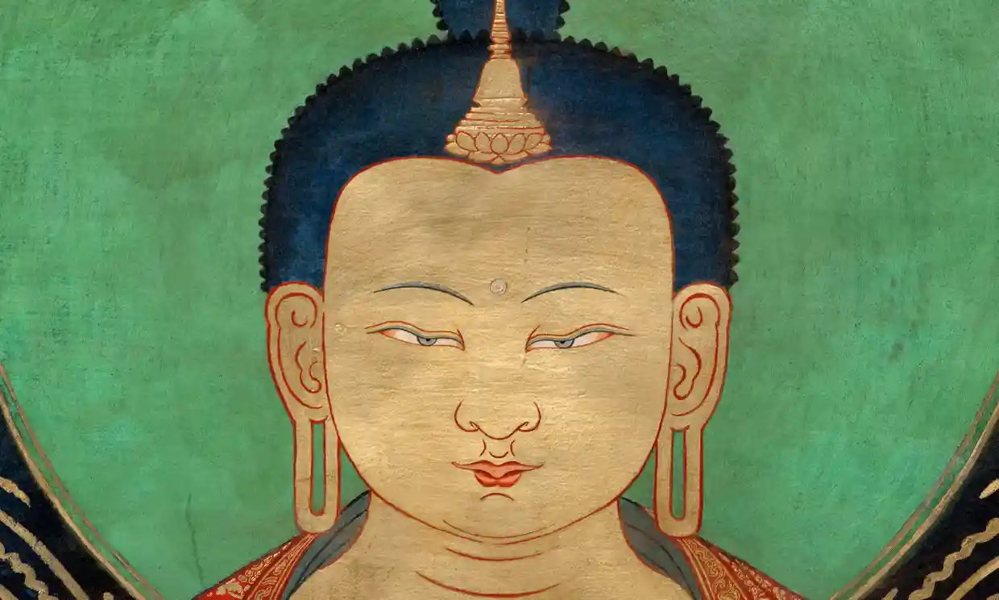

# La meditazione {#sec-meditation}

Le pratiche contemplative sono uno degli elementi più importanti della concezione buddhista. Thrangu Rinpoche (nato 1933) ha scritto:

> Molte persone che ho incontrato durante i miei lunghi viaggi in Europa e nel Nord America mi hanno raccontato i loro problemi privati: problemi mentali, problemi fisici e infelicità con i loro beni o il loro lavoro. La risposta alla moltitudine di questi problemi è sempre la stessa: rendere la propria mente pacifica e calma e sviluppare comprensione e saggezza. Quindi la felicità mondana ordinaria si riduce alla pratica di śamatha e vipaśyanā.

In questo capitolo esamineremo il significato della meditazione nel Vimalakīrti Sūtra. Vedremo come la meditazione possa essere intesa come uno strumento per realizzare la Grande Compassione. Nell'@sec-appendix-meditation verranno invece presentate alcune informazioni "tecniche" su come svolgere concretamente la pratica della meditazione.

## La meditazione nel Vimalakīrti Sūtra

Il Vimalakīrti Sūtra presenta il suo protagonista, Vimalakīrti, come un maestro di meditazione, un praticante capace di applicare gli effetti liberatori di questa pratica in ogni aspetto della sua vita. L'autore del Sūtra ci dice che le pratiche contemplative "generano l'idoneità della mente" per superare una lunga lista di debolezze umane: agitazione mentale, incapacità di concentrazione, mancanza di scopo, senso di futilità nella vita, depressione, disperazione, assorbimento di sé, aggressività, esaltazione del sé, noia, risentimento, rabbia, avidità, odio, illusione, paura, desideri sensuali, disprezzo di sé e molti altri. Inoltre, gli esercizi meditativi non influenzano soltanto gli stati mentali. I loro effetti riguardano anche la "disciplina del corpo, della parola e della mente".

Ricordiamo che Vimalakīrti non è un monaco. Non vive in un ambiente monastico in cui ogni aspetto della vita è progettato per facilitare la pratica della meditazione. Nel Sūtra, lo incontriamo quasi sempre quando è coinvolto in attività mondane, piuttosto che quando è assorto nella meditazione. Vimalakirti ha del lavoro da fare. Quasi sempre insegna, anche quando può sembrare che non lo stia facendo. A prima vista è un uomo d'affari che si impegna nella sua attività economica, ma il modo in cui conduce gli affari mostra anche che insegna il Dharma. È un padrone di casa che supervisiona le sue proprietà, un padre e un marito che si prende cura dei bisogni della sua famiglia, un funzionario del governo che discute le questioni del giorno, un aiutante che lavora nelle scuole e un comune cittadino che trascorre il tempo nei bar e nei casinò. Ma sempre, insieme a queste altre attività, Vimalakirti insegna il Dharma.

Mentre immaginiamo la vita complicata di Vimalakirti, non possiamo fare a meno di chiederci: quando medita? Come fa a trovare il tempo? Dato che una prolungata esperienza di meditazione è considerata essenziale per il risveglio buddista, e dato che la vita monastica è organizzata specificatamente per facilitare l'esperienza meditativa, come è possibile che Vimalakirti possa avere raggiunto una maturazione spirituale molto più completa di quella dei molti monaci incontra, come il Sūtra si prefigge di dimostrare?

Una delle implicazioni importanti del Vimalakīrti Sūtra non è solo che la vita laica ci fornisce un contesto accettabile per seguire il percorso buddhista (mārga) del risveglio, ma anche che questa forma di vita consente una serie di pratiche ispirate al voto compassionevole del bodhisattva. La meditazione non è fine a se stessa ma, come dice il Vimalakīrti Sūtra, è una disciplina che "genera l'idoneità del corpo, della parola e della mente" per una vita illuminata. Se le pratiche contemplative della meditazione sono in definitiva uno strumento *per la vita attiva*, allora forse il ritiro monastico potrebbe non essere il modo migliore per approfondirne gli effetti, almeno non sempre o per tutti.

Come molti di noi sanno per esperienza diretta, una cosa è la capacità di sviluppare la consapevolezza nella meditazione durante un ritiro di meditazione, e un'altra è mantenere quello stato di accresciuta consapevolezza nel mezzo di una discussione politica, quando ci rendiamo conto di avere deluso una persona cara, al mercato o al lavoro. Da questo punto di vista, il livello più alto dell'abilità meditativa non riguarda tanto il profondo assorbimento nella trance ultraterrena, ma piuttosto uno stato focalizzato di consapevolezza costante capace di manifestarsi nel bel mezzo della complessità della vita quotidiana. Quella funzione pratica della meditazione è uno dei temi centrali del Vimalakīrti Sūtra.

La parola più ricorrente associata a "meditazione" nel Vimalakīrti Sūtra, e altrove nel buddismo indiano, è bhāvanā, spesso tradotta come "sviluppare", "coltivare" o "portare ad essere". Per Vimalakīrti, ogni cosa, ogni incontro, ogni problema, ogni frustrazione è un'opportunità per la pratica. Imparare a trasformare tutto ciò che si presenta in un punto focale della meditazione consente a Vimalakīrti di portare la profonda concentrazione della meditazione nel caos della vita quotidiana. Questa idea più ampia di che cosa sia la meditazione ci fa capire che la meditazione può essere molto più di uno specifico esercizio specializzato svolto in solitudine quando viene adottata una particolare postura del corpo. Guidata da questa comprensione più ampia della meditazione, la pratica diventa meno un esercizio specializzato, eseguito fuori dalla vita quotidiana, che una condizione del corpo, della parola e della mente in cui sempre posiamo dimorare.

Nel suo sforzo di esplorare questo ri-orientamento della pratica della meditazione, che si dirige verso il mondo piuttosto che verso stati mentali simili alla trance che portano i praticanti fuori dal mondo, il Vimalakīrti Sūtra impiega una serie di immagini. Ecco come Vimalakīrti insegna al monaco Śāriputra a praticare la meditazione:

> La giusta meditazione consiste nel non rinunciare ai caratteri spirituali già acquisiti, e, allo stesso tempo, nel manifestare tutte el caratteristiche d'un profano. La giusta meditazione consiste nel far sì che li pensiero non si arresti interiormente e non si dissipi esteriormente. La giusta meditazione consiste nel non discostarsi dalle false opinioni, e, allo stesso tempo, nel fissarsi sui trentasette ausiliari dell'illuminazione. La giusta meditazione consiste nel non distruggere le passioni pertinenti alla trasmigrazione, e, allo stesso tempo, nell'introdursi nel Nirvana.

Per molti praticanti, il punto della pratica è "abbandonare le passioni". Per questa ragione il Sūtra descrive la risposta di Śāriputra come un completo silenzio. Śāriputra è incredulo e sconcertato dal consiglio contro-intuitivo di Vimalakīrti. Vimalakīrti non sta cercando una via di fuga dalle gioie e dai dolori della vita, ovvero dalle passioni. Vuole invece vivere pienamente tutte le gioie e i dolori della vita, ma vuole farlo in modo tale da non rimanere imprigionato in essi. Vuole che la pratica della meditazione comprenda tutti gli aspetti della vita, comprese le emozioni, per essere in grado di sfruttare l'energia che da ciò deriva per sviluppare un modo più aperto e liberato di essere nel mondo. E che cosa deve essere sviluppato? In pratica... tutto: il modo in cui sperimentiamo le nostre paure e ansie, il modo in cui comunichiamo con gli altri, il modo in cui lavoriamo, mangiamo, ci divertiamo e soffriamo. Niente cade al di fuori del dominio della pratica del risveglio.

## La meditazione come calmo dimorare

Se nulla esula dall'ambito della pratica meditativa, da dove dobbiamo iniziare? Sebbene possiamo ascoltare lo slogan di John Cage "Begin anywhere", e ciò sia sensato alla luce di ciò che Vimalakīrti sembra dire e fare, questo non è il consiglio più comune nella tradizione buddhista. Invece, la tradizione della meditazione buddista, a partire da ciò che il Buddha stesso ci ha detto e attraverso due millenni e mezzo di storia buddista, sostiene che il punto di partenza migliore sia la consapevolezza del respiro.

Il Buddha istruì i suoi seguaci a dimorare nella concentrazione per mezzo della consapevolezza del respiro. Il meditatore deve diventare perfettamente consapevole del respiro e, insieme, di tutti gli atti e movimenti del corpo, delle sue sensazioni, delle sue percezioni, dei vari pensieri, positivi o negativi. Man mano che questa pratica si sviluppa e si approfondisce, il legame tra respirazione e consapevolezza mentale diventa sempre più evidente. Nulla conduce ad uno stato di concentrazione e aumentata consapevolezza più della respirazione consapevole. Venendo meno la consapevolezza guadagnata attraverso l'attenzione alla respirazione, cadiamo in schemi predefiniti di vagabondaggio mentale e agitazione. La distrazione, poi, ci rende preda delle afflizioni (kleśa; si veda il @sec-patience). Questa è la ragione per cui è necessario applicarsi alla meditazione. Il punto è di concentrarci in modo tale da raggiungere uno stato di calma interiore, così da eliminare quei cicli ansiosi e ripetitivi di pensieri carichi di emozioni, quei cicli malsani di preoccupazioni, pianificazioni e fantasticherie che occupano costantemente la nostra mente e dei quali non abbiamo alcun controllo. Man mano che la concentrazione cresce attraverso la pratica, queste compulsioni mentali si indeboliscono e la nostra mente inizia a manifestare una modalità di esperienza più serena e più libera.

Vimalakīrti è raffigurato nel Sūtra come un maestro di questa profonda libertà interiore. Quando entra nel samādhi, sono a lui disponibili grandi poteri mentali. Questa dimensione della meditazione, la calma e la concentrazione, è il fondamento su cui poi vengono sviluppati gli altri aspetti della pratica della mediazione. Il Sūtra descrive Vimalakīrti come saldamente radicato in questo stato di calma concentrazione mentre conduce la sua vita complicata, pienamente coinvolto nelle vicende della comunità a cui appartiene.

Una descrizione della tecnica della meditazione basata sul respiro è fornita nella @sec-appendix-meditation.

<!-- I praticanti devono provare le sensazioni fisiche della respirazione, concentrandosi completamente su quell'unico processo interno: sentire l'aria entrare nel naso, sentire l'addome espandersi e contrarsi con la flessione e il rilascio del diaframma. Per facilitare la concentrazione in modo che la consapevolezza non si allontani in altre direzioni, gli istruttori spesso consigliano di contare ogni respiro fino a dieci e poi ricominciare, da uno a dieci. Ai meditatori viene insegnato a non forzare o riformare questo naturale processo respiratorio, ma solo a guardare e sentire, senza analisi o sforzo per migliorare. Osserva come i nostri corpi eseguono la danza ritmica del respiro che hanno fatto dal loro primo momento di ingresso nel mondo. -->

<!-- Gli stadi iniziali della tecnica contemplative buddhista cadono sotto il settimo membro dell'ottuplice sentiero, cioè la retta attenzione. Il meditatore deve diventare perfettamente consapevole del respiro e, insieme, di tutti gli atti e movimenti del corpo, delle sue sensazioni, delle sue percezioni, dei vari pensieri, positivi o negativi. La concentrazione è la capacità della mente di soffermarsi a lungo su un oggetto; il suo opposto è la distrazione, che fa vagare la mente e le impedisce di dimorare un singolo oggetto anche per un minuto. La persona distratta è preda delle afflizioni (kleśa; si veda il @sec-patience) e non può sfuggire ad esse. Questa è la ragione per cui è necessario applicarsi alla meditazione. -->

## La meditazione come coltivazione dell'insight

La pratica di meditazione di Vimalakīrti si concentra direttamente sul Dharma, sugli insegnamenti buddisti e sulle tecniche meditative progettate per "incarnare" queste intuizioni liberatorie nei livelli più profondi di "corpo, parola e mente". Il Sūtra può essere letto, infatti, come una meditazione guidata che si occupa delle questioni centrali della dottrina buddhista, e questo è il modo in cui il Sūtra è stato letto nel corso della storia buddista. Il Vimalakīrti Sūtra descrive la meditazione vipaśyanā, o meditazione di insight. Come nelle precedenti tradizioni di meditazione insight, la pratica Mahayana si concentra inizialmente sui "tre segni dell'esistenza" (trilakṣaṇa): l'Impermanenza (Anitya), la Sofferenza (Duḥkha) e il Non-sé (Anātman). La meditazione poi si allarga in modo da comprendere altri principi chiave del dharma, in particolare la codipendenza condizionata e la vacuità di tutti i fenomeni, la compassione e l'interdipendenza non-duale della realtà ultima.

Che cos'è la meditazione di insight e in che modo questo tipo di meditazione dà origine a realizzazioni trasformative? La meditazione di insight implica la "consapevolezza del dharma": significa ricordarlo, portarlo alla mente, comprenderne le implicazioni, quindi integrarlo nel funzionamento della mente nella vita reale. Tali intuizioni vengono integrate in tutti gli aspetti di "corpo, parola e mente". In mancanza di un tale livello di integrazione, la meditazione di insight ha pochi effetti pratici.

Il termine vipaśyanā è spesso definito come \<"intuizione meditativa della vera natura della realtà". Ma qui l'"intuizione" non riguarda solo una delle cinque componenti (skandha) dell'esistenza umana, ovvero il pensiero, ma tutte.

::: callout-note
Ricordiamo che i cinque skandha sono i seguenti.

1.  forma o materia (rūpa);
2.  sensazione o emozione (vedanā);
3.  percezione (saṃjñā);
4.  formazioni mentali" (saṃskāra: qualsiasi processo che induce una persona ad avviare un'azione o un'azione);
5.  coscienza o discriminazione (vijñāna).
:::

L'insight è compreso nel pensiero, attivato nell'alterazione della percezionie, sentito nelle emozioni, plasmato dalla volontà in una motivazione trasformata e riallineato nell'autocoscienza come un nuovo modo di essere nel mondo.

La meditazione di insight inizia con la contemplazione del primo dei "tre segni dell'esistenza": l'impermanenza. L'impermanenza (anitya) è il punto di partenza del sentiero. Questa è anche la prima realizzazione che il Vimalakīrti Sūtra descrive quando le persone raccolte intorno al Buddha esclamano con stupore che "tutte le cose co-dipendenti sono impermanenti". È interessante notare che questa prima intuizione è presentata in forma negativa - le cose sono "impermanenti", non permanenti - piuttosto che positivamente, "tutto cambia". Questo mette subito in gioco la nostra più radicata assunzione secondo cui le cose più importanti, quelle di valore supremo, devono essere permanenti, ovvero l'idea che, al di là di questo mondo di transitorietà, ci può essere qualcosa di stabile, incondizionato, eterna, immutabile e di cui ci possiamo fidare. Non c'è.

L'impermanenza implica che noi possiamo influenzare il cambiamento, ma non possiamo controllarlo. Soffriamo l'impermanenza perché è qualcosa che ci capita e basta, nonostante i nostri sforzi per trasformarla a nostro vantaggio: i nostri poteri di previsione e i nostri poteri di controllo sono limitati. Solo occasionalmente riusciamo a prevedere i cambiamenti entrino in vigore, e anche quando otteniamo ciò che vogliamo, il risultato non è mai ciò che avevamo ipotizzato.

In che modo, allora, Vimalakīrti ci insegna a vivere alla luce del "segno" che innegabilemente l'impermanenza lascia sulla nostra vita? Il primo passo è semplicemente notare l'ubiquità del cambiamento, ammettere e accettare l'impermanenza di tutto ciò che sperimentiamo. In secondo luogo, e più difficile, è l'autocoscienza, l'atto introspettivo di diventare consapevoli delle nostre risposte abituali al cambiamento. Sebbene nessuno di noi sia in grado di controllare il cambiamenti nelle nostre vite, è almeno possibile controllare le nostre risposte ai cambiamenti.

Tutti coloro che intraprendono questo tipo di auto-esame scoprono schemi interni di risposta al cambiamento che sono disadattivi. La gamma di risposte non abili a questa realtà più fondamentale della vita umana è sterminata, e tutti noi ci abbandoniamo ad esse in qualche modo e in una certa misura.

Il Vimalakīrti Sūtra ci offre una serie di suggerimenti per rispondere in maniera adattiva al cambiamento. Il primo di questi è un certo tipo di distacco. Vimalakīrti insegna a coloro che ascoltano a considerare le cose come

> la magia, il sogno, il riflesso, la luna nell'acqua, l'eco, il miraggio, l'immagine nello specchio, la bolla di schiuma, la nuvola.

Vimalakīrti ci suggerisce di meditare sul modo in cui tutte le cose si trasformano e svaniscono. In altre parole, il cambiamento non va ignorato, ma va osservato e studiato. È necessario interiorizzare cosa significa il cambiamento per la nostra vita. È necessario osservare il cambiamento e imparare a "lasciare andare" le cose. Il consiglio del sutra è: "purifica le tue intenzioni" per "liberarti dall'abituale nozione di possesso". Entra in uno "stato di non presa", "libero da egoismo e possessività", così da riconoscere che ciò che in un momento è disponibile può non esserlo più in futuro, e che prendere congedo non deve essere sentito come una perdita.

Nella meditazione del Sutra, Vimalakīrti immagina di affrontare questa sfida lui stesso, e non sceglie qualcosa di irrilevante da "lasciare andare", ma ciò verso cui solitamente sentiamo un grande attaccamento: la ricchezza. Vimalakīrti medita sulla realtà della ricchezza «se riflette sulla nozione di impermanenza». Aspira «alla gioia della rinuncia» e alla «perfezione della generosità»: «per essere gioioso e senza rimpianti nel dare». Ma questa rinuncia, questo distacco, non è un lasciar andare freddo e spassionato. Avendo preso il voto del bodhisattva, Vimalakīrti si impegna in maniera attiva, assumendosi la responsabilità di usare abilmente le sue risorse per fare ciò che può per migliorare la qualità della vita di coloro che lo circondano. Si sforza «di essere responsabile di tutte le cose, ma libero da ogni idea di possesso nei loro confronti». E si rende conto che, per un bodhisattva, essere generoso significa trasmettere agli altri l'insegnamento dell'impermanenza.

L'errore che si possa trovare la tranquillità "nell'illusione della permanenza" è ciò che il sutra chiama un "rifugio sicuro". Questo errore è una tentazione inevitabile poiché qualsiasi cosa, anche il dharma, può diventare un'oggetto a cui ci si aggrappa per provare un po' di sicurezza. Quindi Vimalakīrti insegna ai monaci -- che ogni giorno si impegnano a "rifugiarsi nel dharma" -- che "il dharma non è un rifugio sicuro". Dice:

> Chi è interessato a un rifugio sicuro non è interessato al dharma.

La necessità di "lasciar andare" si estende a tutte le cose. Il dharma non è "una fissa determinazione" che ci può scortare fuori dal regno della complessità impermanente e interdipendente della vita. Invece, ci invita a rimanere pienamente impegnati nella vita tra la moltitudine di esseri interdipendenti e mutevoli. Pertanto, il sutra fa proclamare a Mañjuśrī, il bodhisattva della saggezza che

> colui che rimane nella fissa determinazione dell'increato non è capace di concepire lo spirito di illuminazione. Ma chi vive tra le cose create, nelle miniere delle passioni, senza tendere alla chiusura, è invece capace di concepire lo spirito di illuminazione.

In altre parole, secondo il Vimalakīrti Sūtra, solo vivendo nel mondo (della nostra confusione e nel pasticcio delle nostre emozioni) si può ottenere il Risveglio.

## Mindfulness: dall'osservazione e dall'autoconsapevolezza all'autotrasformazione

Essere consapevoli significa essere consapevoli di ciò che sta accadendo dentro e intorno a noi nel momento presente. Con questo obiettivo generale in mente, la meditazione di consapevolezza insegna ai praticanti a essere direttamente consapevoli dei contenuti dell'esperienza mentre sorgono nella mente, si sviluppano e scompaiono, all'inizio senza analisi, interpretazione o giudizio critico. Lo scopo della pratica è coltivare la nostra consapevolezza di sé, la vigilanza e l'attenzione al mondo che ci circonda e ai nostri modelli di apprensione e risposta interne.

Possiamo pensare alla meditazione di consapevolezza come ad un processo che ha tre livelli. Il primo livello è la consapevolezza del mondo che ci circonda. Essere consapevoli a questo livello significa essere attenti, notare immagini, suoni, movimenti, strutture, qualunque cosa appaia ai nostri sensi. Un secondo livello della pratica della consapevolezza ci insegna ad essere consapevoli dei nostri processi mentali interni. Ci insegna a notare i pensieri, i sentimenti e le motivazioni che sorgono nella nostra mente, in risposta al mondo o meno, e ad esaminare questi processi interni, spesso abituali. Il terzo livello della meditazione di consapevolezza è consapevolezza del Dharma nella vita di tutti i giorni. Questa terza pratica cerca di sviluppare la capacità di richiamare e di attivare gli insegnamenti in relazione ai contenuti dell'esperienza che sorgono ai primi due livelli. Questa dimensione della meditazione consapevole riguarda i nostri valori, i nostri principi, le nostre aspirazioni, le nostre possibilità. Si apre da ciò che è a ciò che potrebbe essere, a ciò che dovrebbe essere.

Essere consapevoli in questo senso significa avere la guida di bodhicitta, il pensiero dell'illuminazione. Significa essere consapevoli del pensiero dell'illuminazione (bodhicitta) in modo che esso possa fornire una guida mentre ci muoviamo attraverso l'esperienza quotidiana in modo che le decisioni che prendiamo mostrino l'impatto di quell'aspirazione. Significa avere i nostri valori più alti impressi sulla situazione che affrontiamo nel momento presente. È ricordare in ogni momento che siamo su un sentiero di nostra scelta e che siamo sostenuti dalla forza di una convinzione, dall'impegno di un voto.

Un insegnamento di meditazione degno di nota ci incoraggia a prestare particolare attenzione a otto distinti modelli reattivi, chiamati "otto venti" perché hanno un'enorme influenza nello spingerci in direzioni che potremmo non aver scelto consapevolmente. Gli otto venti si presentano in quattro coppie: guadagno/perdita, fama/discredito, lode/biasimo, piacere/dolore. Queste preoccupazioni centrali forniscono la forza motivazionale alla base della maggior parte delle nostre attività.

La pratica della meditazione di consapevolezza ci fornisce un inventario delle nostre abitudini personali nel cercare guadagno, fama, lode e piaceri evitando i loro opposti. L'ironia di questa pratica è che non appena diventiamo consapevoli delle nostre tendenze reattive sotto queste otto influenze, abbiamo già fatto un passo per allontanarci da questi legami. La semplice pratica dell'attenzione è quella di consentirci di fare un passo indietro rispetto ai nostri schemi interiori di attaccamento e avversione. Quando diventiamo consapevoli dei nostri attaccamenti insensati, e alla luce delle nostre aspirazioni più elevate -- per la saggezza, per la compassione, per la libertà -- scopriamo che la capacità degli otto venti di controllarci fortemente diminuisce.

Quindi, quando il sutra descrive Vimalakīrti impegnato in un difficile conversazione con i suoi concittadini, o in numerose situazioni in cui uno qualsiasi degli otto venti potrebbe spazzarlo via, possiamo immaginare che, in una fase precedente, Vimalakīrti ha sviluppato una forte disciplina interiore meditante la pratica della meditazione di consapevolezza. Possiamo immaginarlo mentre si dedica a pratiche di meditazione buddiste simili a quella descritta qui, consentendogli di evolversi al di là degli schemi reattivi ordinari fino a raggiungere il livello del bodhisattva straordinariamente abile che viene descritto nel sutra. Leggendo il sutra, percepiamo che Vimalakīrti è un profondo osservatore del mondo che lo circonda, è estremamente attento ai propri schemi di risposta, e non è solo memore dei valori e alle aspirazioni buddhiste, ma li applica direttamente e in prima persona in ogni scelta e azione nella sua vita quotidiana.

## Conclusione {.unnumbered}

Per descrivere il corretto atteggiamento verso la meditazione, Santideva propone la seguente metafora. Un medico deve avere conoscenza dei farmaci e della loro corretta somministrazione, e questo si ottiene attraverso lo studio della medicina. Ma solo leggere libri di medicina non eliminerà la malattia; il paziente deve assumere i farmaci descritti nei testi. Allo stesso modo, solo ascoltare e contemplare il Dharma non è sufficiente, perché non sopprimerà i kleśa né calmerà la mente. Solo prajñā è la medicina in grado di curare la sofferenza, rimuovendo le nostre oscurazioni mentali (kleśa). E per sviluppare prajñā (la saggezza), bisogna praticare la meditazione. Praticare la meditazione significa abituarsi alla meditazione. Se la propria mente è pacifica e felice nella vita quotidiana, tutte le cose esterne appaiono piacevoli; se la propria mente è disturbata e infelice, le cose esteriori sembrano spiacevoli e ingiuste. Per sviluppare la saggezza interiore bisogna pacificare la mente e questo si ottiene con la meditazione. D'altra parte, Vimalakīrti ci fa capire che la meditazione è solo uno strumento, un pre-requisito, per un'attività molto più difficile, ovvero la capacità di "funzionare" nella nostra vita quotidiana senza essere "prevedibili" (come dice la letteratura Lojong), ovvero senza essere la semplice risultante dell'interazione tra gli stimoli ambientali e le nostre tendenze reattive automatiche. La meditazione ci fornisce gli stumenti per interrompere questo "circolo vizioso".

Vimalakīrti propone l'equanimità come una dimensione importante per affrontare l'esperienza di dukkha nella nostra vita quotidiana. Ma cosa significa equanimità in questo contesto? Significa semplicemente accettare l'inevitabilità della sofferenza? In parte sì, ma questa non è tutta la risposta. In realtà, il sutra raffigura Vimalakīrti che lavora sodo ogni giorno per migliorare la sua comunità. Piuttosto che accettare passivamente la presenza di scuole inefficienti, di rapporti economi basati sull'avidità, di una politica corrotta, di una vita sociale violenta e il diffuso problema delle dipendenze, Vimalakīrti resiste. La sua equanimità non significa che si sente estraneo. Non significa mai l'apatia del disimpegno. L'equanimità non significa che Vimalakīrti riduce i suoi sforzi per cambiare il mondo, anche se solo un po'. Il voto del bodhisattva a cui ha affidato la sua vita lo spinge a prendersi cura, non ad ignorare. Lungi dal minare il suo impegno nella vita sociale, l'equanimità lo rafforza.

Dove ci porta tutto ciò? Questo atteggiamento complica la nostra accettazione della sofferenza. Ci impegna a coltivare il benessere di tutti, un ambiente sostenibile e solidale e una comunità di comprensione reciproca, sapendo che questi sforzi non saranno all'altezza dei loro obiettivi e che in una certa misura malattie, problemi ambientali, conflitti, e ingiustizia sociale sempre riemergeranno, nonostante i nostri più grandi sforzi.

L'atteggiamento di Vimalakīrti evita sia la resa distaccata sia il frenetico e controproducente agitarsi quando le cose sfuggono di mano. Ci fornisce un equilibrio tra sforzo e il lasciar andare, che fornisce le abilità necessarie per vivere la vita che ci è stata data. Piuttosto che essere costretti da abitudini radicate di reattività che ci costringono a rispondere alle difficoltà accumulando ancora maggiori difficoltà, ci offre flessibilità, adattabilità e resilienza in vista di qualunque cosa accada, sia essa positiva o negativa.

Il sutra si esprime così:

> Così, riconoscendo nella propria sofferenza l'infinita sofferenza di questi esseri viventi, il bodhisattva contempla correttamente questi esseri viventi e decide di curare tutte le malattie.

Questa risoluzione è enorme, ovviamente impossibile da completare. Ma rappresenta una sfida che ci fa ripensare alle nostre priorità. Ci chiede di imparare come possiamo rispondere al dolore senza infliggere ulteriore dolore a noi stessi e agli altri. Ci fa riconoscere che la nostra tendenza a causare sofferenza agli altri è un modo illusorio per compensare la nostra stessa sofferenza. Ci incoraggia ad andare oltre, riconoscendo come il dolore e la sofferenza sono strutturali e sono insiti nel tessuto stesso dei nostri sistemi politici ed economici -- il che ci pone il problema di decidere cosa fare di fronte a ciò.

Vimalakīrti ci suggerisce che possiamo decidere di considerare la sofferenza nella nostra vita come una disciplina, un esercizio intenzionale di apertura che rifiuta di crollare sotto la pressione di una enorme difficoltà. Questo tipo di padronanza di sé, insiste Vimalakīrti, inizia nel "dominio dell'intuizione introspettiva" e giunge al culmine attraverso pratiche quotidiane costanti di consapevolezza focalizzata attraverso le quali impariamo a "provare piacere nell'essere coscientemente consapevoli". Non c'è nulla di mistico nella pratica della meditazione. I maggiori frutti della meditazione si ottengono lentamente e costantemente riprendendo la nostra mente dai suoi vagabondaggi mentali per concentrarci sul pensiero del risveglio. La meditazione è il campanello d'allarme della cultura buddista, un grande dono del buddismo all'umanità.
