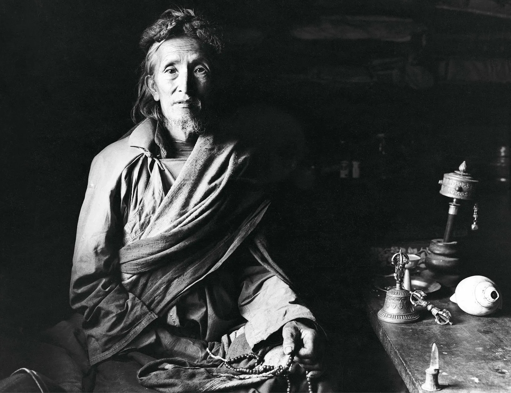
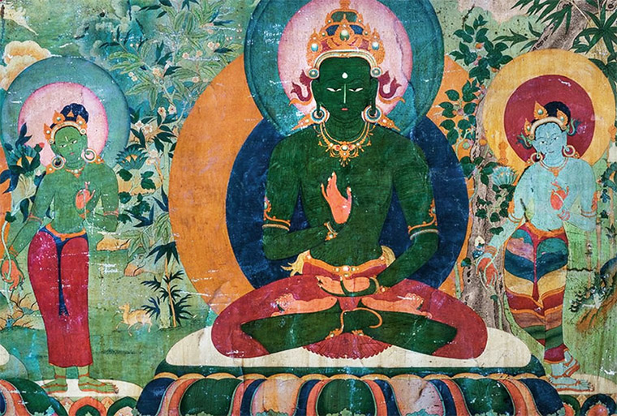
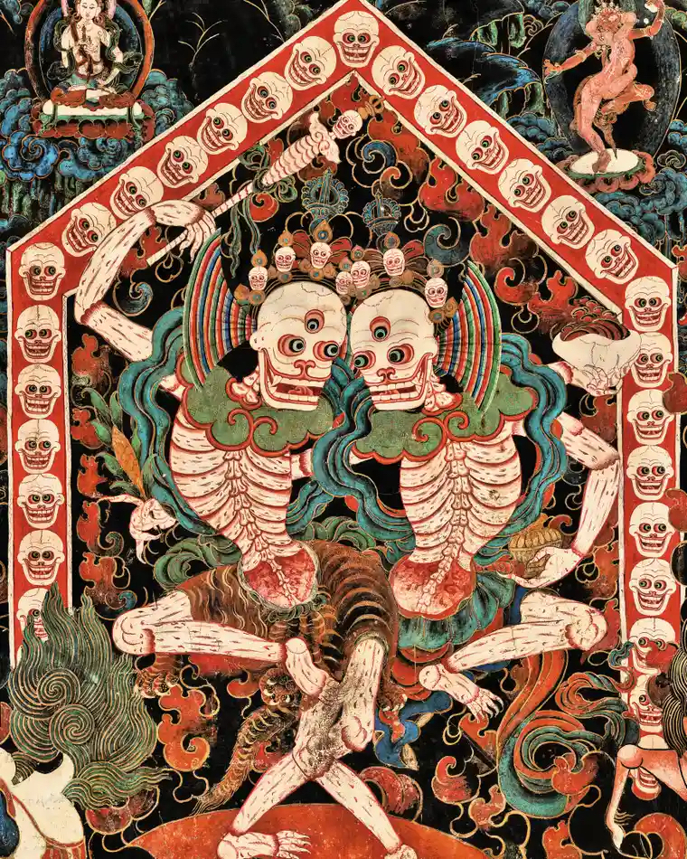
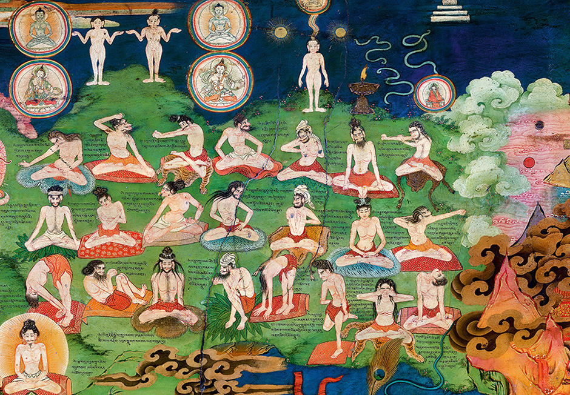

# La pratica della mediatazione {#sec-appendix-meditation}

Forniamo qui alcuni accenni relativi alle tecniche che stanno alla base della pratica della meditazione.

## Ānāpānasati-sutta

Iniziamo con l'Ānāpānasati-sutta, il "Discorso sulla consapevolezza del respiro", il quale offre un'esposizione dettagliata sulla meditazione. È uno dei Sutra più antichi su questo tema. Bhikkhu Anālayo (2015) riassume l'Ānāpānasati-sutta evidenziando 16 passi nella pratica della meditazione del respiro. Questi 16 passi sono suddivisi in 4 tetradi.

### Prima tetrade

> Sempre consapevole egli inspira, consapevole egli espira.\
> 1. Inspirando a lungo, egli comprende: 'io inspiro a lungo'; od espirando a lungo, egli comprende: 'io espiro a lungo.'\
> 2. Inspirando brevemente, egli comprende: 'io inspiro brevemente'; od espirando brevemente egli comprende: 'io espiro brevemente.'\
> 3. Egli si addestra in questo modo: 'inspirerò facendo esperienza dell'intero corpo'; egli si addestra in questo modo: 'espirerò facendo esperienza dell'intero corpo'.\
> 4. Egli si addestra in questo modo: 'inspirerò placando le formazioni corporee.'; egli si addestra in questo modo: 'espirerò placando le formazioni corporee.'

Praticamente, questo significa che, inizialmente, dopo essere diventato consapevole del proprio respiro, il meditatore diventa consapevole della lunghezza dei respiri. Questi possono essere lunghi o corti. L'enfasi è sulla mera osservazione, non vi è alcun tentativo di controllare il respiro. Il passo successivo è di diventare consapevole 'dell'intero corpo'. Questo può essere inteso come diventare consapevole dell'intero corpo del respiro, ovvero essere in grado di distinguere tra la sua parte iniziale, centrale e finale. Oppure, può essere inteso come diventare consapevole dell'intero suo corpo nella posizione seduta. In questa interpretazione, il terzo passo nella progressione comporterebbe un cosciente ampliamento del campo della consapevolezza dal solo respiro all'intero corpo del meditatore. Infine, calmare il respiro porta naturalmente ad una maggiore tranquillità generale del corpo, e la tranquillità del corpo a sua volta aumenta la calma del processo del respiro. Quindi sembra naturale interpretare il quarto stadio come una richiesta di calmare il respiro e il corpo.

### Seconda tetrade

> 5.  Egli si addestra in questo modo: 'io inspirerò facendo esperienza della gioia'; egli si addestra in questo modo: 'io espirerò facendo esperienza della gioia.'\
> 6.  Egli si addestra in questo modo: 'io inspirerò facendo esperienza della beatitudine'; egli si addestra in questo modo: 'io espirerò facendo esperienza della beatitudine';\
> 7.  Egli si addestra in questo modo: 'io inspirerò facendo esperienza delle formazioni mentali'; egli si addestra in questo modo: 'io espirerò facendo esperienza delle formazioni mentali.'\
> 8.  Egli si addestra in questo modo: 'io inspirerò placando le formazioni mentali'; egli si addestra in questo modo: 'io espirerò placando le formazioni mentali.'\

<!-- Da un punto di vista pratico, il grado di base di calma fisica e mentale stabilito attraverso i quattro passi precedenti conduce, in questa seconda fase, al sorgere di una forma di gioia (passo 5). I praticanti possono anche incoraggiare consapevolmente il sorgere della gioia riesaminando la condizione piacevole di tranquillità che si sperimenta dopo aver proceduto in tutte le fasi della prima tetrade. La gioia, che a volte può anche essere piuttosto esuberante ed estatica, conduce all'esperienza più calma della felicità (passo 6), nel senso di una condizione di corpo e mente piacevolmente soddisfatta. Con il passo (7), la consapevolezza della gioia e della felicità porta alla consapevolezza di qualsiasi altra formazione mentale o attività presente nella mente. Questo e il passo successivo di questa tetrade sono simili agli ultimi due passi della tetrade precedente, poiché in entrambi i casi la meditazione procede dalla consapevolezza delle formazioni corporee o mentali ad uno stadio in cui esse si calmano (passo 8). È quando si raggiunge uno stato mentale di distacco dalle formazioni corporee e mentali (saṃskāra) che queste si calmano. Nel contesto attuale, ciò comporta, in particolare, la volontà di abbandonare anche gli saṃskāra di gioia e felicità. -->

<!-- Intesi in questo modo, i passi (5) e (6) mostrano chiaramente che la gioia e la felicità sane hanno un ruolo centrale nella pratica e dovrebbero essere incoraggiate. Allo stesso tempo, tuttavia, i passi (7) e (8) mostrano che la gioia e la felicità devono essere vissute con un atteggiamento disposto a lasciarle andare, consentendo loro di placarsi naturalmente una volta giunto il momento. -->

Un modo per implementare praticamente la seconda tetrade della presenza mentale del respiro può quindi essere quello di procedere dalla gioia che deriva dal calmare i processi corporei all'esperienza più quieta della felicità la quale, attraverso la presa di coscienza di qualsiasi altra attività mentale che ha luogo in quel momento, porta al quietarsi di tutte le attività mentali. I temi principali di tale pratica sono quindi quelli che assegnano un posto importante alla gioia e alla felicità, come parti integranti della pratica, le quali però vengono abbandonate per raggiungere l'obiettivo di calmare tutti i processi mentali.

### Terza tetrade

> 9.  Egli si addestra in questo modo: 'io inspirerò facendo esperienza della mente'; egli si addestra in questo modo: 'io espirerò facendo esperienza della mente.'\
> 10. Egli si addestra in questo modo: 'io inspirerò rasserenando la mente'; egli si addestra in questo modo: 'io espirerò rasserenando la mente.'\
> 11. Egli si addestra in questo modo: 'io inspirerò concentrando la mente'; egli si addestra in questo modo: 'io espirerò concentrando la mente.'\
> 12. Egli si addestra in questo modo: 'io inspirerò liberando la mente'; egli si addestra in questo modo: 'io espirerò liberando la mente.'\

La meditazione passa dall'essere consapevoli dei contenuti della mente al diventare consapevoli della mente stessa. <!-- Finora, il progresso della pratica ha comportato un passaggio dalla consapevolezza del corpo (o di aspetti del corpo) con la prima tetrade all'esperienza delle attività o delle qualità mentali (come gioia e felicità) con la seconda tetrade. Il passaggio alla terza tetrade comporta un ulteriore grado di raffinamento. Diventare consapevoli della mente in quanto tale, nel senso di riconoscere ciò che è consapevole del respiro o consapevole della gioia e della felicità, richiede un certo grado di esperienza meditativa e familiarità con l'introspezione. --> In termini pratici, passare dalla fase (8) alla fase (9) può avvenire attraverso un ripiegamento su se stessa della consapevolezza, per così dire. Dall'essere consapevoli del respiro, si diventa consapevoli di chi è consapevole del respiro. Dall'essere consapevoli dell'esperienza di gioia e felicità, si dirige poi la consapevolezza verso l'agente di tale consapevolezza.

La consapevolezza della mente stessa porta naturalmente al sorgere della letizia, poiché questo ripiegamento su se stesso, o verso l'interno della consapevolezza, si traduce in un tipo di esperienza molto più sottile e calmo. Il tipo di letizia che sorge in questa fase della pratica è quello che porta facilmente alla concentrazione, alla mente che diventa raccolta in sé e unificata (passaggio 11). In questo modo, la mente diventa sempre più libera da qualsiasi ostruzione o impedimento mentale. Essendo diventata naturalmente concentrata, al momento attuale, la mente è anche libera da qualsiasi interferenza da parte del meditatore, per quanto sottile possa essere. La libertà di questa calma compostezza è ciò di cui il praticante è consapevole (passo 12), insieme al ritmo in costante cambiamento di inspirazione ed espirazione. Quindi un modo per implementare in pratica la terza tetrade della presenza mentale del respiro sarebbe quello di esaminare dall'esterno l'atto di esaminare (ovvero, la consapevolezza); procedere poi dalla letizia che deriva da un tale stato alla liberazione della mente da qualsiasi distrazione o interferenza.

### La quarta tetrade

> 13. Egli si addestra in questo modo: 'io inspirerò contemplando l'impermanenza'; egli si addestra in questo modo: 'io espirerò contemplando l'impermanenza.'\
> 14. Egli si addestra in questo modo: 'io inspirerò contemplando lo svanire'; egli si addestra in questo modo: 'io espirerò contemplando lo svanire.'\
> 15. Egli si addestra in questo modo: 'io inspirerò contemplando la cessazione'; egli si addestra in questo modo: 'io espirerò contemplando la cessazione.'\
> 16. Egli si addestra in questo modo: 'io inspirerò contemplando il lasciare andare'; egli si addestra in questo modo: 'io espirerò contemplando il lasciare andare.'\

<!-- Con il primo di questi passi, l'impermanenza, che comunque era presente sullo sfondo della pratica durante tutti i passi precedenti, ora si sposta al centro dell'attenzione: non è solo la natura impermanente del respiro, ma piuttosto la natura impermanente di tutti gli aspetti dell'esperienza a diventare l'oggetto della contemplazione. Ciò include la natura impermanente della gioia e della felicità, così come la natura impermanente dell'agente della conoscenza, ovvero la mente. Anche se la capacità di conoscere è una costante in tutte le esperienze della mente, il fatto stesso di essere in grado di conoscere cose diverse rende chiaro che anche la mente deve cambiare se stessa. Se fosse permanente, ovvero sempre uguale a se stessa, sarebbe per sempre congelato nella condizione di conoscere una cosa soltanto. -->

<!-- Da un pieno apprezzamento dell'impermanenza, la pratica passa poi al virāga, che potrebbe essere tradotto come "svanire" oppure come "distacco" (passo 14). Entrambe le traduzioni fanno emergere delle sfumature correlate di ciò che, nell'esperienza reale, sono aspetti strettamente interconnessi nel progresso dell'insignt. Rendersi conto che tutto cambia ed è destinato a svanire suscita in noi il distacco: diventiamo naturalmente disincantati e disillusi da ciò che inevitabilmente è impermanente e svanirà. In questo modo la emozioni che abbiamo associato agli eventi si indeboliscono fino a svanire. Tale distacco, che deriva dal rendersi conto che tutti i fenomeni sono impermanenti, rendendo inequivocabilmente chiaro che il mondo del samsare è incapace di fornirci una soddisfazione duratura -- ovvero ci rende consapevoli del fatto che il samsara produce necessariamente duḥkha. Tutti i fenomeni condizionati producono "insoddisfazione" e questo insight determina un coinvolgimento sempre minore e rafforza la libertà interiore attraverso il distacco. -->

<!-- Dal distacco, le istruzioni nell'Ānāpānasati-sutta procedono alla cessazione (nirodha). Per cessazione si può intendere il fatto di prestare attenzione all'aspetto della scomparsa di tutto ciò che viene sperimentato. Sia questo il respiro o la gioia, o qualunque altra cosa si esperisca nel momento presente, tutto è destinato a cessare, lasciando spazio al sorgere di qualcos'altro. Contemplare la cessazione acuisce la comprensione dell'impermanenza, portando in primo piano l'aspetto più estremo dell'impermanenza: le cose sono destinate a venire a mancare. Un altro aspetto complementare della pratica è quello che ci fa rendere conto che il distacco (passo 14) porta gradualmente alla cessazione di duḥkha. Mentre la cessazione finale di duḥkha richiede il pieno risveglio, tutti noi possiamo fare esperienza della cessazione di alcuni desideri e forme di attaccamento. -->

<!-- Tanto più il praticante riesce ad accettare il carattere inevitabile della cessazione (passo 15), ovvero, ad accettare che le cose finiscano, più facile diventa l'esperienza del lasciar andare (passo 16). Lasciare andare, o rinunciare, qui si riferisce all'esperienza di lasciar andare qualsiasi forma di attaccamento, lasciare andare ogni senso di appropriazione delle esperienze nei termini di "io" o "mio". -->

Un modo per implementare praticamente la quarta tetrade della consapevolezza del respiro, come descritto nell'Ānāpānasati-sutta, è quello di procedere dall'appercezione della natura mutevole del respiro alla consapevolezza della natura impermanente di qualunque aspetto dell'esperienza. La consapevolezza dell'impermanenza diventa il fondamento dell'esperienza del distacco, il che conduce alla consapevolezza della cessazione di ogni cosa, per finire con il riconoscimento che dobbiamo "lasciar andare", nel modo più completo possibile, tutto ciò che esperiamo. Il tema principale dell'attuazione delle istruzioni per l'ultima tetrade della consapevolezza del respiro è dunque la coltivazione dell'insight basato sulla consapevolezza dell'impermanenza.

## Laṅkāvatāra Sūtra

Un'altra descrizione molto nota della pratica della meditazione è quella fornita dal Laṅkāvatāra Sūtra (350-400 CE). Si notino le somiglianze con le quattro tetradi dell'Ānāpānasati-sutta.

1.  Nel primo stadio, il meditatore esamina i dharma materiali, "gli oggetti esterni", si chiede: "Essi sono forse diversi dalla coscienza? Oppure, sono la coscienza stessa che così si manifesta come nello stato di sogno?" Se li percepisce come oggetti esterni, dovrà scomporli nelle loro componenti, nelle loro condizioni e nelle loro cause, fintanto che non sorgerà in lui il seguente pensiero: "Tutto \[l'universo\] è unicamente pensiero; non esiste più una realtà esterna."
2.  Nel secondo stadio, avendo così meditato sui dharma materiali, ci si rivolge ai dharma immateriali. Il Laṅkāvatāra Sūtra ci dice che, essendo stata dissolta nell'analisi meditativa la realtà materiale, ciò fa anche venire meno l'esistenza di un "soggetto percettore", "in quanto il percettore dipende dal percepibile". Perciò il pensiero "privo di percepibile e percettore" diventa non-duale, "risiede nel supporto della Tathata", "passa oltre" il percettore e il percepito, e permane nella conoscenza senza l'apparenza della dualità.
3.  Nel terzo stadio, il meditatore "passato oltre il solo-pensiero", "passa oltre" anche a questa stessa conoscenza, quella senza apparenza di dualità. Ovvero, il meditatore medita in questo modo: "Poiché è illogico che le cose possano nascere per opera propria o in virtù di altro e data la falsità di realtà percepita e di soggetto percettore, è logicamente insostenibile che anche la conoscenza non-duale possa essere veramente reale, poiché è inseparata da essi".
4.  Nel quarto stadio, il meditatore abbandona ogni forma di attaccamento e si "stabilisce" nella comprensione dell'assenza di natura propria di tutti i dharma. Colui che vi risiede, penetrando nella verità suprema, entra nel samādhi privo di rappresentazioni concettuali.

## Ornamento dei Mahāyāna Sūtras

L'*Ornamento dei Mahāyāna Sūtra* (Mahāyānasūtrālamkāra) di Maitreya/Asanga (IV secolo d.C.) fornisce una descrizione dettagliata dei nove metodi che vengono utilizzati per stabilizzare la mente, ovvero per ottenere lo stadio di samādhi. Questi nove metodi vengono anche ripresi in *Moonbeams of Mahamudra* di Takpo Tashi Namgyal (1512-1587), il classico manuale di meditazione della tradizione Mahamudra. I nove metodi sono i seguenti.

1.  *Stabilizzare*: dirigere la mente in modo univoco verso un oggetto di meditazione.
2.  *Stabilizzare correttamente*: rimanere in uno stato di concentrazione (mindfulness) che non consente alla mente di essere distratta da altre cose.
3.  *Ritirarsi e stabilizzarsi*: se si viene distratti, ciò viene immediatamente riconosciuto e la mente viene nuovamente diretta all'oggetto di meditazione.
4.  *Stabilizzarsi saldamente*: abituandosi a questo stato, il meditatore è in grado di mantenere la continuità e quindi di rimanere in meditazione continuamente per un breve periodo. Il meditatore, a questo punto, dovrebbe rimanere estremamente attento e raccogliere sempre di più la sua mente sull'oggetto della meditazione.
5.  *Domare*: contemplando le qualità del samadhi, il meditatore si sente contento ed entusiasta della concentrazione meditativa, e questo lo porta a tenere la mente sotto controllo.
6.  *Pacificare*: nonostante il piacere della concentrazione meditativa, può sorgere la distrazione; quando ciò accade, il meditatore dovrebbe fare uno sforzo per concentrarsi e pacificare la mente.
7.  *Pacificare fermamente*: quando il samadhi si deteriora a causa di attaccamento, distrazioni, pigrizia o sonnolenza, il meditatore dovrebbe contrastare le offuscazioni mentali con i metodi appropriati (cioè, per mezzo dell'analisi, o applicando un antidoto, o in alternativa lasciando andare le distrazioni senza danrgli peso).
8.  *Mantenere una concentrazione deliberata*: applicando i metodi precedenti il meditatore è in grado di regolare la sua mente in maniera deliberata, esercitando uno sforzo. Questo è l'ottavo metodo e, dall'abitudine a questo, il meditatore giunge ad un punto in cui la concentrazione si manifesta naturalmente.
9.  *Concentrarsi o stabilizzarsi nell'equinamità*: abituandosi per un lungo periodo a stabilizzare deliberatamente la mente, non sarà più necessario fare uno sforzo per concentrarsi e la mente si stabilizzerà automaticamente sull'oggetto della meditazione. Quando la concentrazione diventa spontanea, si raggiunge lo stadio di stabilizzazione della mente senza un'applicazione deliberata. Questo è l'ultimo dei nove metodi che vengono utilizzati per calmare la mente.

Atiśa scrive:

> Se le condizioni per samādhi diminuiscono\
> La concentrazione non sarà raggiunta\
> Anche se si medita strenuamente\
> Per migliaia di anni.

## Kamalaśīla

Una testo sulla meditazione che ha avuto un grande eco nella tradizione tibetata è *La progressione della mediatazione II* di Kamalaśīla (c. 740-795), un monaco buddista dell'università di Nālandā. I testi di Kamalaśīla sono stati citati per più di un millennio in Tibet e sono stati discussi fino ai giorni nostri, ad esempio, nell'opera *Tesoro della conoscenza* di Jamgön Kongtrül (1813--1899), e in tanti altri commentari più recenti dell'opera di Jamgön Kongtrül. *La progressione della mediatazione* è disponibile, in italiano, nel testo *La rivelazione del Buddha* a cura di Raniero Gnoli (un allievo di Giuseppe Tucci). La traduzione de *La progressione della mediatazione II* è anche disponibile, accompagnata da un commento del Dalai Lama, nel testo *Stages of meditation*.

<!-- Nell'ottavo secolo, Śāntarakṣita (725--788) si recò in Tibet per insegnare le fasi della meditazione. Śāntarakṣita, il cui nome si traduce in italiano come "protetto da Colui che è in pace", fu un importante e influente filosofo buddista indiano, in particolare per la tradizione buddista tibetana. Śāntarakṣita fu un filosofo della scuola Madhyamaka, studiò nel monastero di Nālandā e divenne il fondatore di Samye, il primo monastero buddista del Tibet. Quando si rese conto di essere vicino alla morte, disse: "Ho impartito questi insegnamenti. In futuro potrebbero verificarsi problemi e le cose potrebbero andare storte. Se ciò accadrà, invitate il mio allievo Kamalaśīla dall'India. Sarà in grado di spiegare chiaramente la meditazione e rimuovere eventuali errori di interpretazione che potrebbero sorgere". Questo fu il suo ultimo desiderio, poi morì. -->

<!-- Esaminiamo di seguito alcuni brani tratti da *La progressione della mediatazione I* di Kamalaśīla (c. 740-795), anche lui un monaco buddista dell'università di Nālandā. Gli scritti di Kamalaśīla hanno avuto una grande risonanza nella tradizione tibetana e sono stati citati per più di un millennio fino, ad esempio, in volume molto noto dedicato alla meditazione dell'opera *Tesoro della conoscenza* di Jamgön Kongtrül (1813--1899). -->

<!-- La descrizione della pratica della meditazione è fornita ne *La progressione della mediatazione II*, tradotto ne *La rivelazione del Buddha*, pp.  -->

<!-- > Per il meditatore che dimora in questo samādhi, in virtù della cessazione di tutte le costruzioni concettuali, sia l'ostacolo delle afflizioni, sia l'ostacolo dei conoscibili sono interamente dissolti. -->

<!-- > Infatti, nel venerabile Satyadvayanirdesa \[Sutra\] e in altre opere, il Buddha ha spiegato che la radice, la causa, dell'ostacolo delle afflizioni è la concezione erronea secondo cui cose che in realtà sono non-sorte, non-distrutte e inesistenti sarebbero esistenti e via dicendo. Ed è in virtù dell'abbandono di tutte le costruzioni concettuali sull'esistenza, la non-esistenza, ecc., il quale deriva da questo esercizio continuato dello yoga, che si verifica l'abbandono di ogni concezione erronea come l'esistenza, ecc., che ha come sua propria natura la nescienza e che è la radice dell'ostacolo delle afflizioni. Perciò, distruggendone la radice, egli abbandona completamente l'ostacolo delle afflizioni. E così è detto nel Satyadvayanirdesa: O Mañjuśrī, come vengono rimosse le afflizioni? Mañjuśrī disse: Poiché dal punto di vista assoluto tutti i Dharma sono assolutamente non-nati, non-sorti, non-esistenti, è dalla verità convenzionale che deriva la concezione erronea dell'inesistenza. Ed in base a questa concezione erronea che si verifica un'operazione mentale discorsiva; e in base a tale operazione mentale discorsiva, c'è la riflessione scorretta; in conseguenza della riflessione scorretta c'è l'attribuzione di un io a realtà in sé prive di io; in seguito all'attribuzione di un io, c'è il sorgere dei punti di vista errati; infine, dal sorgere dei punti di vista errati si producono le afflizioni. O Devaputra chi, invece, in base alla realtà assoluta conosce tutti i Dharma come assolutamente non-nati, non-sorti, non-esistenti, è, secondo tale realtà, privo di errore. E chi in base alla realtà assoluta è privo di errore, è privo di costruzioni concettuali; e chi è privo di costruzioni concettuali è perfettamente concentrato; e per chi è perfettamente concentrato non sorge l'attribuzione di un io, fino a che, secondo la vera realtà, non c'è il sorgere neppure del punto di vista del nirvana. Per chi dimora in tal modo nella non-produzione, le afflizioni devono considerarsi completamente rimosse. Egli è detto "privo delle afflizioni". Devaputra, quando per mezzo di una conoscenza priva di apparenze egli conosce secondo realtà assoluta le afflizioni come assolutamente vuote, assolutamente inesistenti, assolutamente impermanenti, allora, Devaputra le afflizioni sono perfettamente comprese. In verità, Devaputra, come chi conosce l'origine di un serpente velenoso ne rende inoffensivo il veleno, esattamente allo stesso modo, Devaputra, per colui che conosce l'origine delle afflizioni, le afflizioni stesse si estinguono. -->

<!-- ## Preliminari -->

<!-- Le pratiche contemplative presuppongono il superamento di cinque ostacoli: -->

<!-- -   *piacere edonico* (kāmacchanda): quel particolare tipo di piacere che cerca la felicità attraverso i cinque sensi; nella meditazione include anche il desiderio di sostituire le esperienze dei cinque sensi irritanti o dolorose con quelle piacevoli, cioè il desiderio di comfort sensoriale; -->

<!-- -   *malevolenza* (vyāpāda): desiderio di punire, ferire o distruggere; nella meditazione, la malevolenza può apparire come antipatia verso l'oggetto della meditazione stesso, rifiutandolo in modo che la propria attenzione sia costretta a vagare altrove; -->

<!-- -   *indolenza* (thīna-middha): ottusità della mente che trascina in un'inerzia invalidante e depressa; nella meditazione, provoca una consapevolezza debole e intermittente che può persino portare ad addormentarsi durante la meditazione senza nemmeno rendersene conto; -->

<!-- -   *irrequietezza e rimorso* (uddhacca-kukkucca): l'incapacità di calmare la mente; nella meditazione l'irrequietezza è spesso l'impazienza di passare rapidamente alla fase successiva; -->

<!-- -   *dubbio afflitto* (vicikiccha): mancanza di convinzione o di fiducia nelle proprie capacità; nella meditazione dubbio afflitto che assume la forma di una costante valutazione e corrisponde all'intrusione di domande quali "Posso fare questo?", "È questo il modo giusto?", "Che cos'è questo?", o ancora "Come sto andando?". -->

<!-- Se questi requisiti sono essenzialmente riservati ai monaci; tutti, monaci e laici, devono invece realizzare dentro di sé i quattro "sentimenti infiniti" (apramāṇa): gentilezza amorevole (maitrī), compassione (karuṇā), gioia compartecipe (muditā), equanimità, pio distacco, noncuranza (upekṣā) -- si veda il @sec-definitions. -->

<!-- ### Muditā -->

<!-- Espandiamo con più attenzione muditā. Muditā è una parola dal sanscrito che è difficile da tradurre in italiano. Significa gioia simpatetica, disinteressata, o gioia per la fortuna degli altri. Per definire muditā, possiamo considerare i suoi opposti. Uno di questi è la gelosia. Un altro è schadenfreude, una parola presa in prestito dal tedesco che significa trarre piacere dalla sventura degli altri. Ovviamente, entrambe queste emozioni sono segnate da egoismo e malizia. Muditā è l'antidoto a entrambi. -->

<!-- Lo studioso del V secolo Buddhaghosa ha fornito vari consigli per la coltivazione di muditā nella sua opera più nota, il Visuddhimagga, o Sentiero della purificazione. La persona che sta appena iniziando a sviluppare la muditā, dice Buddhaghosa, non dovrebbe concentrarsi su qualcuno che ama molto, o qualcuno disprezzato, o qualcuno per cui ci si sente neutrali. Invece, dovrebbe iniziare con una persona allegra che è un buon amico. Dovrebbe contempla questa allegria con apprezzamento e lasciarsi riempire da essa. Quando questo stato di gioia comprensiva è forte, allora può essere indirizzato verso una persona cara, una persona "neutra" e una persona che causa difficoltà. La fase successiva è quella di sviluppare imparzialità tra i quattro: la persona amata, la persona neutra, la persona difficile e sé stessi. E poi estendere la gioia comprensiva a favore di tutti gli esseri. Questo processo, dice Buddhaghosa, può avvenire soltanto in coloro in grado di sviluppare lo stato meditativo più profondo, in cui il senso di sé e dell'altro scompaiono. Si notino i paralleli tra la pratica suggerita da Buddhaghosa, nella tradizione Theravada, e il tonglen nel Bodhicaryāvatāra di Śāntideva (si veda il @sec-meditation-tonglen). -->

<!-- Si dice anche che muditā sia un antidoto alla noia. La noia come l'incapacità di connettersi in maniera "partecipante" con un'attività. Vista in questo modo, la noia è l'opposto dell'assorbimento. Muditā fornisce un senso di energico coinvolgimento che spazza via la noia. -->

<!-- Sviluppando muditā è possibile apprezzare le altre persone come esseri completi e complessi, non come semplice caricature che popolano il "dramma" delle nostre proiezioni mentali. In questo modo, muditā è un prerequisito per la compassione (karuṇā) e la gentilezza amorevole (maitrī). Inoltre, il Buddha ha insegnato che queste pratiche sono un prerequisito per il risveglio all'illuminazione. Questo indica che la ricerca dell'illuminazione non richiede il distacco dal mondo. Anche se potrebbe essere necessario ritirarsi in luoghi più tranquilli per studiare e meditare, il mondo è il luogo in cui si svolge la pratica: nelle nostre vite, nelle nostre relazioni, nelle nostre sfide. -->

## Śamatha e vipaśyanā

Scrive Thrangu Rinpoche:

> Śamatha (calma concentrata) è la mente che riposa univocamente su un oggetto in modo che non sorgano altri pensieri, la mente che diventa stabile e calma. Il riposare in pace della mente. Il tenere semplicemente la mente concentrata su un punto non è meditazione śamatha perché nella vera śamatha, l'oggetto su cui ci si concentra deve essere qualcosa di positivo. Un oggetto negativo fa sorgere nella mente attaccamento, aggressività o ignoranza, rendendola incapace di riposare con calma su qualcosa. Riposare su qualcosa di positivo consente invece alla mente di raggiungere la pace. Śamatha viene praticata per prevenire la proliferazione dei pensieri. Si potrebbe pensare che śamatha sia uno stato senza pensieri (come quello di una pietra). Ma questo non è corretto perché nella meditazione śamatha la mente è molto calma e stabile, ma anche molto chiara, in grado di distinguere e di discriminare tra tutti i fenomeni. Questa chiarezza è chiamata vipaśyanā (visione profonda), o intuizione, e si sviluppa attraverso śamatha.

Nel Sūtra della nube di gioielli si dice che vipaśyanā consente una chiara comprensione in cui il relativo è visto come relativo e l'assoluto come assoluto. Quindi la vera natura delle cose è vista così com'è, e questo è ciò che si intende per vipaśyanā.

## La meditazione nel Bodhicaryāvatāra

Aggiungo qui alcune considerazioni di Śāntideva sulla meditazione. Nel capitolo dedicato alla meditazione, il Bodhicaryāvatāra discute a lungo dei requisiti della calma concentrata. Esaminiamone qui alcuni.

> Il soggiorno in un luogo favorevole, l'accontentarsi di poco, il rallegrarsi per ciò che sia ha, l'evitare un sovraccarico di impegni, la purezza della condotta morale, l'abbandono delle costruzioni concettuali relative agli oggetti del desiderio, ecc.

Così scrive Kamalaśīla. Vediamo come Śāntideva affronta questo tema nel capitolo VIII del Bodhicaryāvatāra.

<!-- ::: callout-note -->

<!-- I kleśa nel buddismo sono stati mentali che offuscano la mente e si manifestano in azioni malsane. I kleśa includono stati mentali come ansia, paura, rabbia, gelosia, desiderio, depressione, ecc. I traduttori contemporanei usano una varietà di parole per tradurre il termine kleśa, come: afflizioni, contaminazioni, emozioni distruttive, emozioni disturbanti, emozioni negative, veleni mentali, nevrosi, ecc. -->

<!-- ::: -->

> VIII:1. Sviluppata così l'energia, il Bodhisattva deve fissare la mente nel raccoglimento. L'uomo il cui spirito è dissipato resta dentro la gola delle passioni.

Secondo Śāntideva, per poterci dedicare alla meditazione dobbiamo prima abbandonare le nostre preoccupazioni quotidiane.

### Elogio della solitudine

Il capitolo VIII del Bodhicaryāvatāra afferma:

> VIII:2. L'isolamento fisico e mentale elimina ogni possibilità di dissipazione. Bisogna dunque rinunciare al mondo ed evitarne le preoccupazioni.

> VIII:4. Grazie al raccoglimento l'uomo chiaroveggente compie la distruzione delle passioni. Consapevole di ciò, in primo luogo bisogna cercare proprio il raccoglimento. E questo nasce dall'indifferenza, dal distacco per le cose del mondo.

<!-- È a causa dell'attaccamento ai nostri cari e al nostro desiderio di beni materiali che non rinunciamo alle distrazioni della vita mondana. Nel Dharmasangiti-Sūtra è detto: -->

<!-- > Quando la mente dimora nell'equilibrio meditativo,\ -->

<!-- > si possono vedere le cose perfettamente, così come sono. -->

Nelle parole di Vasubandhu:

> Osserva la disciplina.\
> Ascolta e rifletti sugli insegnamenti.\
> Quindi applica te stesso alla meditazione.\

Quando il vagare nella mente è posto sotto controllo, la mente rimane concentrata nel calmo dimorare (shamatha). L'insight meditativo (vipashyana) consente poi l'emergere della saggezza, ovvero la comprensione intuitiva della realtà ultima dei fenomeni. Vasubandhu afferma:

> La saggezza è sia la causa che l'effetto della concentrazione.\
> Anche il protettore Nagarjuna ha dichiarato:\
> Dove non c'è saggezza, non c'è concentrazione;\
> Dove non c'è concentrazione, non c'è saggezza.\

Quando il calmo dimorare è unito all'insight meditativo (vipashyana), ossia la saggezza che comprende la realtà ultima dei fenomeni (śūnyatā), verranno banditi gli stati afflittivi. Nel Purnaparipriccha-Sūtra viene detto:

> Se desideri liberarti dalle afflizioni, liberati da tutti i beni materiali.\
> Essendoti sbarazzato di essi, rimani in perfetta solitudine\
> E medita sulla vacuità.

Per eliminare le distrazioni, Śāntideva ci suggerisce di rinunciare ai nostri desideri e di non pensare agli eventi del passato, del presente e del futuro. Per evitare distrazioni di tipo esterno ed interno dobbiamo distanziarci da due tipi di oggetti. A livello fisico, dobbiamo abbandonare gli attaccamenti ai "commerci del mondo". A livello mentale, dobbiamo evitare il vagare della mente verso gli oggetti dei sensi e allenarci alla concentrazione. Per ottenere ciò è necessario rimanere da soli: la compagnia anche di una sola persona ostacola la nostra concentrazione. Come ha detto Dzigar Kongtrul:

> Cercare di trovare una felicità duratura nelle relazioni con gli altri o nei beni materiali\
> è come bere acqua salata per dissetarsi.

Śāntideva afferma:

> VIII:7. Egli non vede le cose così come sono, perde la paura del peccato ed è bruciato dal dolore, per il desiderio di riunirsi all'essere che ama.

In altre parole, il desiderio ci rende ciechi e dissolve la nostra "sana disillusione" per il saṃsāra. La nausea che deriva dal fare sempre le stesse cose (ovvero, dal ripetere sempre gli stessi errori) è chiamata "sana disillusione" perché ci motiva a rompere con le nostre cattive abitudini. Al contrario, la disillusione ordinaria è un disgusto basato sull'ego -- questo non mi piace, non lo voglio -- il quale rafforza le nostre abitudini ben radicate. Śāntideva ci dice che quando il desiderio dei beni materiali offusca la nostra percezione della natura effimera e incerta della realtà, la nostra motivazione al risveglio svanisce. Poi diventa è troppo tardi per svegliarsi, perché arriva la puntura del dolore. In altre parole, la morte.

> VIII:8. Tutto preso da questi pensieri, egli consuma invano, d'ora in ora, la sua corta vita e, per un amico passeggero, perde la Legge eterna.

<!-- {width="550px"} -->

Possiamo facilmente capire cosa intende Śāntideva quando dice "tutto preso da questi pensieri". Noi pensiamo sempre agli altri: ai nostri cari, alla famiglia e alle persone che ci piacciono e a quelle che non ci piacciono. Sprechiamo la vita intera a preoccuparci di coloro che desideriamo e di coloro che disprezziamo. Ma la famiglia, gli amici e i nemici svaniscono e scompaiono, lasciandoci soltanto le nostre "abitudini" ben radicate. In questo processo, perdiamo di vista l'obiettivo della liberazione e del risveglio.

> VIII:9. Se egli imita gli insensati, va necessariamente all'inferno; se si distingue da essi, è odiato. A che prò dunque la società cogli insensati?

Il Buddha spesso paragonava gli esseri senzienti ai bambini o agli esseri infantili. Siamo infantili nel modo in cui corriamo costantemente dietro agli oggetti del nostro desiderio. Śāntideva non sta dicendo che lui è capace di elevarsi al di là di questo stato puerile. Sta dicendo che questo è il modo di essere di tutti noi e, facendo così, non possiamo diminuire i nostri attaccamenti.

> VIII:10. Un istante, son nostri amici; un istante dopo, sono nemici. Quand'uno crede di compiacerli, si adirano. Gli uomini del mondo son diffcili da accontentare.

> VIII:11. Esortàti al bene, si irritano e cercano di distogliere me stesso dal bene; se non li ascolto si adirano e si dannano da sé stessi all'inferno.

Il tempo che passiamo a rimanere agganciati ai nostri drammi personali crea solo una maggiore confusione. Un giorno noi eseri infantili siamo amici, il giorno dopo siamo acerrimi nemici. Anche le cose belle che facciamo l'uno per l'altro possono causare problemi. Hai mai cercato di confortare qualcuno con una parola di incoraggiamento per ricevere in cambio solo la sua ostilità? E se invece smettiamo di ascoltare, le persone si arrabbiano ancora di più. Leggendo questi versi, si potrebbe pensare che Śāntideva è un burbero. Ma se riflettiamo con sincerità sulle nostre esperienze, probabilmente scopriremo che Śāntideva sta solo affermando ciò che è ovvio.

> VIII:12. Gelosi dei loro superiori, ostili ai loro uguali, arroganti verso gli inferiori, lusingati dalle lodi, esasperati dalla critica: quando dagli insensati si ricava alcun bene?

> VIII:13. L'insensato raccoglie dall'insensato sempre qualcosa di dannoso: esaltazione di se stesso, detrazione degli altri, compiacenti discorsi sui piaceri del mondo.

Questi versi descrivono come spesso sbagliamo. Siamo gelosi di coloro che sono più ricchi, più popolari, più belli o che hanno un lavoro migliore. Siamo competitivi con i nostri pari. A quelli "sotto" di noi mostriamo disprezzo e orgoglio.

Quello che succede quando siamo emotivamente invischiati con persone infantili è che ci istighiamo a vicenda. Rafforzare le nostre convinzioni in noi stessi, umiliare gli altri, deliziarci per le "cose buone" del samsara -- la nostra meravigliosa vacanza, un'eccellente bottiglia di vino -- così facendo veniamo sempre più invischiati in piaceri transitori. Così facendo è facile rimanere ancorati i piccoli e grandi drammi, personali e sociali, e questo è molto pericoloso.

Il supporto di cui abbiamo bisogno per dissolvere questi vecchi schemi e queste abitudini dannose, ci dice Śāntideva, viene dal trovare il tempo per rimanere in solitudine.

> VIII:14. Associarsi l'un l'altro equivale a congiungere i mali: io vivrò tranquilamente in solitudine, senza contaminare il mio animo.

> VIII:15. Fuggi lontano dall'insensato. Se l'incontri sul tuo cammino, trattalo amichevolmente, non con l'inclinazione di diventare suo intimo, ma con l'indifferenza del saggio.

Se capita ci capita di incontrare amici e parenti mentre siamo in solitudine, dovremmo salutarli allegramente, cioè con parole piacevoli e altri gesti solo per quell'unica occasione, senza però invitare alcun tipo di relazione duratura sia di affetto che di risentimento.

> VIII:16. A quel modo che l'ape prende dai fiori il miele, io non prenderò che quanto è utile alla Legge, e, simile alla nuova luna, io, dovunque mi trovi, non avrò commercio con alcuno.

Rapportiamoci agli altri in termini di piacevole cortesia, ma liberi da attaccamento o avversione. Le relazioni sociali non portano vantaggi per nessuno e da esse non deriva nulla di buono. Quando ci si abbandona a pettegolezzi, vanterie e calunnie, questo è letale. Come api sagge, possiamo ricavare dalle relazioni sociali ciò che sostiene il nostro sviluppo spirituale, evitando però di rimanere invischiati in pratiche mentali malsane.

Nelle parole di Longchenpa:

> Nelle città o nei monasteri, nei luoghi solitari, nei boschi,\
> ovunque tu sia, non cercare amici.\
> Con chiunque tu sia, stai per conto tuo.\
> Nessun attaccamento, nessun risentimento: questo è il consiglio del mio cuore.\

Questi insegnamenti possono risultare in qualche modo offensivi o inquietanti. Ma dobbiamo chiederci: in verità, le nostre relazioni sociali risvegliano il bodhicitta \[la mente dell'illuminazione\], o invece producono esattamente il risultato opposto? È certo che la pratica è un modo per sostenere e aiutare gli altri, non per evitarli. Tuttavia, la pratica deve essere adattata alla situazione specifica in cui ci troviamo. Se siamo fortunati e siamo circondati da persone la cui interazione favorisce il nostro percorso di maturazione spirituale, non c'è sicuramente alcun motivo per evitare tali persone. Ma, sfortunatamente, non sempre è così. Fintanto che le relazioni con gli altri non rappresentano altro che un ostacolo del nostro percorso spirituale, abbiamo bisogno della solitudine per approfondire la nostra stabilità e consapevolezza.

Śāntideva non sta dicendo di non avere amici o di non stare in compagnia degli altri. Ci sta dando consigli per diventare meno reattivi e più saggi. La stabilità della mente è come la fiamma di una candela: è molto vulnerabile. La solitudine è una protezione che le impedisce di spegnersi. Se la fiamma è stabile è anche possibile fare a meno delle protezioni. Ma, fino a quel momento, non è una buona idea esporre la fiamma ad un vento impetuoso.

Se consideriamo la nostra situazione corrente, possiamo re-interpretare questi versi di Śāntideva pensando a dedicare un po' di tempo alla meditazione ogni giorno. E possiamo anche pensare di prenderci un po' di tempo, il fine settimana, quando è possibile, per rimanere soli con noi stessi. Il punto qui è quello di rendere la solitudine una parte della nostra vita. Di fronte a quello che chiamiamo lo "stress" e il "burn-out", la solitudine fornisce un antidoto che ci consente di rafforzare la nostra stabilità e la nostra consapevolezza. Per lavorare con circostanze esterne difficili, dobbiamo raccogliere la nostra forza interiore. Se anche solo dieci o venti minuti di meditazione ogni giorno ci aiutano ad ottenere questo risultato, è una buona idea trovare il tempo per fare ciò. Fare un buon uso del nostro tempo limitato, il tempo limitato dalla nascita alla morte, così come il nostro tempo limitato di ogni giorno, è la chiave per sviluppare stabilità e calma interiori.

Un'altra possibilità è quella di esercitarsi negli "spazi vuoti". Ogni volta che non siamo impegnati a parlare con qualcuno, a fare qualcosa che richiede la nostra attenzione, possiamo rilassare la nostra mente ed rimanere presenti a noi stessi. Quando laviamo i piatti, o camminiamo da un luogo all'altro, o aspettiamo l'autobus, possiamo sfruttare quell'occasione per calmare la nostra mente. È possibile usare i momenti di pausa dalla nostra attività frenetica per esplorare quella solitudine interiore che ci conduce alla pratica.

Quando Śāntideva elogia la solitudine, non ci sta suggerendo di sfuggire da ogni esperienza spiacevole per nasconderci lontano da essa. Anche se ciò fosse possibile, non sarebbe una buona idea: è possibile trascorrere anni da soli in una caverna senza davvero avere abbandonato alcunché. La domanda che Śāntideva si pone è invece come sia possibile raggiungere quella solitudine interiore che è in grado di condurci ad una felicità duratura.

### Rinuncia ai beni materiali

Come principio generale, il Buddha ha insegnato che la proprietà monastica può essere usata da coloro che hanno raggiunto gli stadi più avanzati dello sviluppo spirituale, come se fosse loro personale. Coloro che sono ancora sulla via dell'apprendimento, invece, possono considerare la proprietà monastica come qualcosa che gli è stato dato in dono. Gli individui ordinari che sono dotati delle qualità della conoscenza e della libertà \[dalla contaminazione\] possono usare la proprietà monastica come beneficiari di qualcosa che è stata concessa loro per dispensa. Quando della proprietà monastica si avvalgono coloro che sono privi di saggezza, ma che tuttavia osservano la disciplina monastica, essi contrarranno un debito karmico. Infine, per coloro che non osservano la disciplina monastica, utilizzare la proprietà monastica è descritto con una metafora: è come ingoiare sfere di ferro incandescente.

Il capitolo VIII del Bodhicaryāvatāra afferma:

> VIII:21. Altri mi disprezzano: perché rallegrarmi di essere lodato? Altri mi lodano: perché affliggermi di essere biasimato?

> VIII:22. Gli esseri hanno aspirazioni diverse; e neppure gli stessi Bhudda possono soddisfarli. A maggior ragione, che dire di ignoranti come me? A che prò dunque preoccuparsi del mondo?

I versi 17--22, innoltre, affrontano il modo in cui veniamo distratti dalla buona sorte. Il maestro di meditazione Dilgo Khyentse Rinpoche \[1910---1991\] ha affermato che a volte è più difficile lavorare con le buone circostanze che con quelle cattive, perché le esperienze piacevoli ci fanno più facilmente abbassare la guardia. Le ha chiamate "ostacoli positivi". Quando qualcuno è arrabbiato con noi, questo ci ricorda di meditare sulla pazienza. Quando ci ammaliamo, la nostra sofferenza può metterci in contatto con il dolore degli altri. Quando le cose vanno bene, invece, la nostra mente le accetta facilmente. Senza renderci conto di cosa sta succedendo, veniamo assorbiti dei nostri successi. È difficile ricordarci che anche le esperienze positive sono degli ostacoli: il saṃsāra produce dukkha, sempre e comunque. Anche le esperienze positive sono insoddisfacenti: perché vorremmo avere di più, perché non durano. L'autocompiacimento è un ostacolo difficile da superare. Śāntideva ci ricorda di prendere i nostri successi con leggerezza: non dureranno. Allo stesso modo, ci suggerisce di considerare anche i nostri fallimenti con leggerezza. Perché, alla fine, come tutto il resto, anch'essi svaniranno e saranno dimenticati.

### L'impermanenza del corpo e della vita

Fino al verso 37, Śāntideva tratta dell'impermanenza di tutto ciò che fa parte della vita e, in particolare, del nostro corpo. Il verso 38 conclude la sezione dell'ottavo capitolo dedicata alla ricerca della solitudine esteriore e interiore.

> VIII:38. La solitudine è deliziosa, priva di pene, propizia ala salute, pacificatrice di ogni dissipazione. Io voglio consacrarmici per sempre.

Abbandonando le aspirazioni, i desideri e tutti gli stati mentali rivolti al vantaggio personale, Śāntideva dirige la sua attenzione la sua mente e si pone l'obiettivo di portarla sotto controllo. Questa sarà la sua unica preoccupazione. Si adopererà nella meditazione dell'unione di shamatha e vipashyana: il primo per calmare la mente, il secondo per sviluppare l'insight meditativo.

### Eliminare il vagabondaggio mentale

Nella sezione successiva, Śāntideva si focalizza sull'abbandono delle distrazioni che disturbano la mente, in particolare il desiderio sessuale. Śāntideva decostruisce inesorabilmente la giustificazione del desiderio. Non importa ciò che desideriamo, un amante, un'auto, un gelato: alla fine è sempre molto rumore per nulla.

Ci sono molti insegnamenti dedicati all'eliminazione del mind-wandering e l'intero Bodhicharyavatara può essere letto in questo senso. Il capitolo sulla pazienza tratta del rimedio specifico per la rabbia e il capitolo sulla saggezza espone l'antidoto all'ignoranza. Il capitolo sulla concentrazione meditativa descrive l'antidoto al desiderio e all'attaccamento.

> VIII:40. I desideri son fonte di mali in questo mondo e nell'altro. In questa vita la prigione, la morte e le mutilazioni. Nell'altra, l'inferno.

In questo e in qualsiasi altro mondo (in altre parole, in questa vita e in quelle future), il desiderio per gli amanti, per i beni e così via, è la causa di ogni sofferenza. Come dice il proverbio, "per quanto gioioso possa essere l'atto, il prezzo è pagato in lacrime".

Ci sono due antidoti tradizionali al desiderio sessuale. Il primo è sostituire il desiderio con l'avversione. Śāntideva usa questo approccio quando guarda al corpo dopo la morte e ci chiede di contemplare l'irragionevole desiderio per questa massa di carne ed ossa. Il desiderio, dice, svanisce rapidamente quando il tuo amante diventa un cadavere in decomposizione. L'altro antidoto si basa sul riconoscimento della natura inconsistente e onirica del corpo. Come osserva nel verso 42, coloro che desideriamo non sono altro che un mucchio di ossa, senza un'esistenza permanente e solida.

Śāntideva ci ricorda che ci troviamo di fronte a una scelta. Se vogliamo eliminare la sofferenza dobbiamo rinunciare al desiderio delle soddisfazioni materiali, anche sessuali, perché tali desideri sono solo ostacoli sulla via del "triplice addestramento" (triśikṣā).

::: callout-note
Nel buddismo, triśikṣā, "triplice addestramento", corrisponde ai tre tipi di apprendimento richiesti a coloro che cercano di raggiungere l'illuminazione. La triplice formazione comprende tutti gli aspetti delle pratiche buddiste. Disposte in un ordine progressivo, le tre pratiche sono: (1) śīla ("condotta morale"), che rende il corpo e la mente atti alla concentrazione, (2) samādhi ("meditazione"), la concentrazione della mente è un prerequisito per raggiungere una chiara visione della verità e (3) prajñā ("saggezza"), intesa come l'esperienza intuitiva della realtà ultima, raggiunta in uno stato di samadhi.
:::

È solo attraverso l'osservanza della disciplina che l'attaccamento e i desideri possono essere superati. Se questo non viene fatto, non è possibile raggiungere il calmo dimorare della mente, śamatha, e senza śamatha non si può verificare l'insight meditativo di vipaśyanā. Senza l'unione di śamatha e vipaśyanā è impossibile abbandonare le afflizioni della mente e eliminare la sofferenza.

I versi 43--70 riflettono sul carattere "impuro" del corpo umano, ovvero sul fatto che ciò che chiamiamo bellezza del corpo è una maschera che nasconde una realtà ben diversa. Nuovamente, Śāntideva ci sollecita, al di là delle nostre proiezioni mentali, a guardare il mondo per come veramente è.

### I dolori che derivano dall'attaccamento

I versi 71-78 sono una riflessione sui "costi" che dobbiamo pagare, in termini di tempo e di fatica, se cerchiamo di soddisfare i nostri desideri, e sulla necessità di liberarci dall'attaccamento.

I versi 79-84 trattano del prezzo che deriva dall'attaccamento ai beni materiali. Le persone che sono distratte dal loro attaccamento per i beni materiali non trovano il tempo di praticare il "triplice addestramento" (triśikṣā) e non avranno la possibilità di liberarsi dalla sofferenza. In primo luogo, le persone che sono attaccate ai beni materiali non appartengono ai ranghi degli Arya, esseri nobili che hanno pochi desideri, sono liberi da ogni forma di attaccamento e si accontentano di poco. In secondo luogo, poiché non rinunciano ai loro desideri, tali persone non sono nemmeno in grado di raggiungere lo stadio preparatorio della concentrazione meditativa. E senza una tale preparazione, l'insight meditativo non si può sviluppare, perché di esso manca il fondamento. Infine, finché dipendono dai loro desideri, queste persone continuano a dimorare nel saṃsāra, ovvero, non saranno mai libere dalle sofferenze dell'esistenza ciclica.

Il Bodhicaryāvatāra afferma:

> VIII:82. Per questo corpo effimero, trascurabile, condannato alle torture infernali, quante pene, in ogni tempo, ci siamo volontariamente imposte!

> VIII:83. Con uno sforzo mille volte minore, si sarebbe raggiunto il risveglio! Gli schiavi del desiderio soffrono più dei Bodhisattva e non raggiungono il risveglio.

La felicità che si basa sugli oggetti del desiderio è inaffidabile. È transitoria e di breve durata. Eppure, per cercare di soddisfare i desideri di piaceri materiali, spendiamo quasi la totalità della nostra esistenza. Tutte gli sforzi che facciamo per cercare di soddisfare i nostri desideri, tutte le nostre fatiche senza fine che facciamo nel saṃsāra, non producono altro che sofferenza.

<!-- ### Una riflessione sui vantaggi della solitudine -->

<!-- I versi 85-88 riprendono nuovamente i vantaggi della solitudine. Śāntideva illustra dunque l'eccellenza della solitudine in due \[separate\] occasioni. La ripetizione serve come forma di incoraggiamento che mette in evidenza i vantaggi della solitudine. -->

### Coltivare il pensiero del risveglio

Il Bodhicaryāvatāra afferma:

> VIII:89. Grazie a consimili riflessioni sull'eccellenza della solitudine, privo di ogni diversa considerazione, il bodhisattva deve coltivare il pensiero del risveglio.

Śāntideva riassume quello che è stato presentato in precedenza dicendo che è necessario riflettere ripetutamente, considerando i vari punti di vista che sono stati presentati, sui vantaggi di non avere distrazioni a livello esteriore né, dal punto di vista interiore, mind-wandering. Ci ricorda di riflettere anche sui vantaggi della solitudine, ricordando che è una delle cause della felicità in questa vita e in quelle future. Mediante la comprensione di questi aspetti è possibile pacificare i nostri pensieri, il nostro desiderio e aggrapparci ai beni materiali, e ci spinge a meditare su bodhicitta.

Śāntideva sottolinea dunque che la fase preparatoria alla meditazione richiede l'abbandono dell'attaccamento e del desiderio per i beni materiali e per gli stati emotivi piacevoli, e l'adozione della qualità positiva del distacco. Così facendo, il nostro corpo e la nostra mente saranno pronti al calmo dimorare della mente nel primo samādhi. Non si dovrebbe pensare che il samadhi (stabilità o concentrazione meditativa) corrisponda ad uno stato di "non conoscenza" o vuoto. Samādhi (o "totale raccoglimento di sé") corrisponde allo stadio più alto di concentrazione mentale che le persone possono raggiungere. Samādhi è uno stato di contemplazione profonda totalmente assorbente che non è disturbata dal desiderio, dalla rabbia o da qualsiasi altro pensiero o emozione generato dall'ego. È uno stato di calma gioiosa, o anche di rapimento e beatitudine, in cui si mantiene la piena prontezza mentale e acutezza. Nel Buddismo, il samadhi è l'ultimo degli otto stadi che portano all'illuminazione (l'Ottuplice Sentiero).

::: callout-note
L'idea dell'Ottuplice Sentiero \[Astangika-marga\] appare in quello che è considerato il primo sermone che il Buddha pronunciò dopo la sua illuminazione. Lì propone una via di mezzo, l'Ottuplice Sentiero, tra gli estremi dell'ascesi e dell'indulgenza sensuale. Più avanti nel Sūtra, il Buddha espone le Quattro Nobili Verità e identifica la quarta verità, la verità del sentiero, con l'Ottuplice Sentiero.

In breve, gli otto elementi del percorso sono: (1) retta visione (Samyag-dṛṣṭi), ovvero una comprensione accurata della natura delle cose, in particolare le Quattro Nobili Verità, (2) retta intenzione (Samyak-saṃkalpa), che ci porta ad evitare pensieri di attaccamento, odio e intenzioni dannose, (3) retta parola (Samyag-vāc), che ci porta ad astenerci dalla menzogna, dai discorsi divisivi, dai discorsi aspri e dai discorsi insensati, (4) retta azione (Samyak-karma-anta), ovvero non uccidere, non rubare e evitare una cattiva condotta sessuale, (5) retta sussistenza (Samyag-ājiva), ovvero evitare di impegnarci in attività che danneggiano direttamente o indirettamente altri, (6) retto sforzo (Samyag-vyāyāma), ovvero abbandare gli stati mentali negativi che sono già sorti, prevenire gli stati negativi che devono ancora sorgere e sostenere gli stati mentali positivi che sono già sorti, (7) retta presenza mentale (Samyak-smṛti), consapevolezza del corpo, sentimenti, pensieri e fenomeni (i costituenti del mondo esistente) e (8) retta concentrazione (Samyak-samādhi).
:::

Il samādhi, però, è solo il primo aspetto della meditazione. Una volta ottenuto samādhi, è possibile svuluppare vipaśyanā, o insight meditativo, o visione profonda. Con il solo samādhi, infatti, non può esserci l'eliminazione delle afflizioni (kleśa). Ne *La progressione della mediatazione I*, Kamalaśīla cita il seguente Sūtra:

> Se egli poi medita il samādhi,\
> e non riflette sul concetto del sé,\
> in virtù di quest'ultimo egli si agita nuovamente nelle afflizioni.\

Dal verso 90 in poi, il capitolo VIII prosegue con la descrizione del tonglen, la meditazione sull'uguaglianza di sé e l'altro e la meditazione sullo scambio di sé e l'altro (questo aspetto è stato trattato nei capitoli precedenti).

## Il significato della pratica

Come si dice: "una cosa è il dire, un'altra è il fare". L'esperienza in prima persona è cruciale. Su questo, però, è necessario chiarire un punto che potrebbe risultare contro-intuitivo. I pensatori tibetani e i loro predecessori indiani hanno enfatizzato l'importanza di ottenere un'intuizione diretta della realtà, l'importanza dell'abbandono delle oscurazioni ottenuto attraverso la contemplazione, l'importanza del comportamento etico e delle pratiche rituali. Tuttavia, all'esperienza in sé è stata assegnata solo un'importanza secondaria, solitamente è stata considerata come un sottoprodotto e un indicatore del progresso nel percorso. Ad esempio, Vasubandhu (circa V secolo), nel suo celebre *Tesoro dell'Abhidharma* (Abhidharmakośa), afferma:

> Il santo Dharma del Maestro \[cioè del Buddha\] è duplice:\
> \[Ha\] la natura delle affermazioni testuali e delle realizzazioni.

In altre parole, gli insegnamenti del Buddha sono di due tipi. Il primo tipo è ciò che ha insegnato direttamente o indirettamente ai suoi discepoli. Quest'ultimo è ciò che i suoi seguaci realizzano incorporando il primo tipo di insegnamenti nella pratica personale. Da questa prospettiva, tutte le istanze del sentiero buddista sono viste come realizzazioni (ad es. realizzazione dell'altruismo) o risultati (ad es. nirvāṇa) di tali realizzazioni.

D'altra parte, le "esperienze" personali non sempre corrispondono alle "realizzazioni" del sentiero. Le esperienze della pratica personale non portano, necessariamente, ad un avanzamento spirituale. Trattando delle esperienze meditative, Janet Gyatso afferma:

> Le esperienze meditative sono viste come faccende complicate; possono essere negative o positive, soteriologicamente parlando... Anche quelle positive sono ambigue, poiché da un lato sono volute ed espressamente coltivate, ma dall'altro sono pericolose: se non sono intese come "vuote", si avverte, possono diventare oggetto di attaccamento, per cui l'intero scopo della pratica viene vanificato. Quindi il punto non è semplicemente avere un numero maggiore di esperienze meditative, ma piuttosto quello di raggiungere la "realizzazione", ovvero la comprensione della natura di tali esperienze.

Quando si viene incoraggiati ad esperire direttamente i diversi aspetti degli insegnamenti buddisti, non è l'esperienza in sé che viene enfatizzata, ma il fatto di scoprire "dentro di sé" gli elementi discussi negli insegnamenti, anziché trattarli semplicemente come oggetti esterni di studio intellettuale. Pertanto, non dobbiamo considerare la beatitudine, la non-concettualità, ecc. né come dei puri oggetti di contemplazione intellettuale, né dobbiamo sviluppare delle forme di attaccamento nei confronti delle *esperienze personali* di beatitudine, non-concettualità, ecc. Questi, infatti, *non sono* gli obiettivi della loro pratica. L'obiettivo della pratica è realizzare la vacuità, non la beatitudine. Lo stato di samādhi è uno strumento della meditazione, non è il fine.

